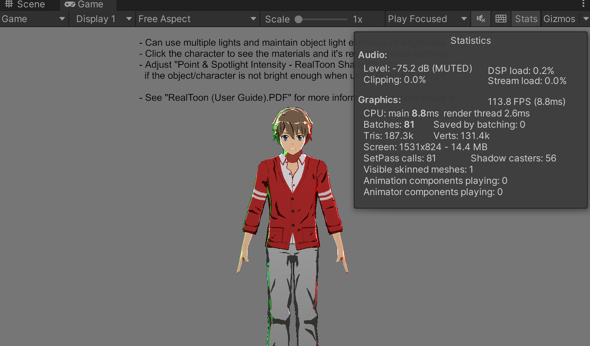
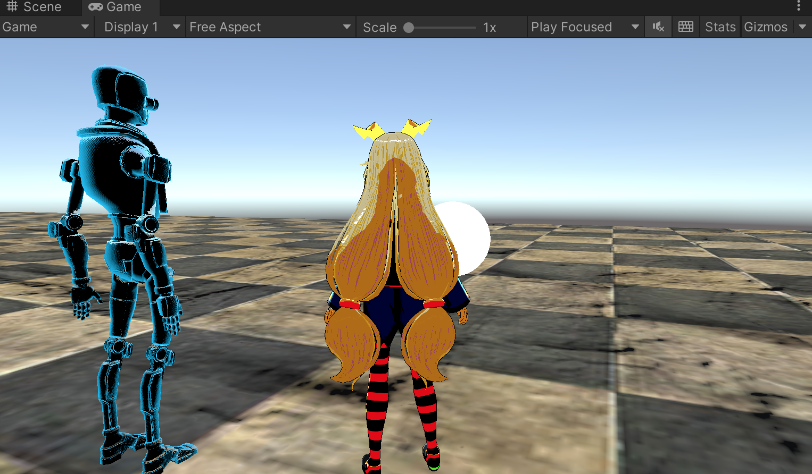
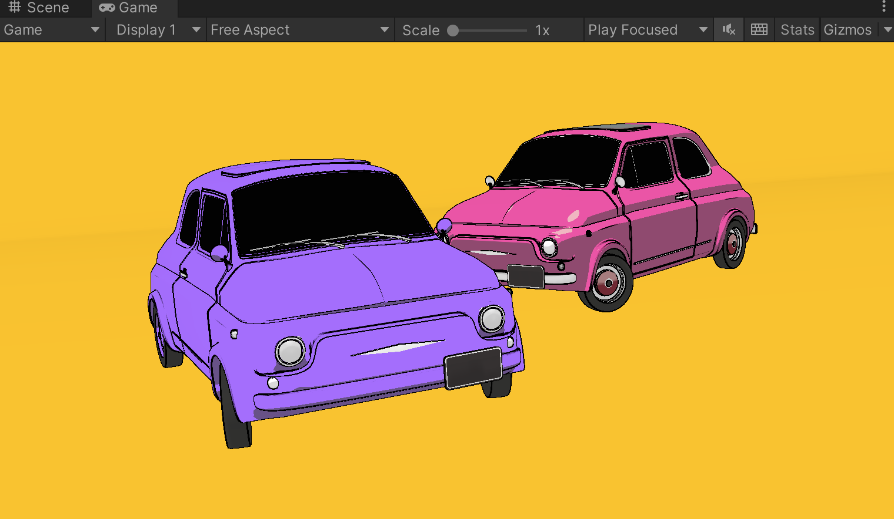
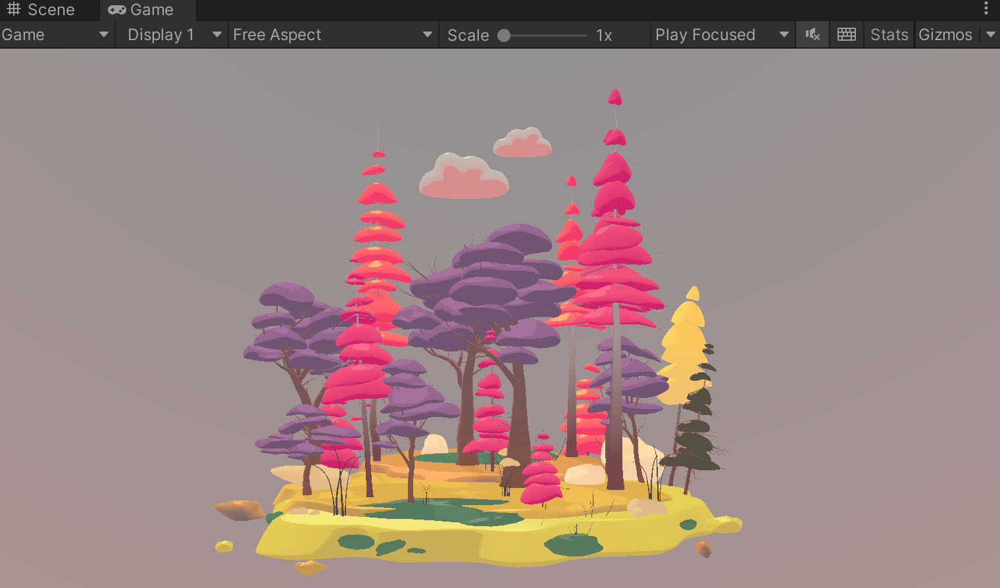
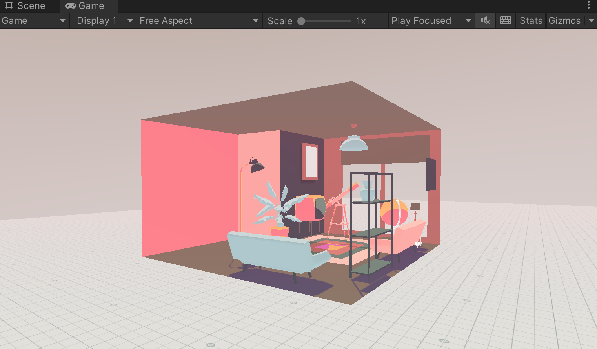
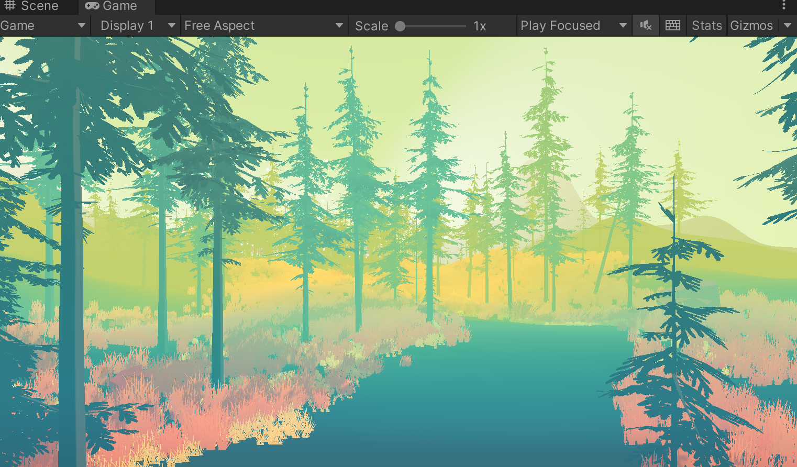
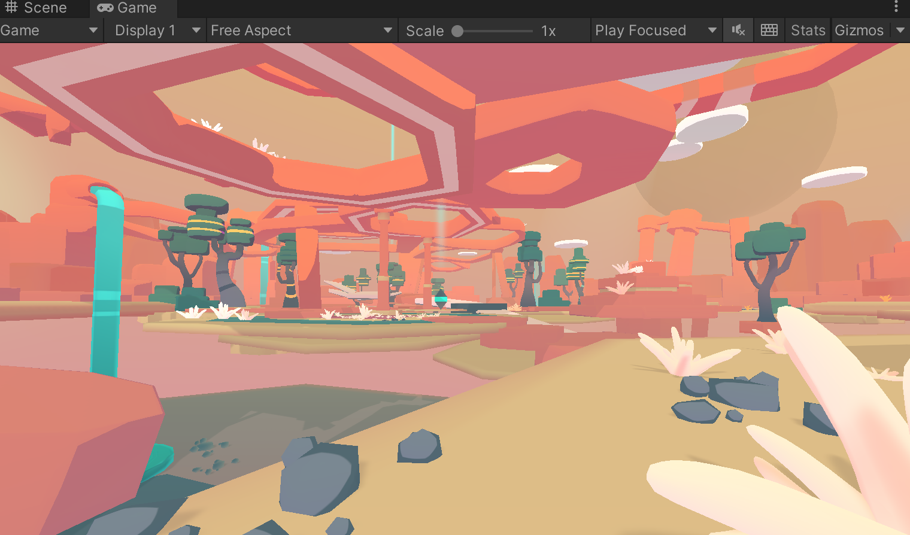

>[Unity学习笔记 Vol.83 URP环境下卡通渲染Shader工具一览](https://www.bilibili.com/read/cv10777857)

>[RealToon (An Anime/Toon Shader)](https://assetstore.unity.com/packages/vfx/shaders/realtoon-an-anime-toon-shader-65518?locale=zh-CN)

>[Flat Kit: Toon Shading and Water](https://assetstore.unity.com/packages/vfx/shaders/flat-kit-toon-shading-and-water-143368)

本文使用的Unity 环境是：Unity 版本是2021.3.13f1c1，并且使用的是内置渲染管线（Build-In RP [3D]）

## RealToon (An Anime/Toon Shader) 

>同时可以参考《RealToon (User Guide).pdf》

基于文章开头提到的Unity 环境，所以在将RealToon An AnimeToon Shader 5.0.8p4.unitypackage 拖入到Unity 工程中之后，再双击`/Assets/RealToon/RealToon Shader Packages/Built-In RP [3D]/RealToon Built-In RP [3D] (Unity 2019 and Later).unitypackage` 导入内置渲染管线版本的包

然后可以导入`/Assets/RealToon/RealToon Examples/Built-In RP [3D]/RealToon Built-In RP [3D] (Example).unitypackage`，就可以看到官方的演示效果！

如果是HDRP、URP 等可编程渲染管线，则找该渲染管线对应的包unpack 即可！

## Flat Kit: Toon Shading and Water

>同时可以参考《FlatKit Manual.pdf》

>[https://flatkit.dustyroom.com/](https://flatkit.dustyroom.com/)

Flat Kit: Toon Shading and Water 依赖Post Processing，所以需要先安装Post Processing 插件！

基于文章开头提到的Unity 环境，所以在将Flat Kit Toon Shading and Water 2.9.5.unitypackage 拖入到Unity 工程中之后，再双击`/Assets/FlatKit/[Render Pipeline] Built-In.unitypackage` 导入内置渲染管线版本的包

如果是URP 等可编程渲染管线，则找该渲染管线对应的`[Render Pipeline] Universal (URP).unitypackage` 包双击导入即可！

备注：Flat Kit Toon Shading and Water 2.9.8.unitypackage 在当前开发环境下导入的时候可能出现报错：Failed to import package with error: Couldn't decompress package
