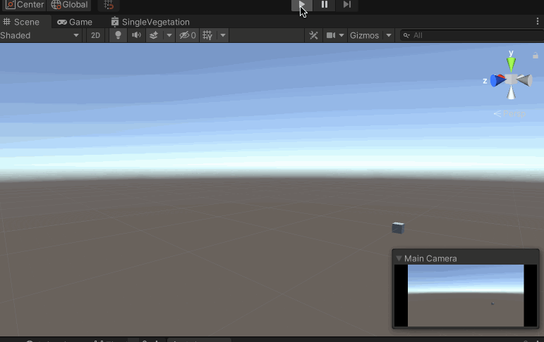
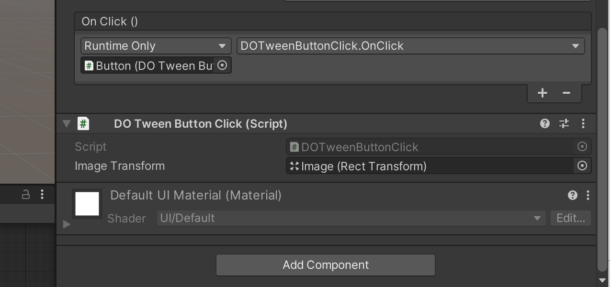
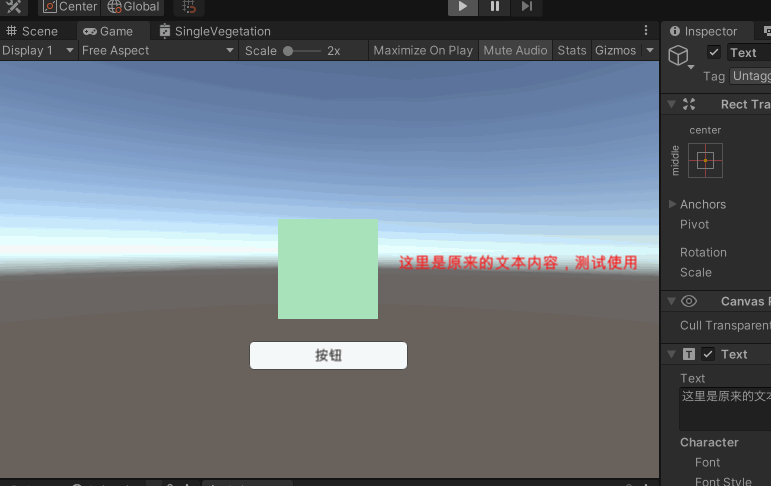

>[http://dotween.demigiant.com/](http://dotween.demigiant.com/) 官网有详细的文档说明！

>本文是[DoTween动画插件](https://www.bilibili.com/video/av33901896/) 的笔记！

DOTween 是一个动画插件，有免费版，也有收费的专业版。DOTween 可以用于控制UI 组件的移动、淡入淡出的效果；还可以用于比如3D 游戏中人物的行走等

## 对数值进行变化

比如使用DOTween 控制Cube 的位置的变化，为Cube 添加CubePositionChange.cs 脚本

```c#
using System.Collections;
using System.Collections.Generic;
using DG.Tweening;
using UnityEngine;

public class CubePositionChange : MonoBehaviour
{
    private Vector3 myValue = new Vector3(0, 0, 0);

    // Start is called before the first frame update
    void Start()
    {
        // 指定在2s 时间内，myValue 的值变化到Vector(10, 10, 10)
        // 第一个参数是() => myValue，Lambda 表达式，返回myValue
        // 第二个参数是x => myValue = x，也是Lambda 表达式，x 与目标值new Vector(10, 10, 10) 计算一个插值，赋值给myValue
        DOTween.To(() => myValue, x => myValue = x, new Vector3(10, 10, 10), 2);
    }

    // Update is called once per frame
    void Update()
    {
        // 在Update 中用myValue 的值对应更新Cube 的Position
        transform.position = myValue;
    }
}
```

运行的效果是这样的



>比如可以实现颜色的渐变、UI 的位置的移动……效果

## 动画的快捷播放方式

在场景中新增一个Image、Button 的UI 游戏对象

为按钮增加DOTweenButtonClick.cs 脚本

```c#
using System.Collections;
using System.Collections.Generic;
using DG.Tweening;
using UnityEngine;

public class DOTweenButtonClick : MonoBehaviour
{
    // 要求在Unity 编辑器中拖入对应Image 组件
    public RectTransform imageTransform;

    private bool isIN = false;

    private void Start()
    {
        // DOTween 提供了一下拓展方法，比如DOMove
        // 点击事件发生时，image 对象会在2s 内移动到Vector3(10, 10, 10)
        Tweener tweener = imageTransform.DOMove(new Vector3(10, 10, 10), 2);   // 修改世界坐标。动画默认播放完后会被销毁
                                                                               // Tweener 对象保存这个动画的信息，每次调用DO..() 类型方法时都会创建，这个对象由DOTween 来管理
                                                                               // 为了不每次点击时都创建一个Tweener 对象，所以在Start() 中创建一次，后续一直用
        tweener.SetAutoKill(false);  // 设置动画不自动销毁，DOPlayBackwards() 才可以倒放
        tweener.Pause();             // 不在这里执行动画，让后面在点击时执行

        // tweener.SetEase(Ease.InBack);    // 设置动画曲线。还有InBounce、OutBounce、……
        // tweener.SetLoops(2);  // 设置动画循环次数

        tweener.OnComplete(OnTweenComplete);  // 设置动画播放完后回调的方法

        // imageTransform.DOMove(new Vector3(10, 10, 10), 2).From(); // 默认是从当前位置运行到目标位置，加上From()方法以后，表示从目标位置移动到当前位置
        //imageTransform.DOLocalMove(new Vector3(10, 10, 10), 2); // 修改局部坐标
    }

    public void OnClick()
    {
        if (isIN == false)
        {
            // 移入
            imageTransform.DOPlayForward();   // 播放在Start() 中设置的动画
        }
        else
        {
            // 移出
            imageTransform.DOPlayBackwards();   // 倒放
        }

        isIN = !isIN;
    }

    void OnTweenComplete()
    {
        Debug.Log("动画播放完成");
    }
}
```

然后为Button 添加点击实现，对应脚本中的OnClick() 方法



## DOTween 动画生命周期

When you create a tween it will play automatically (unless you change the global defaultAutoPlay behaviour) until it completes all its loops.

When a tween is complete it is automatically killed (unless you change the global defaultAutoKill behaviour), which means you won't be able to use it anymore.

If you want to reuse the same tween, just set its autoKill behaviour to FALSE (either by changing the global autoKill settings for all tweens, or by chaining SetAutoKill(false) to your tween).

If your tween's target becomes NULL while a tween is playing errors might happen. You'll have to either be careful or activate the safe mode

生命周期相关的函数有

* OnComplete(TweenCallback callback)
* OnKill(TweenCallback callback)
* OnPlay(TweenCallback callback)
* OnPause(TweenCallback callback)
* OnRewind(TweenCallback callback)
* OnStart(TweenCallback callback)
* OnStepComplete(TweenCallback callback)
* OnUpdate(TweenCallback callback)
* OnWaypointChange(TweenCallback<int> callback)

## 对话框文字

在游戏中，场景切换、对话等情况下是会有一些文字提示的，如果加上一些动画效果会更好

在场景中加入一个Text 的UI 组件，为其添加DOTweenText.cs 脚本

```c#
using System.Collections;
using System.Collections.Generic;
using DG.Tweening;
using UnityEngine;
using UnityEngine.UI;

public class DOTweenText : MonoBehaviour
{
    private Text text;

    // Start is called before the first frame update
    void Start()
    {
        text = this.GetComponent<Text>();
        text.DOText("接下来进入第二关，开启新的征程", 2);   // 默认是一个字一个字显示的动画效果
        // DOText() 还有更多参数，比如用来设置文本颜色等，对应参考官方文档

        // text.DOColor(Color.blue, 2); 2秒钟内文本变成蓝色
        // text.DOFade(1, 3);   // 3秒内文本由没有渐变显示出来，实际是修改Color 的Alpha 值
    }
}
```

运行效果如下



## 屏幕震动效果

在动作游戏中，攻击与防守、被击中、死亡等时候可以通过同时让屏幕震动来增强的打击感，其实实现的原理很简单，就是用DOTween 对摄像机做一个动画

为摄像机增加一个DOTweenShake.cs 脚本

```c#
using System.Collections;
using System.Collections.Generic;
using DG.Tweening;
using UnityEngine;

public class DOTweenShake : MonoBehaviour
{
    // Start is called before the first frame update
    void Start()
    {
        // 实现随机震动，第一个参数是震动时间；第二个参数是震动强度，这里指定仅在X、Y轴震动
        transform.DOShakePosition(1, new Vector3(1, 1, 0));
    }
}
```

>更多内容参考官网，以上只是一些简单的效果展示，发挥自己的想象力，使用DOTween 做出来更酷炫的动画效果

>以上是自己编写代码的方式，DOTween 还自带了DOTweenAnimation 等现成的组件！

## 路径编辑器DOTweenPath

Shift + Command 添加路径点

Shift + Alt 移除路径点

>但是目前不知道为什么在MacOS 上的Unity 中使用这两个快捷键无法进行设置？？？

运行起来后会按照设置的路径点播放动画，DOTweenPath 还有其他很多参数可以自己一个个地都试一试！

另外可以为某一个Button 的点击事件设置为DOTweenPath.DOPlay() 或DOTweenPath.DOTogglePause() 实现点击按钮的时候触发动画的播放
