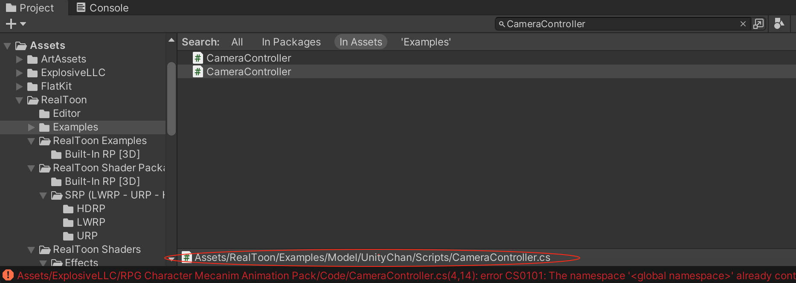

>[https://assetstore.unity.com/packages/3d/animations/rpg-character-mecanim-animation-pack-63772](https://assetstore.unity.com/packages/3d/animations/rpg-character-mecanim-animation-pack-63772)

本文使用的Unity 环境是：Unity 版本是2021.3.13f1c1，并且使用的是内置渲染管线（Build-In RP [3D]）

所有的角色都采用了Mecanim 人形动画的结构，所以你可以很轻松地嵌入你自己的角色，其还支持有五根手指的手以适应有着高细节要求的模型。我们所提供的动画控制器简洁明了，您或可以将动画插入在您的现有设置当中。角色使用了根骨骼运动进行精确的动态追踪，通过高精确微调的混合来实现完美的过渡

导入之后在对应的目录下有一些pdf 文件可供学习，但是可能出现如下报错:

```
Assets/ExplosiveLLC/RPG Character Mecanim Animation Pack/Code/CameraController.cs(4,14): error CS0101: The namespace 'global namespace' already contains a definition for 'CameraController'

Assets/ExplosiveLLC/RPG Character Mecanim Animation Pack/Code/RPGCharacterInputController.cs(2,19): error CS0234: The type or namespace name 'InputSystem' does not exist in the namespace 'UnityEngine' (are you missing an assembly reference?)

Assets/ExplosiveLLC/RPG Character Mecanim Animation Pack/Inputs/RPGInputs.cs(6,19): error CS0234: The type or namespace name 'InputSystem' does not exist in the namespace 'UnityEngine' (are you missing an assembly reference?)

Assets/ExplosiveLLC/RPG Character Mecanim Animation Pack/Inputs/RPGInputs.cs(7,19): error CS0234: The type or namespace name 'InputSystem' does not exist in the namespace 'UnityEngine' (are you missing an assembly reference?)

Assets/ExplosiveLLC/RPG Character Mecanim Animation Pack/Code/RPGCharacterInputController.cs(188,37): error CS0246: The type or namespace name 'InputAction' could not be found (are you missing a using directive or an assembly reference?)

Assets/ExplosiveLLC/RPG Character Mecanim Animation Pack/Inputs/RPGInputs.cs(11,31): error CS0246: The type or namespace name 'IInputActionCollection' could not be found (are you missing a using directive or an assembly reference?)

Assets/ExplosiveLLC/RPG Character Mecanim Animation Pack/Inputs/RPGInputs.cs(606,21): error CS0540: 'RPGInputs.IEnumerable.GetEnumerator()': containing type does not implement interface 'IEnumerable'

Assets/ExplosiveLLC/RPG Character Mecanim Animation Pack/Inputs/RPGInputs.cs(622,26): error CS0246: The type or namespace name 'InputActionMap' could not be found (are you missing a using directive or an assembly reference?)
```

因为这个插件依赖Input System，所以需要先安装Input Sytem。【Windows】->【Package Manager】然后搜索下载安装Input System 1.4.4 即可！

但还是可能出现如下编译报错

```
Assets/ExplosiveLLC/RPG Character Mecanim Animation Pack/Code/CameraController.cs(4,14): error CS0101: The namespace 'global namespace' already contains a definition for 'CameraController'
```

全局搜索CameraController，发现RealToon 插件在相同的namespace 下存在同名的C# 类，这也是使用外部插件常遇到的问题，包括我们自己在游戏开发的时候，要规划好namespace，避免冲突问题



临时的解决方案是为RPG Character Mecanim Animation Pack 6.0 插件下的CameraController 增加命名空间RPGCharacterAnims

```c#
namespace RPGCharacterAnims
{
    public class CameraController : MonoBehaviour
    {
        public GameObject cameraTarget;
        public float rotateSpeed;
        float rotate;
        public float offsetDistance;
        public float offsetHeight;
        public float smoothing;
        Vector3 offset;
        bool following = true;
        Vector3 lastPosition;

        void Start()
        {
            lastPosition = new Vector3(cameraTarget.transform.position.x, cameraTarget.transform.position.y + offsetHeight, cameraTarget.transform.position.z - offsetDistance);
            offset = new Vector3(cameraTarget.transform.position.x, cameraTarget.transform.position.y + offsetHeight, cameraTarget.transform.position.z - offsetDistance);
        }


    }
}
```

然后就可以编译运行了！

运行起来后，可能发现Character 直接从场景中掉落下去，在编辑模式下，将RPG-Character 的Position.Y 属性适当设置大一些，比如0.08，使其在地面之上就可以解决这个问题！

另外运行起来后，会有一些运行时错误。另外还会发现当Character 碰撞到其他物体后，都可能直接从场景中掉落下去，可以结合源码排查原因，这里就不详细解释了！

