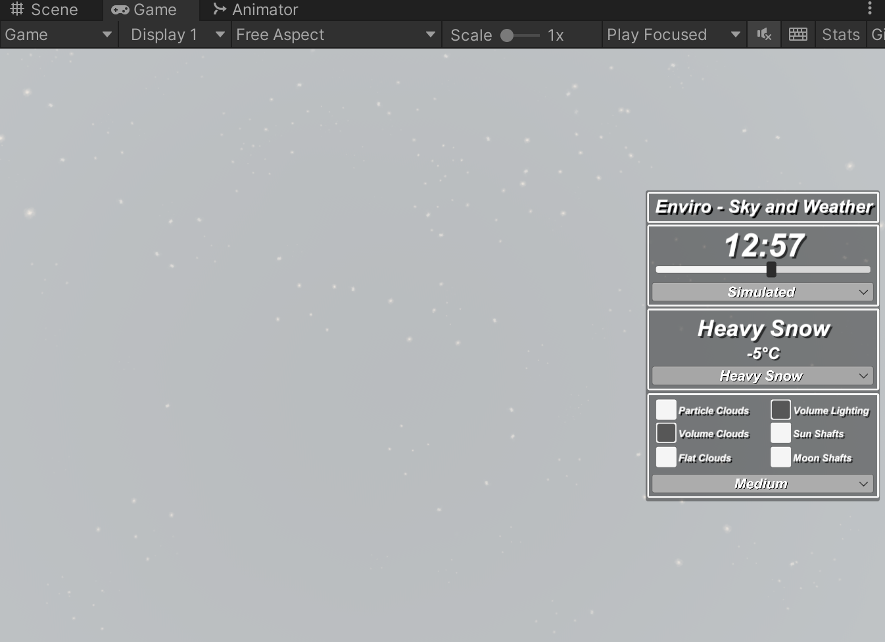

>[https://assetstore.unity.com/packages/tools/particles-effects/enviro-sky-and-weather-33963](https://assetstore.unity.com/packages/tools/particles-effects/enviro-sky-and-weather-33963)

>导入到Unity 之后，可以通过《Documentation.pdf》文档学习其使用

本文使用的Unity 环境是：Unity 版本是2021.3.13f1c1，并且使用的是内置渲染管线（Build-In RP [3D]）

Enviro - Sky and Weather 2.3.1 依赖Post Processing，所以需要先安装Post Processing 插件！

Unity 真实动态云雾体积照明天空天气环境系统特效Enviro-Sky and Weather 2.3.1，支持真实的昼夜循环，日月位置和全方位的经纬度

比如设置为Heay Snow，运行效果如下：

**【配置系统】**

Enviro 的配置文件系统让你轻松调整天空。在运行时调整设置并保存至配置文件。在设计和运行时加载配置。创建不同场景的配置文件或与其他用户分享你的配置。

**【日夜周期】**

Enviro 支持逼真的日夜周期。拥有准确的太阳和月亮位置以及带有经度和纬度的全方位支持。你可选择使用系统时间或让 Enviro 根据运行时更新时间。

**【天空盒】**

天空盒：Enviro 包含一个高级快速的大气天空盒着色器，来得到出色的天空。你有很多选项来调整天空，甚至可以设置时髦的外星天空！天空盒还包含逼真的闪烁星星、可选的银河系、不同阶段的月亮、高海拔的动态卷云和一个极光效果。

**【光照】**

Enviro 会根据太阳的高度真实地照亮你的场景。在编辑器中，你可以通过修改曲线和渐变来完全控制光照强度和颜色！你还可以从不同的环境光模式中选择。

**【季节】**

Enviro 会更改季节并包含用以置换游戏物体、材质和 unity 地形纹理的组件。除了逼真设置，还有很多功能！你可以设置每个季节的开始和结束日。Enviro 还支持根据季节、时间和当前天气进行温度模拟。

**【云】**

Enviro 的新光线穿射云系统是基于最新的云渲染文件。这些可以让你的天空栩栩如生，为你提供很多选项来自定义。通过使用时间重投影和细节级别系统等技术优化云的性能。此外，还可以混合或单使用快速扁平与粒子云选项以获得最佳性能。

**【雾】**

需要让人眩晕的迷雾吗？Enviro 包含高级光线散射雾图像效果，并具有距离、高度和天空雾支持。需要在你的透明材质上出现迷雾吗？没问题，只要写几行代码，你便可以修改你的透明着色器，呈现你想要的雾。此外几个粒子和透明着色器已经包括在内来帮助你入门！

**【天气】**

Enviro 包含非常强大的天气系统。你可以创建你自己的天气类型、驱动光、天空、雾和云。Enviro 支持所有 Unity 粒子特效，让你可以自由创建任何你想要的天气效果。它包含 11 种预制天气类型，包括“晴天”、“多云”、“有雨”、“暴风雨”、“下雪”、“有雾”天气。你可以启用闪电风暴并选择不同的环境与天气声音在各个天气之间流畅切换。

**【体积光照】**

想要 AAA 游戏的体积光照特效吗？没问题，Enviro 支持有影和无影的定向、点和聚光灯的体积光照，轻松任你使用！

**【极光特效】**

Enviro 包含一个用于模拟特殊大气夜晚的北极光效果！支持完全自定义并直接在天空盒内进行渲染从而在你的场景上轻松反射。

**【扩展反射探测器】**

Enviro 包含一个扩展反射探测器组件，可以将像云、雾这样的环境效果加到你的反射探测器上。它还支持基于游戏时间进行时间分段和定期更新，在实时使用时保存性能。

**【场景视图效果】**

在将 Enviro 特效（例如云、体积光照和雾）应用到你的场景之前，可对其进行预览。当然你也可以单独为每个特效启用或禁用场景视图预览功能。
