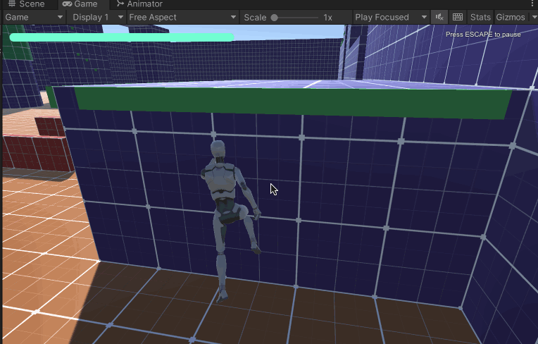

>[https://assetstore.unity.com/packages/templates/systems/climbing-system-151612](https://assetstore.unity.com/packages/templates/systems/climbing-system-151612)

本文使用的Unity 环境是：Unity 版本是2021.3.13f1c1，并且使用的是内置渲染管线（Build-In RP [3D]）

运行效果如下

