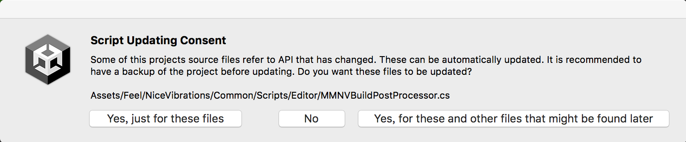
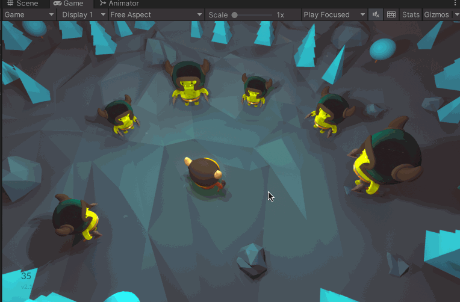

>[https://assetstore.unity.com/packages/tools/particles-effects/feel-183370](https://assetstore.unity.com/packages/tools/particles-effects/feel-183370)

本文使用的Unity 环境是：Unity 版本是2021.3.13f1c1，并且使用的是内置渲染管线（Build-In RP [3D]）

Feel 是一款可以增加游戏感觉的插件

导入之后可能出现这样的编译报错：

```
Multiple precompiled assemblies with the same name Newtonsoft.Json.dll included on the current platform. Only one assembly with the same name is allowed per platform. (/Users/???/Unity/Demos/Demos/Library/PackageCache/com.unity.nuget.newtonsoft-json@3.0.2/Runtime/Newtonsoft.Json.dll)


Multiple precompiled assemblies with the same name Newtonsoft.Json.dll included on the current platform. Only one assembly with the same name is allowed per platform. (Assets/Feel/NiceVibrations/ThirdParty/Newtonsoft/Newtonsoft.Json.dll)
```

解决方案是，删除Feel 插件目录下的dll：Assets/Feel/NiceVibrations/ThirdParty/Newtonsoft/Newtonsoft.Json.dll，防止需要恢复的情况，通过将其重命名为Newtonsoft.Json.dll.bak

然后可能出现这样的报错



点击【Yes，for these and other files that might be found later】

/Assets/Feel/FeelDemos/Barbarians 的运行效果如下


