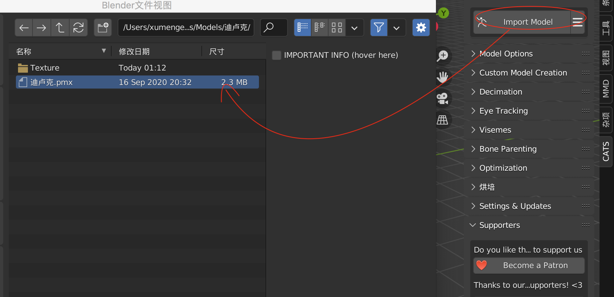
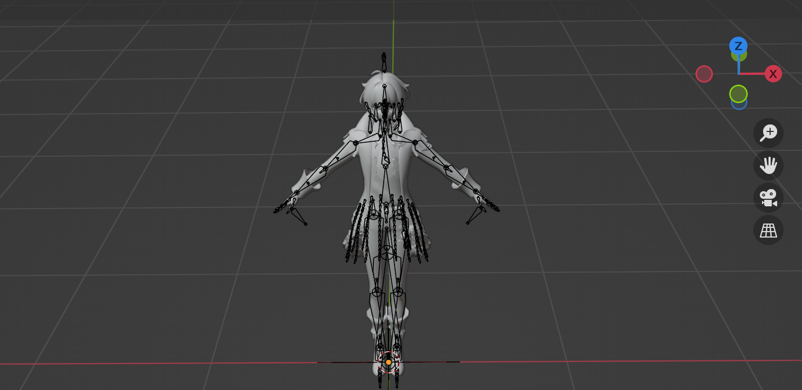
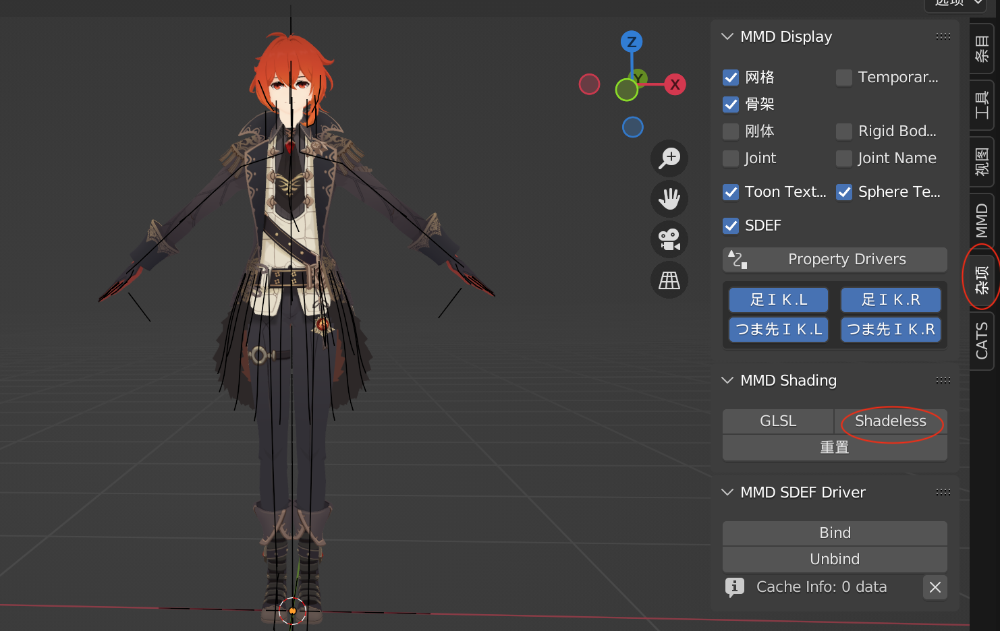
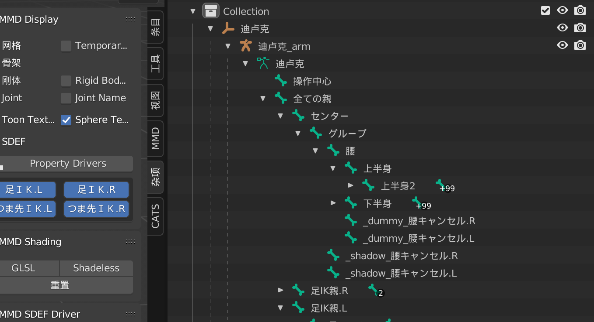
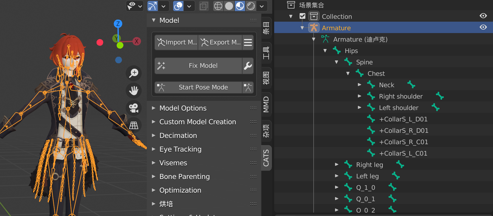
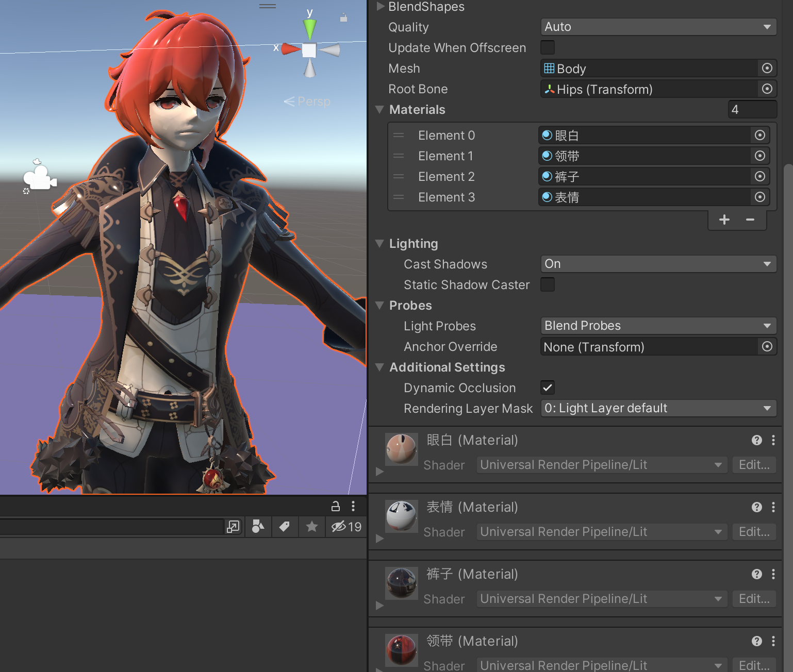

原神的模型可以在模之屋下载：[https://www.aplaybox.com/u/680828836/model](https://www.aplaybox.com/u/680828836/model)

下载下来后，是pmx 格式的


## Blender 转换格式

需要把它转为fbx 格式才能导入Unity 中使用。pmx 转fbx 可以通过Blender 来转，cats-blender-plugin 是Blender 的插件，可以实现这个需求

[https://github.com/absolute-quantum/cats-blender-plugin](https://github.com/absolute-quantum/cats-blender-plugin) 打开后，在这里下载


注意，下载错误的版本，在导入的时候可能出现报错！

```
Traceback (most recent call last):
  File "/Users/xumenger/Library/Application Support/Blender/2.90/scripts/addons/cats-blender-plugin-master/extern_tools/mmd_tools_local/panels/prop_object.py", line 132, in draw
    c.prop(obj.mmd_joint, 'name_j')
AttributeError: 'Object' object has no attribute 'mmd_joint'

location: <unknown location>:-1
```

>经过测试，Blender3.2.1、Blender2.9.0 都支持这个插件！

导入插件后，勾选启用插件，可以在主界面导入下载的pmx 模型



导入后的模型是这样的白模（因为材质有问题）



我们打开侧边栏的Misc（杂项），然后点击Shadeless（即使用卡通材质），然后就可以正常显示了



另外，模型的骨骼节点可能都不是按照Unity 骨骼映射的规范进行英文命名的，也需要修复



点击CATS插件的Fix Model 按钮，即可自动进行修复，除此之外，它还会帮我们删除多余无用的骨骼，将使用同一张贴图的节点合并为一个Mesh并重命名为Body 等

注意这个步骤需要使用Blender2.9.0，Blender3.2.1 版本下可能报错

```
Python: Traceback (most recent call last):
  File "/Users/xumenger/Library/Application Support/Blender/3.2/scripts/addons/cats-blender-plugin-master/tools/armature.py", line 1208, in execute
    hierarchy_check_hips = check_hierarchy(False, [
  File "/Users/xumenger/Library/Application Support/Blender/3.2/scripts/addons/cats-blender-plugin-master/tools/armature.py", line 1275, in check_hierarchy
    Common.show_error(6.4, missing2)
  File "/Users/xumenger/Library/Application Support/Blender/3.2/scripts/addons/cats-blender-plugin-master/tools/common.py", line 1652, in show_error
    bpy.ops.cats_common.show_error('INVOKE_DEFAULT')
  File "/Applications/Blender.3.2.1.app/Contents/Resources/3.2/scripts/modules/bpy/ops.py", line 113, in __call__
    ret = _op_call(self.idname_py(), C_dict, kw, C_exec, C_undo)
RuntimeError: 错误: Python: Traceback (most recent call last):
  File "/Users/xumenger/Library/Application Support/Blender/3.2/scripts/addons/cats-blender-plugin-master/tools/common.py", line 1670, in invoke
    return context.window_manager.invoke_props_dialog(self, width=dpi_value * dpi_scale)
TypeError: WindowManager.invoke_props_dialog(): error with keyword argument "width" -  Function.width expected an int type, not float
位置: /Applications/Blender.3.2.1.app/Contents/Resources/3.2/scripts/modules/bpy/ops.py:113
```



点击CATS 插件的Export Model 按钮，即可导出fbx 文件，建议与原来的pmx 文件相同目录

## 导入Unity

注意将fbx 格式的文件和贴图文件夹都放到Unity 工程下，然后拖入到某个场景中，可以看到这样的效果，有点像恐怖娃娃，其默认使用Unity URP 内置的材质



而且材质是嵌在fbx 中的，无法进行编辑，所以需要创建新的材质球替换。下一篇文章讲解如何制作卡通渲染效果！
