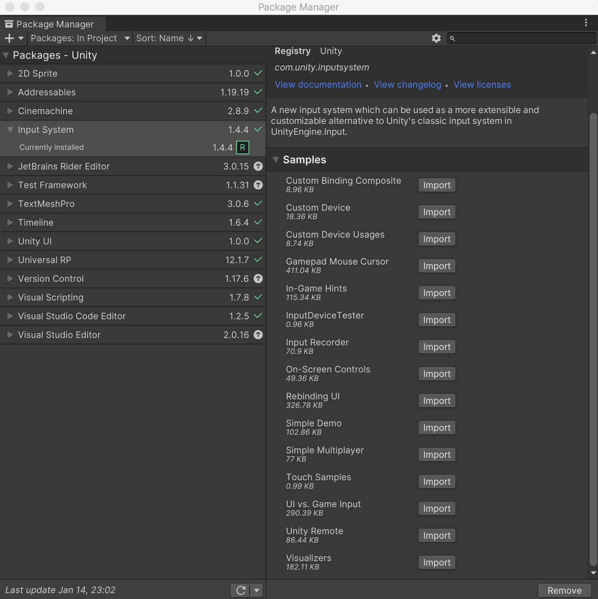
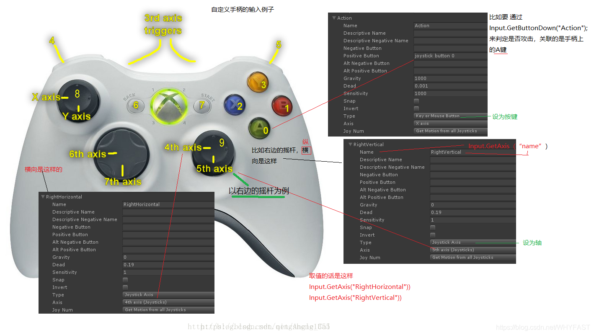
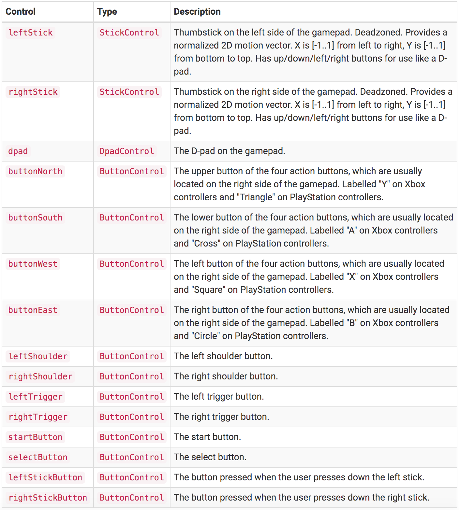
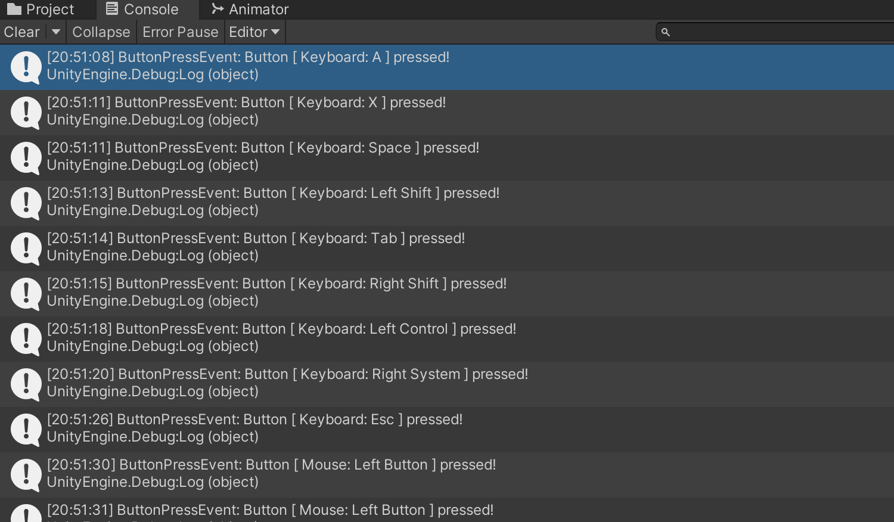
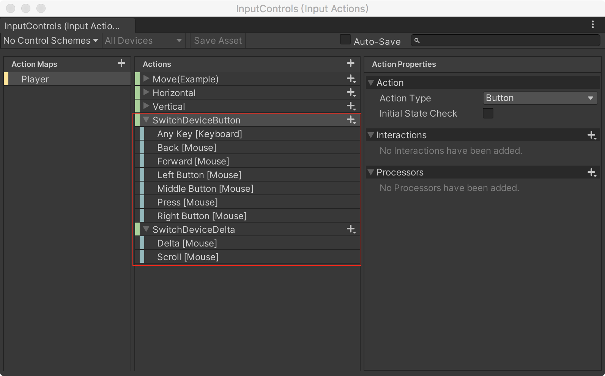
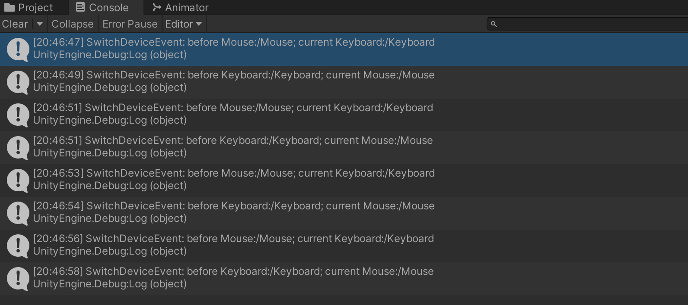

>[https://docs.unity3d.com/cn/2020.3/Manual/com.unity.inputsystem.html](https://docs.unity3d.com/cn/2020.3/Manual/com.unity.inputsystem.html)

>[https://docs.unity3d.com/Packages/com.unity.inputsystem@1.4/manual/index.html](https://docs.unity3d.com/Packages/com.unity.inputsystem@1.4/manual/index.html)

>[https://docs.unity3d.com/Packages/com.unity.inputsystem@1.4/api/UnityEngine.InputSystem.InputSystem.html](https://docs.unity3d.com/Packages/com.unity.inputsystem@1.4/api/UnityEngine.InputSystem.InputSystem.html)

>[好好玩游戏：Unity InputSystem 插件](http://www.xumenger.com/player-input-20210930/)

为了学习Input System，可以选择安装一些Demo！



## 手柄与Input Manager

>[《Unity3D之输入轴配置示意图》](https://blog.csdn.net/whyfast/article/details/94214338)



开发者常用的鼠标、键盘、手柄，Input System 都是支持的

* [支持鼠标](https://docs.unity3d.com/Packages/com.unity.inputsystem@1.4/manual/Mouse.html)
* [支持键盘](https://docs.unity3d.com/Packages/com.unity.inputsystem@1.4/manual/Keyboard.html)
* [支持手柄](https://docs.unity3d.com/Packages/com.unity.inputsystem@1.4/manual/Gamepad.html)

Input System 对于手柄的支持如下



## Input System hight-level 架构图

>[https://docs.unity3d.com/Packages/com.unity.inputsystem@1.4/manual/Architecture.html](https://docs.unity3d.com/Packages/com.unity.inputsystem@1.4/manual/Architecture.html)


基于布局中的信息，Input System 使用Control 表示为每个设备的控制，这让你获取每个控制设备的状态。使用Action 来绑定一个或多个Control。然后Input System 监控这些Control 的状态变化，并使用回调通知游戏逻辑

也可以为Actions 使用Processors、Interactions 处理更复杂的行为逻辑。Processor 会先处理输入数据然后再发送出来；Interaction 允许监听指定的输入模式，比如multi-taps

这样使用Action Editor（对应也体现了Action Map、Action、Binding、Control、Interaction、Processor 之间的关系）


## 判断任何按键按下

Input Manager 中的`UnityEngine.Input.anyKey` 可以用下面的方法替代

```c#
InputSystem.onAnyButtonPress
    .CallOnce(ctrl => Debug.Log($"Button {ctrl} pressed!"));
```

这个方法只有第一次按下某个按钮的时候会触发，后续不再触发，如果想每次都触发，则使用这样的方式

```c#
InputSystem.onAnyButtonPress
    .Call(ctrl => Debug.Log($"ButtonPressEvent: Button [ {ctrl.device.displayName}: {ctrl.displayName} ] pressed!"));
```

运行效果如下



## 识别新设备接入

>[https://docs.unity3d.com/Packages/com.unity.inputsystem@1.4/manual/HowDoI.html#know-when-a-new-device-has-been-plugged-in](https://docs.unity3d.com/Packages/com.unity.inputsystem@1.4/manual/HowDoI.html#know-when-a-new-device-has-been-plugged-in)

>[https://docs.unity3d.com/Packages/com.unity.inputsystem@1.4/api/UnityEngine.InputSystem.InputDeviceChange.html](https://docs.unity3d.com/Packages/com.unity.inputsystem@1.4/api/UnityEngine.InputSystem.InputDeviceChange.html)

使用InputSystem.onDeviceChange 可以监控是否有设备接入，或者设备被移除

```c#
InputSystem.onDeviceChange += 
    (device, change) => 
    {
        switch (change)
        {
            case InputDeviceChange.Added:
                // New Device.
                break;
            case InputDeviceChange.Disconnected:
                // Device got unplugged.
                break;
            case InputDeviceChange.Connected:
                // Plugged back in.
                break;
            case InputDeviceChange.Removed:
                // Remove from Input System entirely; by default, Devices stay in the system once discovered.
                break;
            default:
                // See InputDeviceChange reference for other event types.
                break;
        }
    };
```

但是，onDeviceChange 只会在当前已经设定好的设别发生改变时触发，无法检测游戏运行时输入设备之间的切换

## 使用onActionChange 检测输入设备变化

上面说到了onDeviceChange 的问题，那么可以使用onActionChange 检测输入设备变化。onActionChange 是low-level 的API

>[https://docs.unity3d.com/Packages/com.unity.inputsystem@1.4/api/UnityEngine.InputSystem.InputSystem.html#UnityEngine_InputSystem_InputSystem_onActionChange](https://docs.unity3d.com/Packages/com.unity.inputsystem@1.4/api/UnityEngine.InputSystem.InputSystem.html#UnityEngine_InputSystem_InputSystem_onActionChange)

先定义一个记录设备变化的内部类

```c#
public class SwitchDeviceInfo
{
    InputDevice beforeDevice;       // 上一个设备
    InputDevice currentDevice;      // 当前设备

    public InputDevice before
    {
        get { return beforeDevice; }
    }

    public InputDevice current
    {
        get { return currentDevice; }
    }

    public bool switchDevice(InputDevice newDevice)
    {
        if (currentDevice == newDevice)
            return false;

        beforeDevice = currentDevice;
        currentDevice = newDevice;

        return true;
    }
}
```

然后使用onDeviceChange 实现检测输入设备变化

```c#
public class InputController : Singleton<InputController>
{
	private SwitchDeviceInfo switchDevice = new SwitchDeviceInfo();

    void Start()
    {
        // 游戏运行期间不销毁
        DontDestroyOnLoad(this.gameObject);

        // 设备切换事件
        InputSystem.onActionChange += DetectInputDevice;     // 会在输入系统接收到输入信号时触发
    }

    private void OnDisable()
    {
        InputSystem.onActionChange -= DetectInputDevice;
    }

    public void DetectInputDevice(object obj, InputActionChange change)
    {
        if (change != InputActionChange.ActionPerformed)
            return;

        InputDevice device = ((InputAction)obj).activeControl.device;

        if (!switchDevice.switchDevice(device))
            return;

        Debug.Log($"SwitchDeviceEvent: before {switchDevice.before}; current {device}");
        SprialEventBus.GlobalEventBus.TriggerEvent<SwitchDeviceInfo>(InputEventEnum.SwitchDeviceEvent, switchDevice);
    }
}
```

但是这个方法也有它的问题！

比如没有在PlayerInput 编辑器中为任何Action 绑定【X】这个按键，那么当你按下【X】的时候，并不会触发该回调；另外比如为多个Action 都绑定了【A】这个按键，那么按下【A】的时候会触发多次回调

第二个问题还好，只是触发多次回调，我们做好设备检查的逻辑就好，怎么解决第一个问题？粗暴一些，直接在Player Input 中绑定所有设备的所有操作（键盘按键、鼠标按键、鼠标滚动……），其他设置都不需要。如下图的设置只支持键盘按键、鼠标按键、鼠标滑动触发的切换，其他比如手柄暂不支持，如果需要支持，则对应在这里添加即可！



运行效果如下



## 更多问题？

1. 怎么识别连续两次点击按键？
2. 怎么识别比如【Shift+A】这种组合键？ => One Modifier
3. InputSystem怎么与UI系统对接？
