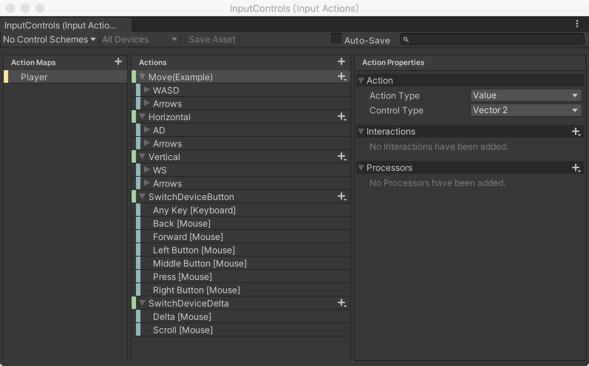
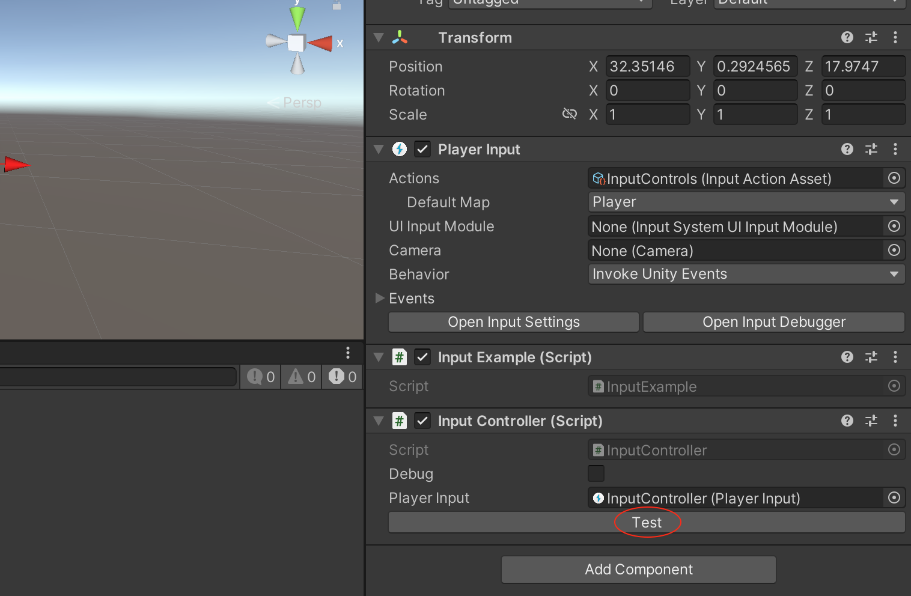

有这样的一个需求，希望为某个MonoBehaviour 在Unity 编辑环境下增加一个按钮，然后在开发环境下点击该按钮触发相关的逻辑，比如我要去遍历下面这个Input Actions 下面所有的Action



先编写一个MonoBehaviour

```c#
public class InputController : MonoBehaviour
{
    public PlayerInput playerInput;     // PlayerInput

    public void Test()
    {
        foreach (var actionMap in playerInput.actions.actionMaps)
        {
            foreach (var action in actionMap.actions)
            {
                Debug.Log(action.name);
            }
        }
    }
}
```

然后为它编写编辑器扩展

```c#
[CustomEditor(typeof(InputController))]
public class InputControllerEditor : Editor
{
    public override void OnInspectorGUI()
    {
        DrawDefaultInspector();

        InputController inputController = (InputController)target;
        if (GUILayout.Button("Test"))
        {
            inputController.Test();
        }
    }
}
```

将InputController 这个MonoBehaviour 实现类组件放到某个GameObject 上，可以看到在编辑器环境下其多了一个按钮



点击按钮，可以看到下面的输出，说明运行正确


