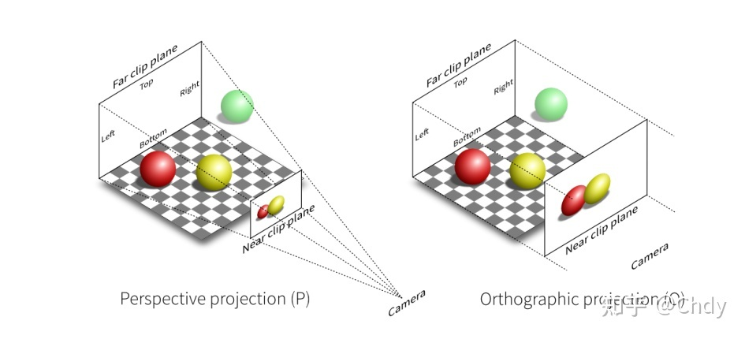

>[https://docs.unity3d.com/cn/2020.3/Manual/com.unity.cinemachine.html](https://docs.unity3d.com/cn/2020.3/Manual/com.unity.cinemachine.html)

>[https://docs.unity3d.com/Packages/com.unity.cinemachine@2.8/manual/index.html](https://docs.unity3d.com/Packages/com.unity.cinemachine@2.8/manual/index.html)

>[好好玩游戏：Cinemachine 实现角色跟随](http://www.xumenger.com/cine-machine-20210914/)

>[好好玩游戏：Cinemachine 与Timeline 实现镜头融合](http://www.xumenger.com/cine-machine-20210915/)

Cinemachine 并不是创建一个新的Camera，而是直接操控Unity 的Camera，比如Virtual Camera 可以移动、旋转Unity Camera，以及控制它的相关设置

Cinemachine Brain 是Unity Camera 的一个组件，它监控场景中所有Active 的Virtual Cameras！

## 透视投影与正交投影

>[变换（模型、视图、投影）](https://zhuanlan.zhihu.com/p/347216526)

透视投影（Perpective projection）与正交投影（Orthographic projection）对比如下

很显然，透视投影是符合现实近大远小的逻辑的！

