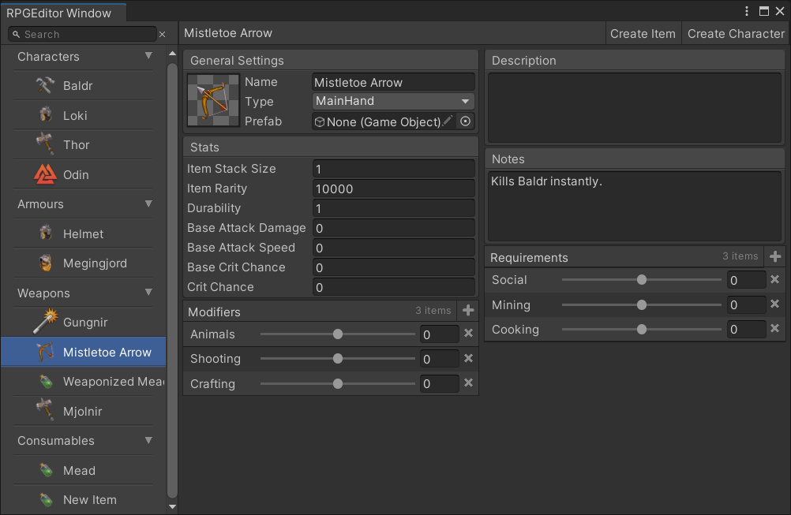
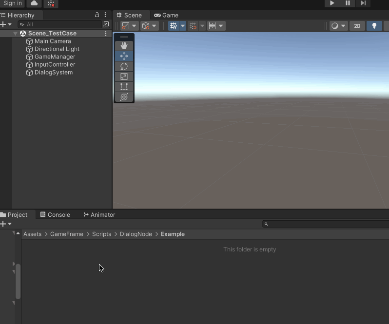

>[想拥有一套自己的Unity可视化工作流？我来带你一网打尽！](https://www.bilibili.com/video/BV1i7411w7tW)

>[完全理解GraphView](https://qiita.com/ma_sh/items/7627a6151e849f5a0ede)

>[https://docs.unity3d.com/cn/2020.2/ScriptReference/Experimental.GraphView.GraphView.html](https://docs.unity3d.com/cn/2020.2/ScriptReference/Experimental.GraphView.GraphView.html)

>[Unity的GraphView](https://blog.csdn.net/alexhu2010q/article/details/118053288)

>[Unity Graph View打造图形化对话编辑系统（一）](https://blog.csdn.net/sdhexu/article/details/123480230)

>[Unity进阶：ScriptableObject使用指南](https://blog.csdn.net/qq_46044366/article/details/124310241)

## GraphView 介绍

GraphView 主要有四个要素

1. 视图 GraphView
2. 节点 Node
3. 端口 Port
4. 边 Edge

Shader Graph、技能编辑器、对话系统、行为树、剧情编辑器等游戏常见的功能都可以使用节点编辑器来实现！

## Odin 介绍

>[十分钟入门Unity革命性编辑器拓展插件——Odin](https://www.bilibili.com/video/BV1ME411e7mS)

>[Unity插件Odin入门](https://blog.csdn.net/sinat_34014668/article/details/125957699)

Odin 是一个对编辑器进行扩展的插件，可以序列化各种数据，方便的制作出各种编辑器界面



Odin提供了100多个特性（Attribute），只需要把特性加到字段上就可以显示上方的样式。特性简单说就是用来标记元素的，如字段，方法，类。这么多特性很难记住，一般是需要了再去查找合适的样式。

```c#
//AssetsOnly表示只能拖拽Assets目录下的资源，场景中的资源是无法拖动
[AssetsOnly]
public GameObject SomePrefab;

//SceneObjectsOnly相反，只能拖拽Scene场景中的资源
[SceneObjectsOnly]
public GameObject SomeSceneObject;
```

## NodeGraphProcessor 使用说明

但是GraphView 没有提供数据结构的序列化和存储，这些就需要自己去扩展实现！当然也有现成的解决方案：NodeGraphProcessor

>[https://github.com/alelievr/NodeGraphProcessor](https://github.com/alelievr/NodeGraphProcessor)

>[https://www.lfzxb.top/nodegraphprocesssor-and-odin/](https://www.lfzxb.top/nodegraphprocesssor-and-odin/)

>[https://alelievr.github.io/NodeGraphProcessor/api/index.html](https://alelievr.github.io/NodeGraphProcessor/api/index.html)

>[节点编辑插件GraphProcessor(1)](https://www.crosshair.top/index.php/2021/04/07/%e8%8a%82%e7%82%b9%e7%bc%96%e8%be%91%e6%8f%92%e4%bb%b6graphprocessor1/)

下载[NodeGraphProcessor](https://github.com/alelievr/NodeGraphProcessor)，然后将com.alelievr.NodeGraphProcessor 拷贝到你的项目中

比如我要实现一个对话系统的节点编辑器，在DialogNode 目录下新增一个BaseGraph 的实现类

```c#
using GraphProcessor;

/// <summary>
/// 如何创建DialogGraph => DialogGraphAsset.CreateDialogGraph()
/// 打开编辑DialogGraph => DialogGraphAsset.OnDialogGraphOpened()
/// 
/// </summary>
public class DialogGraph : BaseGraph
{
    
}
```

然后新建一个Editor 文件夹，新增一个DialogGraphWindow 类，后续使用这个窗口类打开上面创建的asset 资源文件

```c#
/// <summary>
/// 双击DialogGraph.asset 对应使用DialogGraphWindow 打开
/// 
/// </summary>
public class DialogGraphWindow : BaseGraphWindow
{
    /// <summary>
    /// 初始化窗口界面
    /// 
    /// </summary>
    /// <param name="graph"></param>
    protected override void InitializeWindow(BaseGraph graph)
    {
        titleContent = new GUIContent(graph.name);

        if (graphView == null)
        {
            // 主窗口
            graphView = new DialogGraphView(this);

            // 工具栏
            graphView.Add(new DialogGraphToolbarView(graphView));
        }

        rootView.Add(graphView);
    }
}
```

对应DialogGraphView、DialogGraphToolbarView 分别如下

```c#
/// <summary>
/// 双击DialogGraph.asset 对应使用DialogGraphWindow 打开
/// 
/// </summary>
public class DialogGraphWindow : BaseGraphWindow
{
    /// <summary>
    /// 初始化窗口界面
    /// 
    /// </summary>
    /// <param name="graph"></param>
    protected override void InitializeWindow(BaseGraph graph)
    {
        titleContent = new GUIContent(graph.name);

        if (graphView == null)
        {
            // 主窗口
            graphView = new DialogGraphView(this);

            // 工具栏
            graphView.Add(new DialogGraphToolbarView(graphView));
        }

        rootView.Add(graphView);
    }
}
```

```c#
/// <summary>
/// 为窗口增加工具栏按钮
/// 目前不需要工具栏功能，暂时空实现
/// 
/// </summary>
public class DialogGraphToolbarView : ToolbarView
{
    public DialogGraphToolbarView(BaseGraphView graphView) : base(graphView)
    {

    }

    /// <summary>
    /// 增加工具栏按钮
    /// 
    /// </summary>
    protected override void AddButtons()
    {
        //AddToggle("Graph Option", false, (v) => graphView.ToggleView<DialogGraphGlobalOptionView>());
    }
}
```

在Editor 文件夹下新增一个DialogGraphAsset 类，指定创建DialogGraph.asset 的菜单目录，以及使用什么窗口打开DialogGraph.asset

```c#
public class DialogGraphAsset
{
    /// <summary>
    /// 指定菜单创建DialogGraph 资产文件
    /// 
    /// </summary>
    [MenuItem("Assets/Create/DialogGraph", false, 10)]
    public static void CreateDialogGraph()
    {
        var graph = ScriptableObject.CreateInstance<DialogGraph>();
        ProjectWindowUtil.CreateAsset(graph, "New DialogGraph.asset");
    }


    /// <summary>
    /// 指定使用什么编辑器打开DialogGraph.asset 文件
    /// 对应DialogGraphWindow => 具体跳转到DialogGraphWindow的源码
    /// 
    /// </summary>
    /// <param name="instanceID"></param>
    /// <param name="line"></param>
    /// <returns></returns>
    [OnOpenAsset(0)]
    public static bool OnDialogGraphOpened(int instanceID, int line)
    {
        var dialogGraph = EditorUtility.InstanceIDToObject(instanceID) as DialogGraph;
        if (dialogGraph != null)
        {
            EditorWindow.GetWindow<DialogGraphWindow>().InitializeGraph(dialogGraph as BaseGraph);
            return true;
        }
        return false;
    }
}
```

然后创建一些在Graph 窗口中可以创建的节点，先定义一个测试节点

```c#
[NodeMenuItem("Dialog/Common")]
public class DialogTestNode : BaseNode
{
    public override string name => "测试节点";

    // allowMultiple = true，允许多个前置节点连入
    [Input(name = "In", allowMultiple = true)]
    public bool input;

    [Output(name = "Out")]
    public bool output;

}
```

然后就可以创建DialogGraph.asset 资产，并且去编辑节点了，下面简单演示怎么使用


