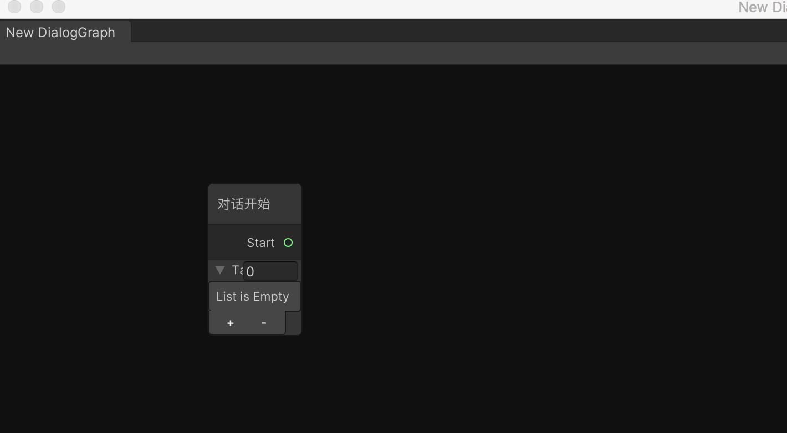
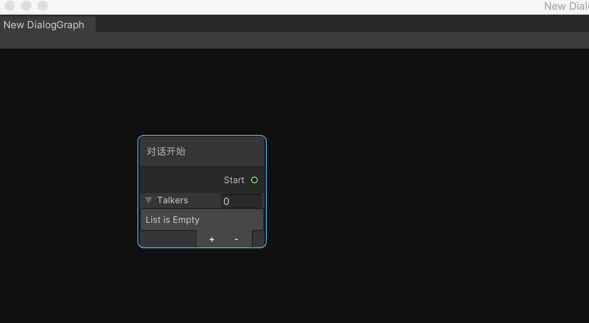

>[https://docs.unity3d.com/cn/current/Manual/UIE-USS.html](https://docs.unity3d.com/cn/current/Manual/UIE-USS.html)

>[Unity2019 UIElement 笔记（六）USS介绍上](https://blog.csdn.net/qq_43500611/article/details/89791492)

比如我实现了一个节点

```c#
public class DialogStartNode : BaseNode
{
    public override bool deletable => false;
    public override string name => "对话开始";


    // 新增选项，保证可以在后续节点选择
    public string[] talkers;


    [Output(name = "Start", allowMultiple = true)]
    public string output;
}
```

然后在NodeGraph 中可以看到其默认显示是这样的



很明显，宽度不是我想要到，很多内容没有完整显示，那么就可以使用uss 文件来指定节点的样式

首先在任意目录下创建名为Resources 的文件夹，然后为该节点增加一个uss 文件，为了演示，就指定宽度一个属性

```uss
.node
{
    min-width: 160px;
}
```

>更多内容参考[https://docs.unity3d.com/cn/current/Manual/UIE-USS-Properties-Reference.html](https://docs.unity3d.com/cn/current/Manual/UIE-USS-Properties-Reference.html)

>这里只是演示功能，实际项目中如何实现颜色、长宽的自适应等请参考上面的资料

然后修改DialogStartNode 的代码如下，指定对应的uss 样式文件

```c#
public class DialogStartNode : BaseNode
{
    public override bool deletable => false;
    public override string name => "对话开始";

    // 指定样式文件 => Resources/DialogStartNode.css
    public override string layoutStyle => "DialogStartNode";


    // 新增选项，保证可以在后续节点选择
    public string[] talkers;


    [Output(name = "Start", allowMultiple = true)]
    public string output;
}
```

然后可以看到这个节点现在的显示效果是这样的



在NodeGraphProcessor 下面有一个RelayNode.uss 文件，可以参考一下

```uss
.node
{
    margin: 0px;
    padding: 0px;
}

.node > #node-border
{
    border-radius: 9px;
}

#contents > #top > #input, #contents > #top > #output
{
    padding: 0px;
    margin: 0px;
    height: 16px
}

#contents > #top > #input .connectorBox, #contents > #top > #output .connectorBox
{
    padding: 0px;
    margin: 0px;
}

#contents > #top > #input .unity-label
{
    display: none;
}

.hideLabels .unity-label
{
    display: none;
}
```
