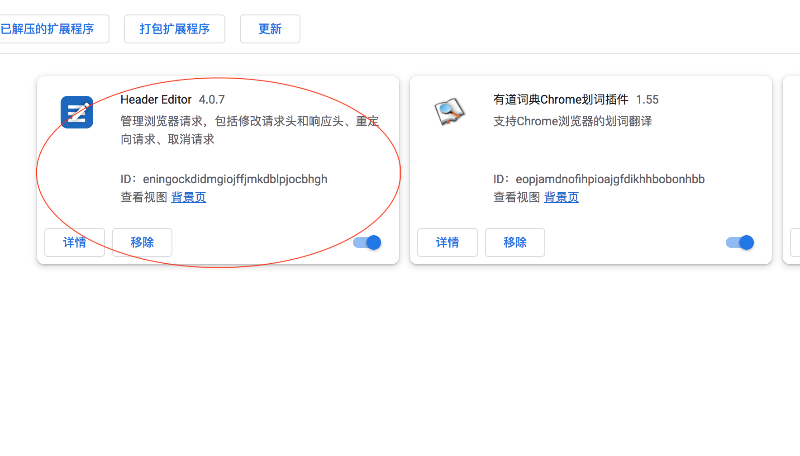
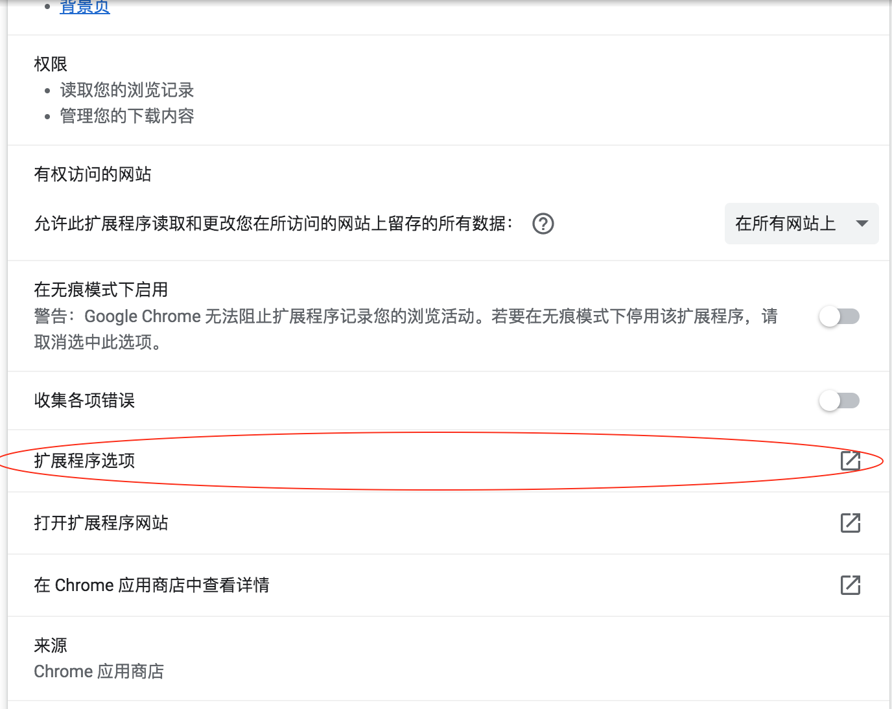
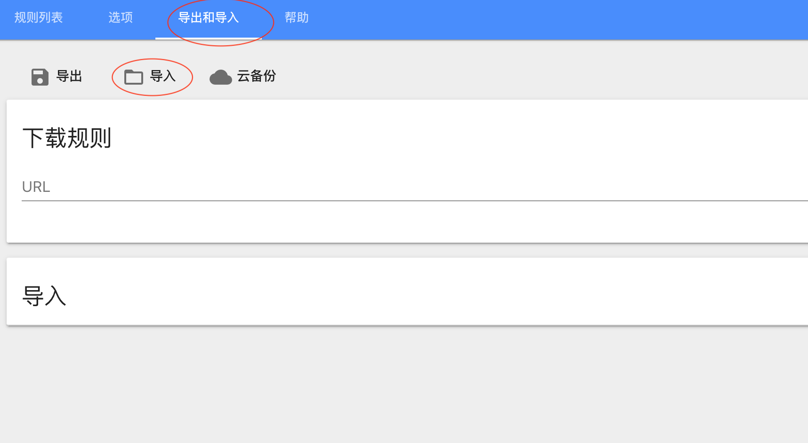
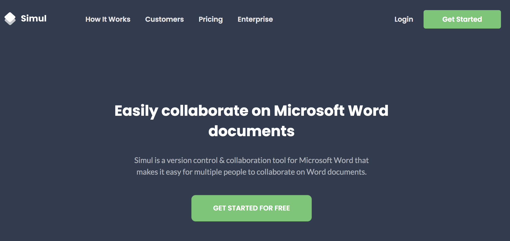
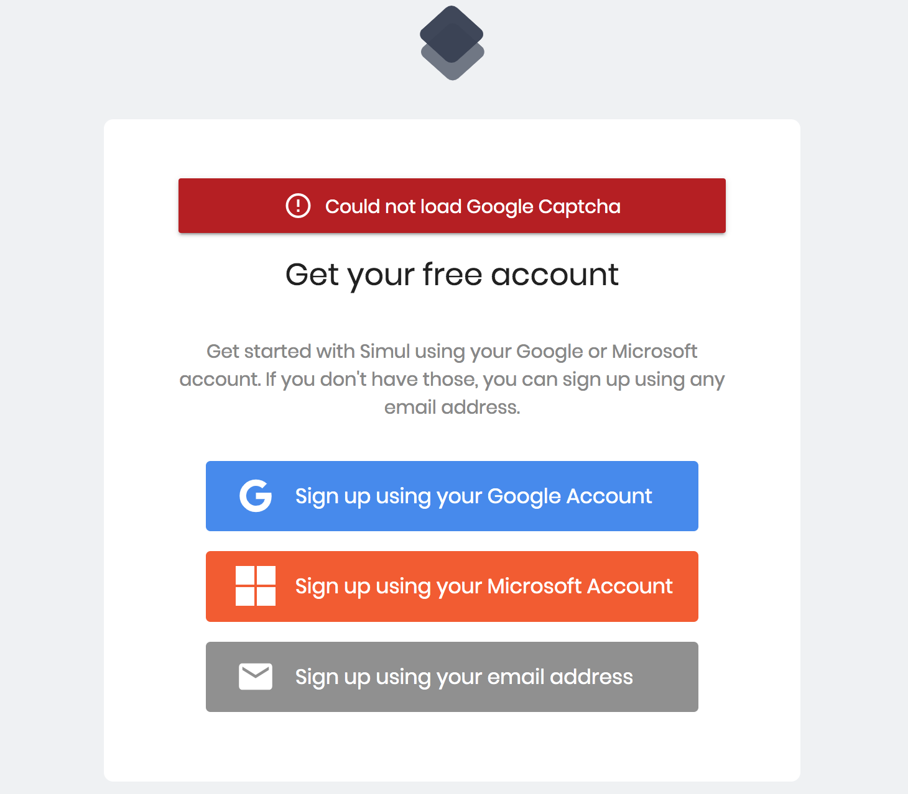
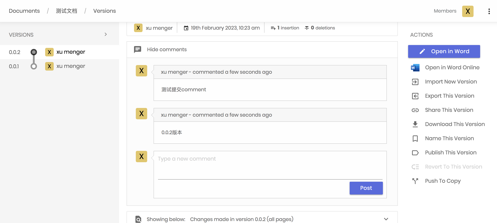

## HeaderEditor 插件

可能会遇到问题：Could not load Google Captcha

点击[这里](../download/20230219/HeaderEditor.zip) 下载插件，解压缩得到Header Editor.crx

【Chrome】->【更多工具】->【扩展程序】，将下载的.crx 文件拖进来即可完成安装

点击[这里](../download/20230219/HE-GoogleRedirect.json)打开规则文件，在Chrome浏览器下可以Ctrl-S 保存到本地供后续流程使用

如上图，点击【详情】->【扩展程序选项】

然后导入刚才下载的规则文件即可

如此是为了防止接下来注册Simul 的时候出现【Could not load Google Captcha】

## 注册Simul

>[https://www.simuldocs.com/](https://www.simuldocs.com/)

点击【Get Started】，这一步会比较慢，耐心等一下（下图看到了有Could not load Google Captcha 报错，上面已经给了解决方案了）

使用邮箱注册【Sign up using your email address】

注册成功后即可登录使用，比如上传了一个测试文档后，可以在Simul 上进行版本的管理了，也可以为每个版本提交comment

