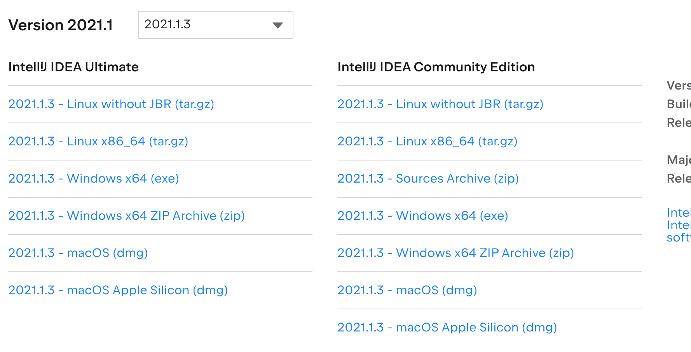
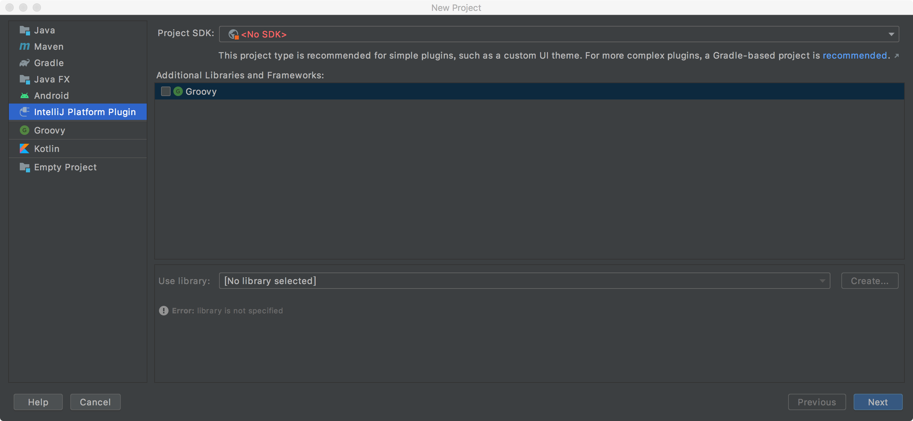
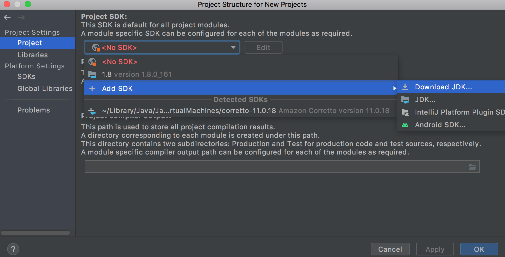
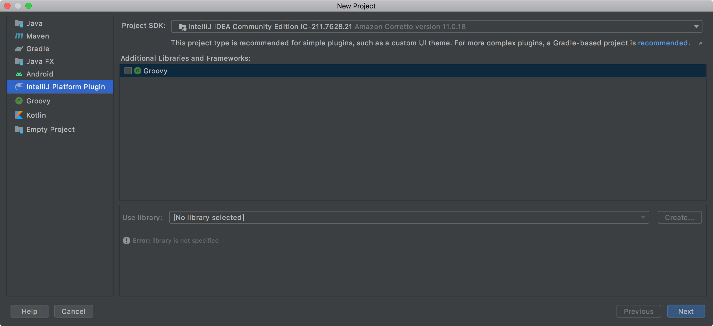

## 安装IDEA

[https://www.jetbrains.com/zh-cn/idea/download/#section=mac](https://www.jetbrains.com/zh-cn/idea/download/#section=mac) 可以选择下载免费的社区版本

下载dmg 格式的安装包，正常安装即可！

为了与工作环境保持一致，可以去[https://www.jetbrains.com/idea/download/other.html](https://www.jetbrains.com/idea/download/other.html) 选择下载你平时使用的某个历史版本！

关于JDK 等的安装，可以参考之前写的[《Mac OS下安装Eclipse》](http://www.xumenger.com/mac-install-eclipse-20180306/)

## IDEA 插件开发环境

选择使用IDEA 一方面是因为现在大家都使用了，还是要随大流，另外一点是因为IDEA 可以方便的定制化插件，比如实现自动化的代码检视等功能

在创建IntelliJ Platform Plugin Project 的时候需要选择Project SDK，但是IDEA CE 是没有SDK的

具体可以参考官方文档[https://plugins.jetbrains.com/docs/intellij/setting-up-theme-environment.html](https://plugins.jetbrains.com/docs/intellij/setting-up-theme-environment.html)

注意，2021 版本要求JDK 是 JDK11，否则无法正确配置IntelliJ Platform Plugin SDK，可以通过下面的截图直接下载jdk11

【File】->【Project Structure】

然后相同的界面，【Add SDK】->【IntelliJ Platform Plugin SDK】即可，注意别忘了点击【Apply】

然后就可以正常的创建IntelliD Platform Plugin 项目了

比如创建一个SourceCheck 的项目，用于做代码规范的扫描
