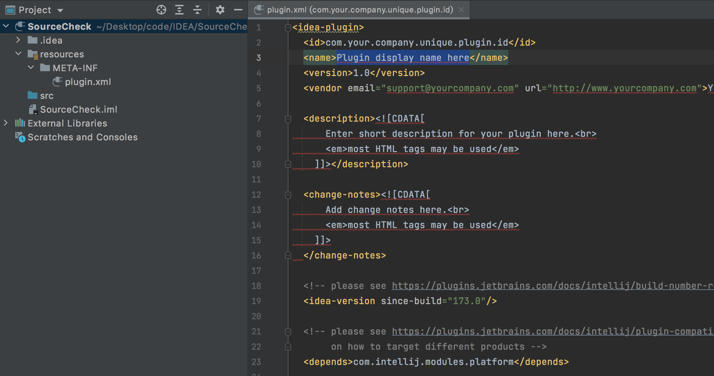
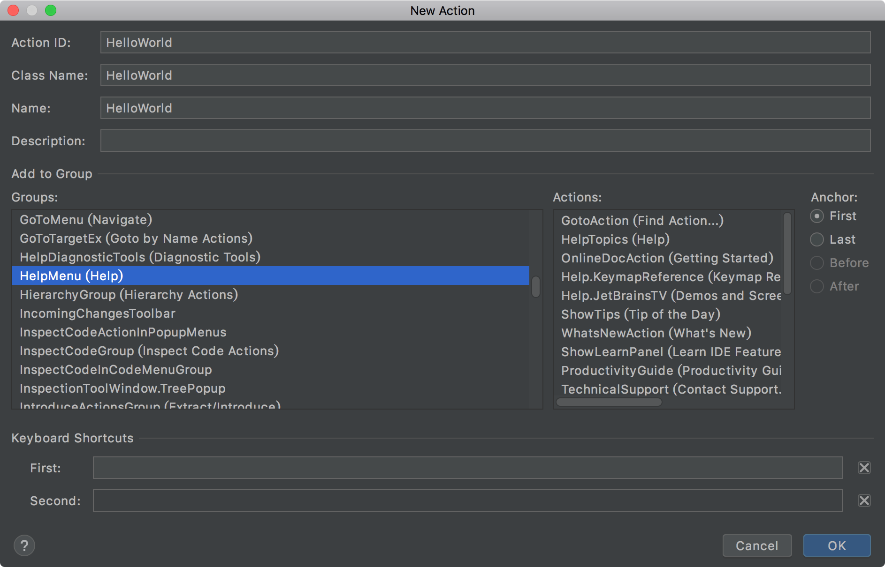
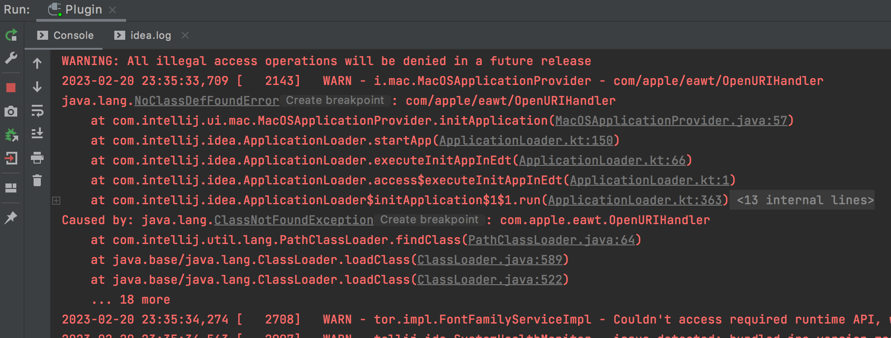
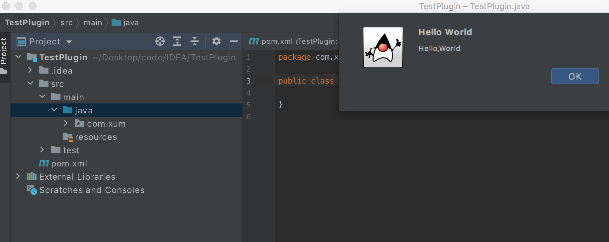

>参考[《史上最全idea插件开发入门实战(傻瓜式教程)》](https://blog.csdn.net/weixin_43722048/article/details/123786363)

>[IDEA插件开发官方文档](https://plugins.jetbrains.com/docs/intellij/xml-dom-api.html)

新建插件项目之后，可以看到plugin.xml 项目有一些报错



修改plugin.xml 的内容如下

```xml
<idea-plugin>
  <id>com.your.company.unique.plugin.id</id>
  <name>我的代码检视插件</name>
  <version>1.0</version>
  <vendor email="support@126.com" url="http://www.xumenger.com">个人开发者</vendor>

  <description>我的代码检视插件，专门用于Java工程的编码规范自动化检查！！！！！！！！！！！！！！！</description>

  <change-notes>随便写点啥</change-notes>

  <!-- please see https://plugins.jetbrains.com/docs/intellij/build-number-ranges.html for description -->
  <idea-version since-build="173.0"/>

  <!-- please see https://plugins.jetbrains.com/docs/intellij/plugin-compatibility.html
       on how to target different products -->
  <depends>com.intellij.modules.platform</depends>

  <extensions defaultExtensionNs="com.intellij">
    <!-- Add your extensions here -->
  </extensions>

  <actions>
    <!-- Add your actions here -->
  </actions>

</idea-plugin>
```

【New】->【Plugin DevKit】，在SourceCheck 项目中新增一个Action，一切还是从HelloWorld 开始



>Action ID 保证不重复即可，选择HelpMenu（Help）表示这个Action 在Help 菜单的里面

创建完成之后，可以看到plugin.xml 自动新增了一个HelloWorld 的Action

自动创建的HelloWorld 的代码如下

```java
package com.xum;

import com.intellij.openapi.actionSystem.AnAction;
import com.intellij.openapi.actionSystem.AnActionEvent;

public class HelloWorld extends AnAction {

    @Override
    public void actionPerformed(AnActionEvent e) {
        // TODO: insert action logic here
    }
}
```

然后编写测试代码如下

```java
package com.xum;

import com.intellij.openapi.actionSystem.AnAction;
import com.intellij.openapi.actionSystem.AnActionEvent;
import com.intellij.openapi.actionSystem.PlatformDataKeys;
import com.intellij.openapi.project.Project;
import com.intellij.openapi.ui.Messages;

public class HelloWorld extends AnAction {

    @Override
    public void actionPerformed(AnActionEvent e) {
        Project project = e.getData(PlatformDataKeys.PROJECT);
        Messages.showMessageDialog(project,"Hello,World","Hello World", Messages.getInformationIcon());
    }
}
```

点击运行，可能出现这样的报错



```
2023-02-20 23:35:33,709 [   2143]   WARN - i.mac.MacOSApplicationProvider - com/apple/eawt/OpenURIHandler 
java.lang.NoClassDefFoundError: com/apple/eawt/OpenURIHandler
	at com.intellij.ui.mac.MacOSApplicationProvider.initApplication(MacOSApplicationProvider.java:57)
	at com.intellij.idea.ApplicationLoader.startApp(ApplicationLoader.kt:150)
	at com.intellij.idea.ApplicationLoader.executeInitAppInEdt(ApplicationLoader.kt:66)
	at com.intellij.idea.ApplicationLoader.access$executeInitAppInEdt(ApplicationLoader.kt:1)
	at com.intellij.idea.ApplicationLoader$initApplication$1$1.run(ApplicationLoader.kt:363)
	at java.desktop/java.awt.event.InvocationEvent.dispatch(InvocationEvent.java:313)
	at java.desktop/java.awt.EventQueue.dispatchEventImpl(EventQueue.java:770)
	at java.desktop/java.awt.EventQueue$4.run(EventQueue.java:721)
	at java.desktop/java.awt.EventQueue$4.run(EventQueue.java:715)
	at java.base/java.security.AccessController.doPrivileged(Native Method)
	at java.base/java.security.ProtectionDomain$JavaSecurityAccessImpl.doIntersectionPrivilege(ProtectionDomain.java:85)
	at java.desktop/java.awt.EventQueue.dispatchEvent(EventQueue.java:740)
	at java.desktop/java.awt.EventDispatchThread.pumpOneEventForFilters(EventDispatchThread.java:203)
	at java.desktop/java.awt.EventDispatchThread.pumpEventsForFilter(EventDispatchThread.java:124)
	at java.desktop/java.awt.EventDispatchThread.pumpEventsForHierarchy(EventDispatchThread.java:113)
	at java.desktop/java.awt.EventDispatchThread.pumpEvents(EventDispatchThread.java:109)
	at java.desktop/java.awt.EventDispatchThread.pumpEvents(EventDispatchThread.java:101)
	at java.desktop/java.awt.EventDispatchThread.run(EventDispatchThread.java:90)
Caused by: java.lang.ClassNotFoundException: com.apple.eawt.OpenURIHandler
	at com.intellij.util.lang.PathClassLoader.findClass(PathClassLoader.java:64)
	at java.base/java.lang.ClassLoader.loadClass(ClassLoader.java:589)
	at java.base/java.lang.ClassLoader.loadClass(ClassLoader.java:522)
	... 18 more
```

参考[IDEA 插件开发（一）：菜单及气泡通知](https://www.cnblogs.com/ageovb/p/16749993.html)，忽略这个报错

>从 JDK 9 开始，已经不提供包 com.apple.eawt 和 com.apple.eio，取而代之的是 java.awt.desktop。不知道哪里的代码用的还是 JDK 8，目前不影响，先不用管

运行之后会打开一个新的IDEA 程序，比如创建一个Meaven 项目，并且新增一个Java文件，然后在【Help】菜单下面可以看到有一个【Hello World】的选项。点击后可以看到下面的弹出框



OK，基于这些参考的文章，现在开发一个IDEA 插件的流程基本就是这样的，后续的文章我们就基于IDEA 插件做更多的功能
