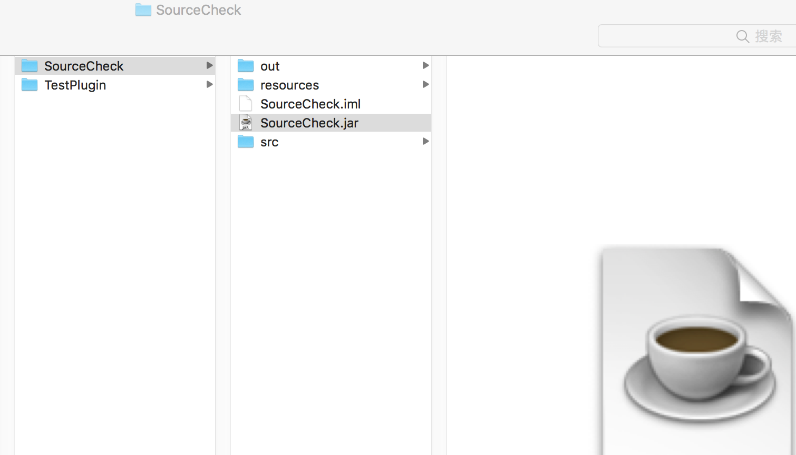
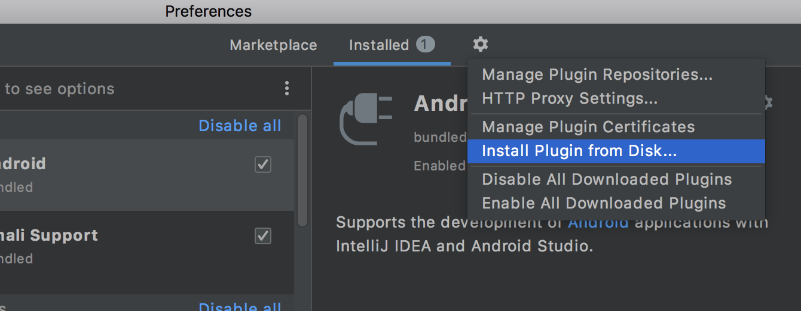
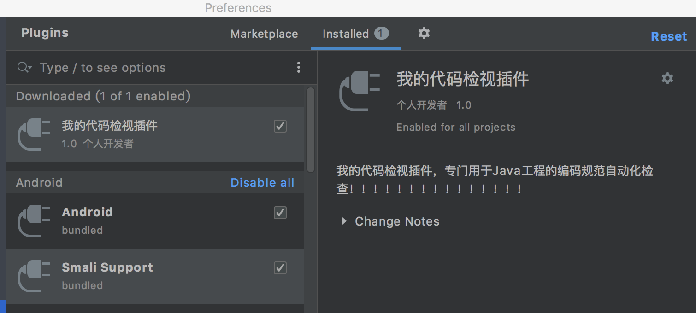

## 插件打包与安装

参考[《手把手制作IDEA插件(Demo篇)》](https://zhuanlan.zhihu.com/p/47739355)

基于以上两篇，在开发环境下可以去开发一款插件了，并且在IDEA可以直接运行然后验证，但是我们是最终希望以一个插件包的形式安装到IDEA中的

基于上两篇文章开发的插件，本文展示怎么打包

在IDEA插件工程中。【Build】->【Prepare Plugin Module "SourceCheck" For Deployment】

然后在项目目录下可以看到对应打包得到的jar包

后续就可以使用这个包安装到IDEA 中

【File】->【Settings...】->【Plugins】，在这里可以指定通过刚才打包得到的jar 进行安装

>如果是Mac OS 的话，路径是【IntelliJ IDEA】->【Preferences】->【Plugins】

然后就可以看到已经安装成功了，注意需要点击Apply，否则不生效

通过【Help】->【HelloWorld】菜单可以看到插件运行符合预期

