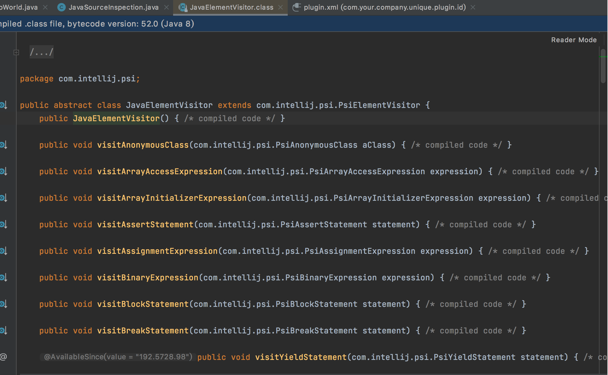
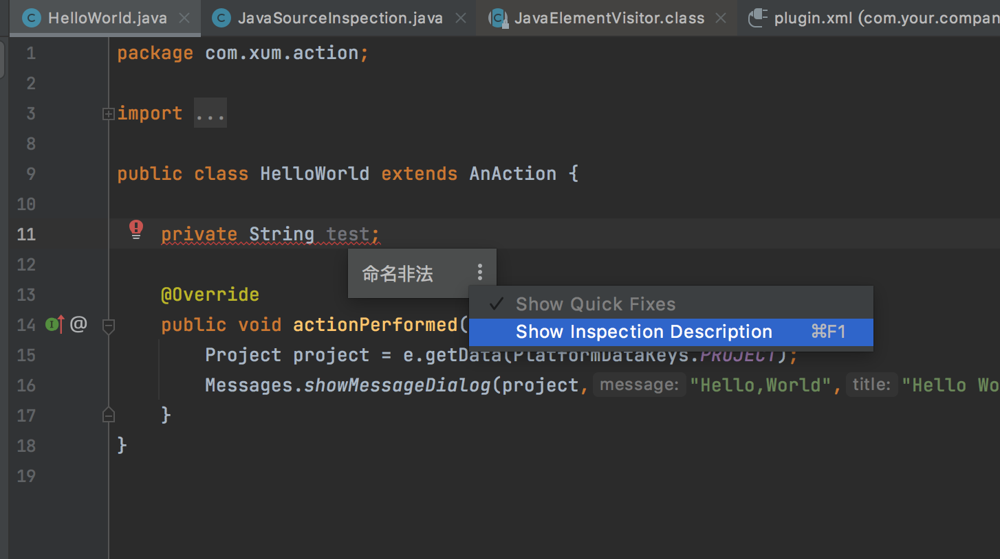

现在进入正题，怎么通过IDEA 的插件实现代码规范的校验

>[基于IDEA2020.1的JAVA代码提示插件开发例子](https://blog.csdn.net/weixin_45781803/article/details/105935826)

>[史上最全idea插件开发入门实战(傻瓜式教程)](https://blog.csdn.net/weixin_43722048/article/details/123786363)

之前的文章是以Action 开发为例，Action用于提供菜单栏，这个菜单的位置在plugin.xml 中配置

如果要开发代码规范检查的插件，那么需要不同的方案，通过实现AbstractBaseUastLocalInspectionTool 可以实现

```java
package com.xum.plugin;

import com.intellij.codeInspection.AbstractBaseUastLocalInspectionTool;
import com.intellij.codeInspection.ProblemsHolder;
import com.intellij.psi.JavaElementVisitor;
import com.intellij.psi.PsiElementVisitor;
import com.intellij.psi.PsiField;
import org.jetbrains.annotations.NotNull;

public class JavaSourceInspection extends AbstractBaseUastLocalInspectionTool
{
    @Override
    public PsiElementVisitor buildVisitor(@NotNull final ProblemsHolder holder, final boolean isOnTheFly){
        JavaElementVisitor javaElementVisitor = new JavaElementVisitor() {
            @Override
            public void visitField(PsiField field) {
                super.visitField(field);
                if (field.getName().equals("test")){
                    holder.registerProblem(field, "命名非法");
                }
            }
        };
        return javaElementVisitor;
    }
}
```

对应在plugin.xml 中增加对应的扩展

```xml
  <extensions defaultExtensionNs="com.intellij">
    <localInspection
            id="inspection.JavaSourceInspection"
            language="JAVA"
            shortName="JavaSourceInspection"
            displayName="JavaSourceInspection"
            groupName="JavaSourceInspection"
            enabledByDefault="true"
            level="ERROR"
            implementationClass="com.xum.plugin.JavaSourceInspection"/>
  </extensions>
```

visitField 是对类成员变量的检查，如果想实现对方法、类名、包名等的校验，只需要重写相应的方法就行了。这里的方法有很多



打包之后，重新安装到IDEA 中，可能会遇到这样的报错

```
com.intellij.diagnostic.PluginException: Cannot load class com.xum.plugin.JavaSourceInspection (
  error: com/intellij/codeInspection/AbstractBaseUastLocalInspectionTool,
  classLoader=PluginClassLoader(plugin=PluginDescriptor(name=我的代码检视插件, id=com.your.company.unique.plugin.id, descriptorPath=plugin.xml, path=~/Library/Application Support/JetBrains/IdeaIC2021.1/plugins/SourceCheck.jar, version=1.0, package=null), packagePrefix=null, instanceId=19, state=active)
)
	at com.intellij.ide.plugins.cl.PluginClassLoader.loadClassInsideSelf(PluginClassLoader.java:346)
	at com.intellij.ide.plugins.cl.PluginClassLoader.tryLoadingClass(PluginClassLoader.java:233)
	at com.intellij.serviceContainer.ComponentManagerImplKt.doLoadClass(ComponentManagerImpl.kt:1090)
	at com.intellij.serviceContainer.ComponentManagerImplKt.access$doLoadClass(ComponentManagerImpl.kt:1)
	at com.intellij.serviceContainer.ComponentManagerImpl.instantiateClass(ComponentManagerImpl.kt:781)
	at com.intellij.serviceContainer.LazyExtensionInstance.createInstance(LazyExtensionInstance.java:54)
	at com.intellij.openapi.extensions.CustomLoadingExtensionPointBean.createInstance(CustomLoadingExtensionPointBean.java:29)
	at com.intellij.codeInspection.InspectionEP.instantiateTool(InspectionEP.java:206)
	at com.intellij.codeInspection.ex.InspectionToolWrapper.getTool(InspectionToolWrapper.java:80)
	at com.intellij.codeInspection.ex.InspectionProfileWrapper.checkInspectionsDuplicates(InspectionProfileWrapper.java:61)
	at com.intellij.codeInsight.daemon.impl.LocalInspectionsPass.getInspectionTools(LocalInspectionsPass.java:756)
	at com.intellij.codeInsight.daemon.impl.LocalInspectionsPass.collectInformationWithProgress(LocalInspectionsPass.java:119)
	at com.intellij.codeInsight.daemon.impl.ProgressableTextEditorHighlightingPass.doCollectInformation(ProgressableTextEditorHighlightingPass.java:84)
	at com.intellij.codeHighlighting.TextEditorHighlightingPass.collectInformation(TextEditorHighlightingPass.java:56)
	at com.intellij.codeInsight.daemon.impl.PassExecutorService$ScheduledPass.lambda$doRun$1(PassExecutorService.java:400)
	at com.intellij.openapi.application.impl.ApplicationImpl.tryRunReadAction(ApplicationImpl.java:1096)
	at com.intellij.codeInsight.daemon.impl.PassExecutorService$ScheduledPass.lambda$doRun$2(PassExecutorService.java:393)
	at com.intellij.openapi.progress.impl.CoreProgressManager.registerIndicatorAndRun(CoreProgressManager.java:688)
	at com.intellij.openapi.progress.impl.CoreProgressManager.executeProcessUnderProgress(CoreProgressManager.java:634)
	at com.intellij.openapi.progress.impl.ProgressManagerImpl.executeProcessUnderProgress(ProgressManagerImpl.java:64)
	at com.intellij.codeInsight.daemon.impl.PassExecutorService$ScheduledPass.doRun(PassExecutorService.java:392)
	at com.intellij.codeInsight.daemon.impl.PassExecutorService$ScheduledPass.lambda$run$0(PassExecutorService.java:368)
	at com.intellij.openapi.application.impl.ReadMostlyRWLock.executeByImpatientReader(ReadMostlyRWLock.java:167)
	at com.intellij.openapi.application.impl.ApplicationImpl.executeByImpatientReader(ApplicationImpl.java:178)
	at com.intellij.codeInsight.daemon.impl.PassExecutorService$ScheduledPass.run(PassExecutorService.java:366)
	at com.intellij.concurrency.JobLauncherImpl$VoidForkJoinTask$1.exec(JobLauncherImpl.java:188)
	at java.base/java.util.concurrent.ForkJoinTask.doExec(ForkJoinTask.java:290)
	at java.base/java.util.concurrent.ForkJoinPool$WorkQueue.topLevelExec(ForkJoinPool.java:1020)
	at java.base/java.util.concurrent.ForkJoinPool.scan(ForkJoinPool.java:1656)
	at java.base/java.util.concurrent.ForkJoinPool.runWorker(ForkJoinPool.java:1594)
	at java.base/java.util.concurrent.ForkJoinWorkerThread.run(ForkJoinWorkerThread.java:183)
Caused by: java.lang.NoClassDefFoundError: com/intellij/codeInspection/AbstractBaseUastLocalInspectionTool
	at java.base/java.lang.ClassLoader.defineClass2(Native Method)
	at java.base/java.lang.ClassLoader.defineClass(ClassLoader.java:1109)
	at com.intellij.util.lang.UrlClassLoader.consumeClassData(UrlClassLoader.java:276)
	at com.intellij.util.lang.ZipResourceFile.findClass(ZipResourceFile.java:119)
	at com.intellij.util.lang.JarLoader.findClass(JarLoader.java:55)
	at com.intellij.util.lang.ClassPath.findClassInLoader(ClassPath.java:224)
	at com.intellij.util.lang.ClassPath.findClass(ClassPath.java:183)
	at com.intellij.ide.plugins.cl.PluginClassLoader.loadClassInsideSelf(PluginClassLoader.java:338)
	... 30 more
Caused by: java.lang.ClassNotFoundException: com.intellij.codeInspection.AbstractBaseUastLocalInspectionTool PluginClassLoader(plugin=PluginDescriptor(name=我的代码检视插件, id=com.your.company.unique.plugin.id, descriptorPath=plugin.xml, path=~/Library/Application Support/JetBrains/IdeaIC2021.1/plugins/SourceCheck.jar, version=1.0, package=null), packagePrefix=null, instanceId=19, state=active)
	at com.intellij.ide.plugins.cl.PluginClassLoader.loadClass(PluginClassLoader.java:215)
	at java.base/java.lang.ClassLoader.loadClass(ClassLoader.java:522)
	... 38 more
```

查阅资料，因为plugin.xml 中默认的配置是

```xml
<!-- please see https://plugins.jetbrains.com/docs/intellij/plugin-compatibility.html
       on how to target different products -->
<depends>com.intellij.modules.platform</depends>
```

针对IDEA2021.1.3 需要改为

```xml
<depends>com.intellij.modules.java</depends>
```

默认构建的plugin.xml 里面，在depends 上面有一段注释，大概意思就是，请前往注释里面的网站去找到如何根据产品去选择对应的depends，那就很简单了，直接上网页看，里面很多的介绍，以及各种不同的depends是干嘛的。网页里面有这么一段话：

```
(2) The Java language functionality was extracted as a plugin in version 2019.2 of the IntelliJ Platform. This refactoring separated the Java implementation from the other, non-language portions of the platform. Consequently, Java dependencies are expressed differently in plugin.xml depending on the version of the IntelliJ Platform being targeted:

Syntax required for releases prior to 2019.2, allowable in all releases:
plugin.xml include com.intellij.modules.java
Syntax for 2019.2 and later releases:
plugin.xml allowable alternative include com.intellij.java
build.gradle required to include intellij.plugins 'java'
```

大概意思是，从2019.2 版本开始后，java代码相关的支持抽成了一个插件，不包含在默认构建的包里面了


然后比如你创建一个类，有一个成员变量命名为test，就可以看到这样的报错



OK，到目前为止，怎么开发插件的流程已经清晰了，接下来就是把你们团队的编码规范转换成Java 逻辑写到插件里面了

另外，其实还有一个需求，比如点击了菜单之后，可以通过扫描当前的代码，然后输出一份代码检查报告，这个怎么实现？

