下面以《寄梦远方SEASON》这款游戏的UI 系统为切入点，做一些简单的解析、梳理

## 剧情梗概

主角的故事写在日记中，通过一个未来的陌生人阅读主角的日记进行讲述

主角来自山间的一个小村庄，这个小村庄里面的人从来没有离开过。主角的朋友做了一个梦，长老解读这个梦意味着季节很快就会结束，世界将迈入一个新时代，每个人都很害怕

这个即将结束的季节是什么？为什么它会终结？究竟是什么能让世界发生天翻地覆的变化？

主角问长老自己是否可以离开，长老只说了一个条件：主角必须将自己收集的东西送到博物馆保险库，一个地处世界边缘的艺术和记忆之殿堂。那里是唯一不受季节变化影响的地方

主角与母亲告别，然后开启了离家之路……

>游戏中所说的Season，并不是我们所理解的春夏秋冬季节，应该指的是时代？

## 物品交互UI

比如到桌子前，可以通过UI 让玩家选择桌子上的物品，并且每个选择会对应提示应该按下手柄的哪个键

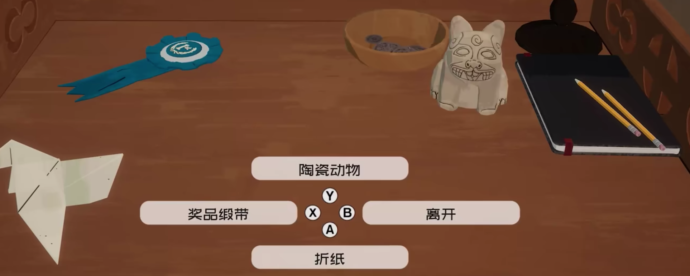

 另外再比如，选择铃铛之后，会有UI 弹出，玩家可以选择接下来怎么与铃铛互动

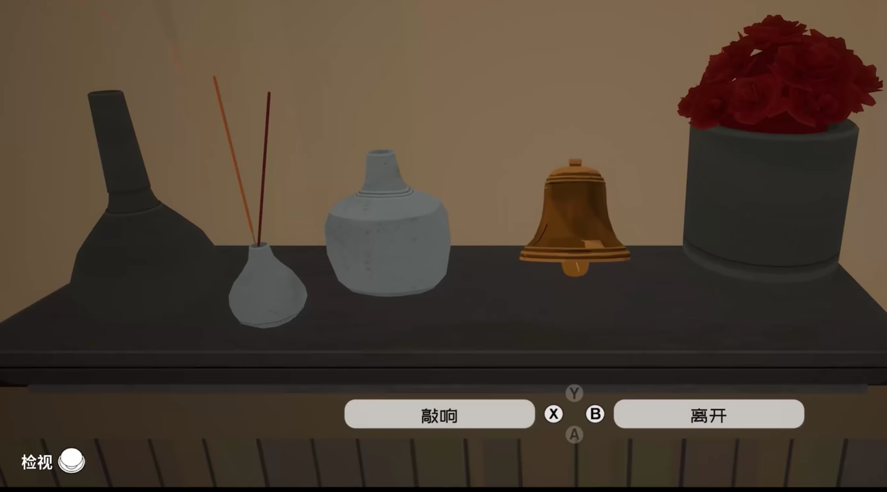

## 详情UI

选择一本书，会弹出UI 对书的内容进行详细介绍

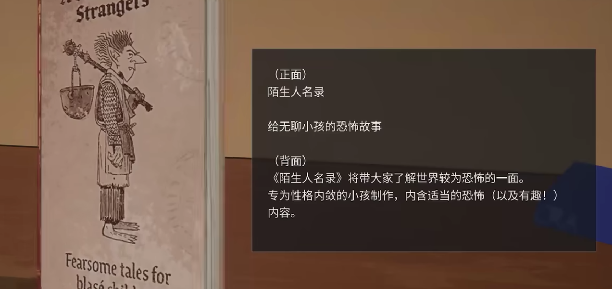

## 玩法选择

比如主角到了客厅之后，UI 弹出各种选择，玩家可以据此作出对应的选择，以此继续接下来的剧情

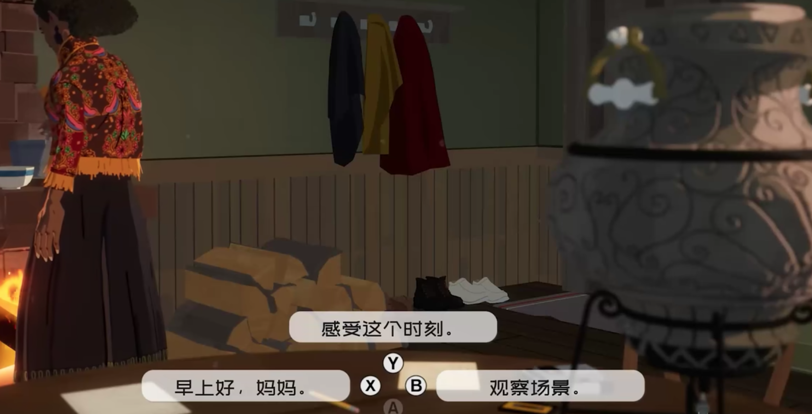

## 对话UI

先是妈妈说，吊坠可以保护主角

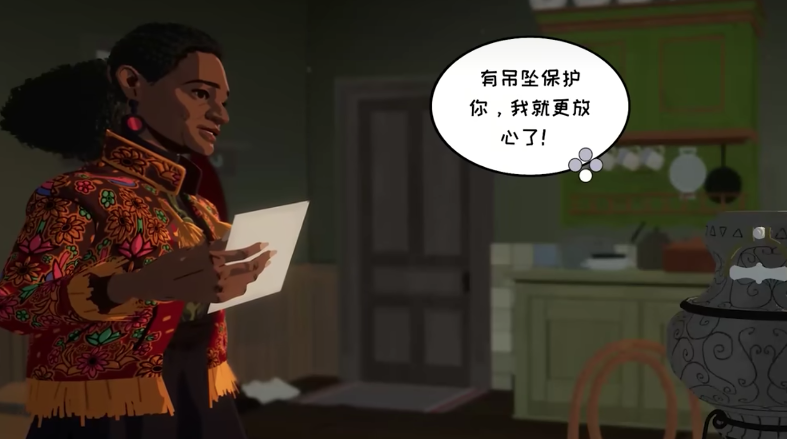

然后主角可以选择下面两句话中的任意一个回答

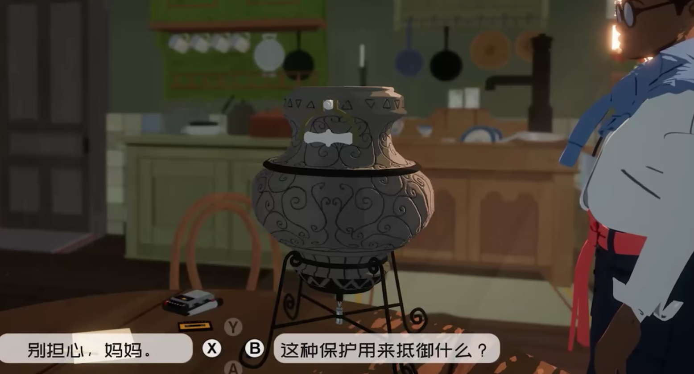

主角选择：这种保护用来抵御什么呢。然后妈妈回答

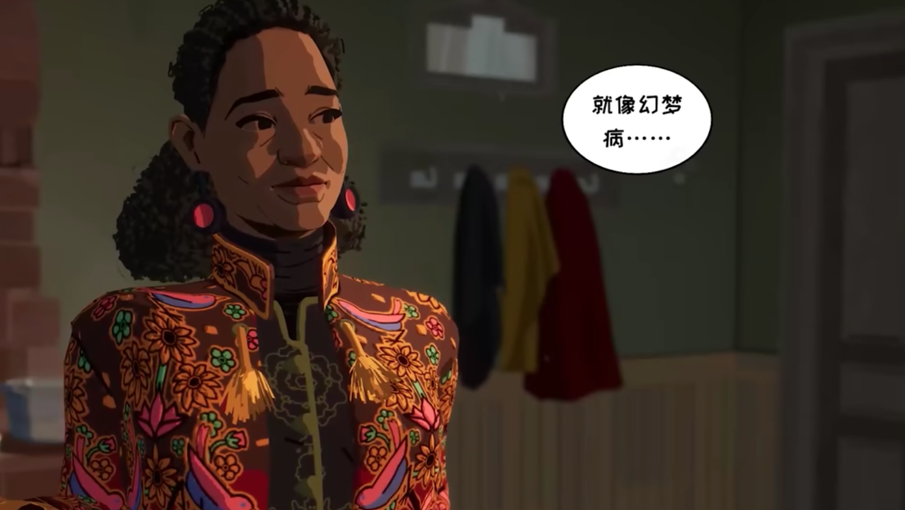

然后主角继续问

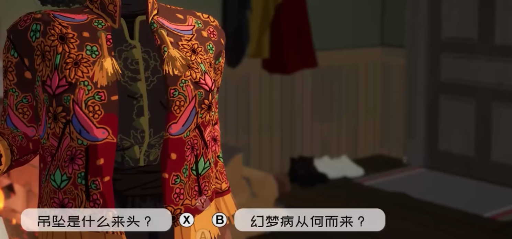

然后继续后续的对话，大概的剧情就是吊坠需要为每个感官收集一个附有感情的物件：听觉、嗅觉、触觉、视觉、味觉；体验那种感觉，并大声说出来关于每个物件的一个记忆；将相应的物件放入油灯。然后对应的人会失去相应的记忆，记忆会转移到吊坠上！

## 日记本UI

类似于常规游戏里面的背包系统一样的UI，显示选择对应的物品

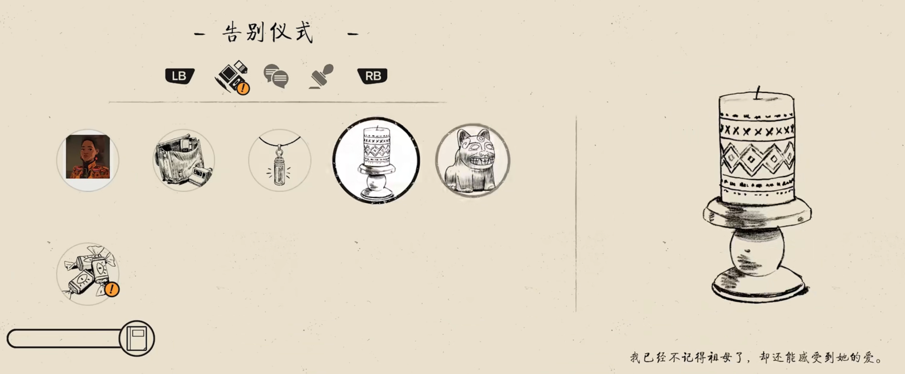

比如选择妈妈的照片，然后可以放到日记本上（可以随意放置、放大、缩小、旋转……）

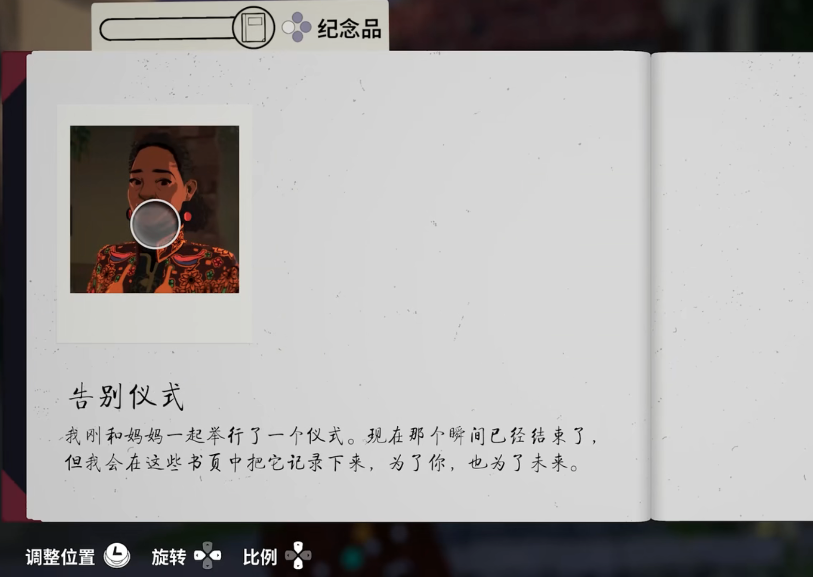

可以看到上面有一个进度条（类似血条），放置足够的纪念品来解锁灵感！

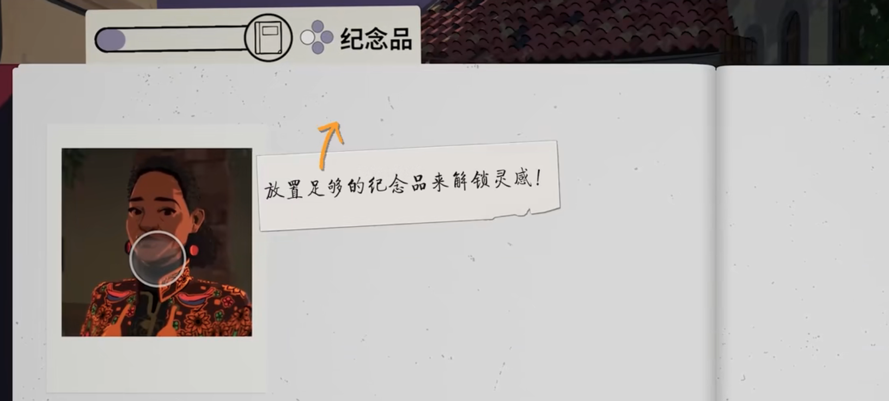

这个游戏的很大的一个玩法点就是拍照贴到日记本上，以及在日记本上写解语，收集花/明信片等物件放到日记本里；另外一个玩点则是骑自行车看沿途的风景

用相机拍下沿途的风景、用录音机录下沿途的声音！

## 游戏加载界面

在场景切换和过渡的时候，会显示如下的UI 界面

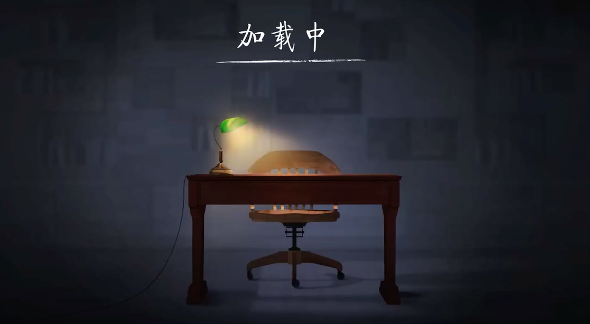

## 手柄交互提醒

主角骑行的时候通过摇杆控制，在界面上会显示一个UI 提示

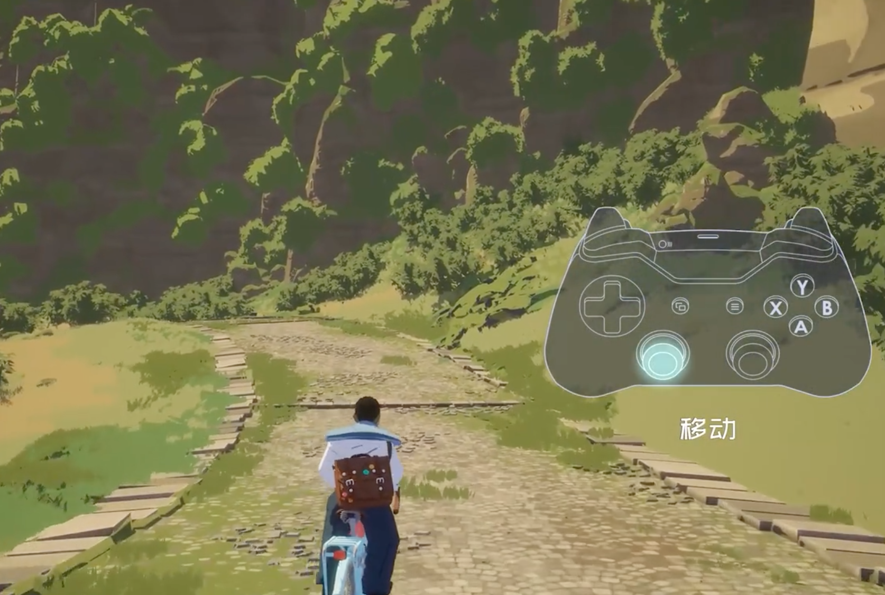

