这个游戏里面的飞行、攀爬、神庙、开放世界、伙伴蛋（呀哈哈）、体力值等元素说实话和塞尔达还是有一点像的！不过美术风格是真的独特，我个人是觉得很美的

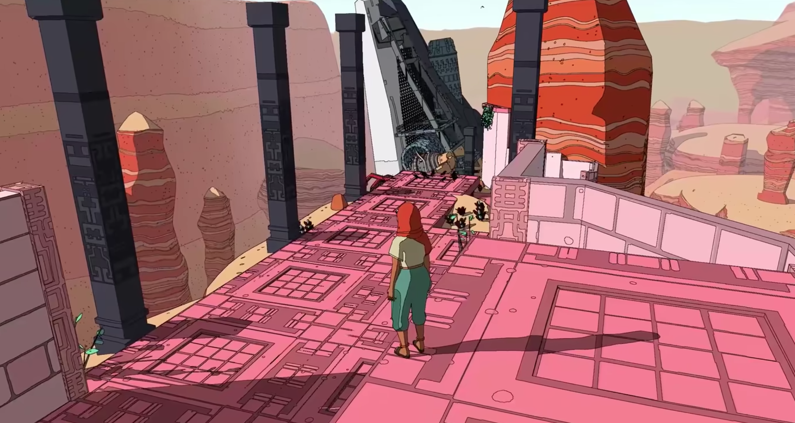

下面的感觉又和宫崎骏的《风之谷》很像

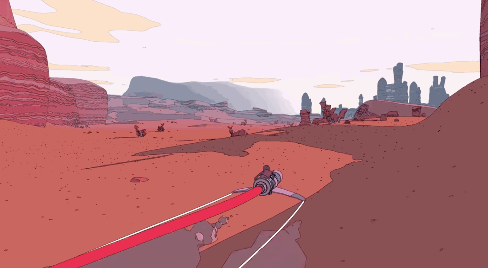

## 菜单界面

在菜单界面可以：继续游戏、新的游戏、加载游戏、游戏设置、退出游戏。界面还是比较简洁的，字体、配色很有质感

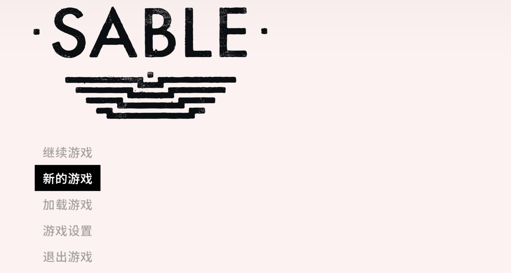

## 操作提示

使用类似对话框的方式提示玩家该怎么操作

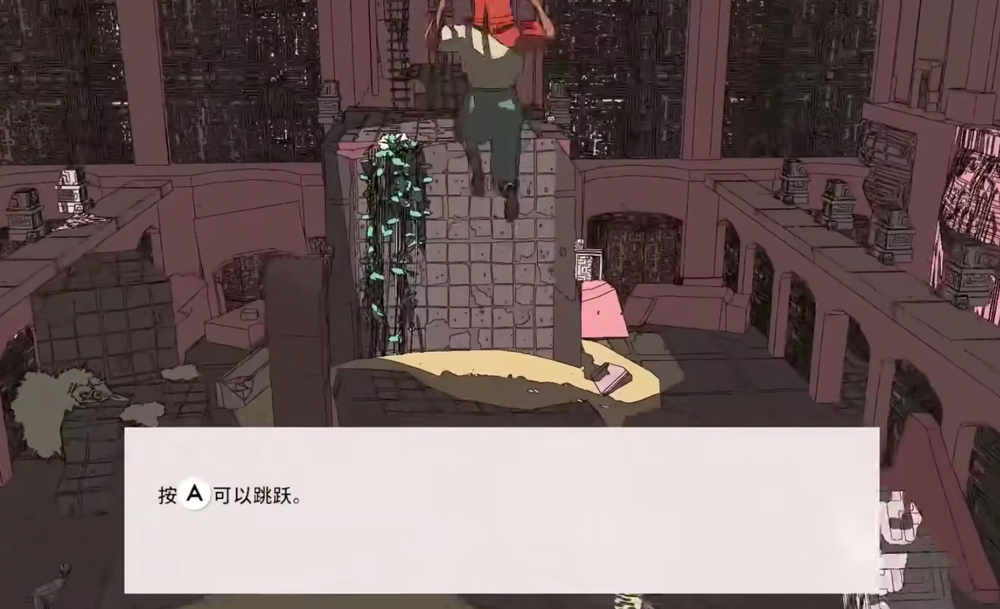

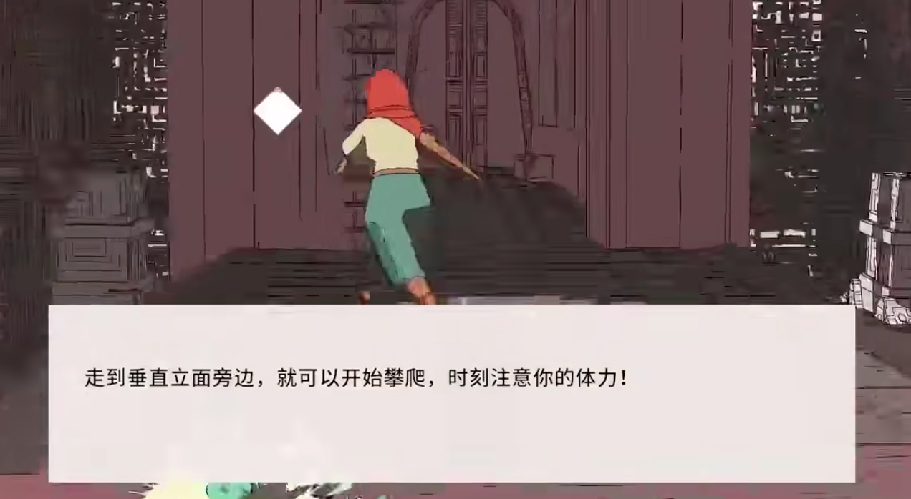

# 对话系统UI

贾迪说话

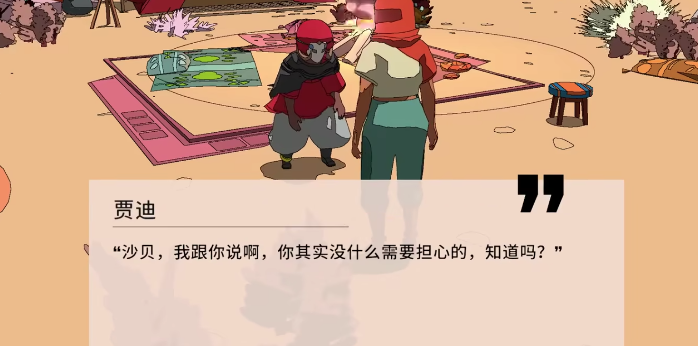

然后沙贝可以选择不同的回答

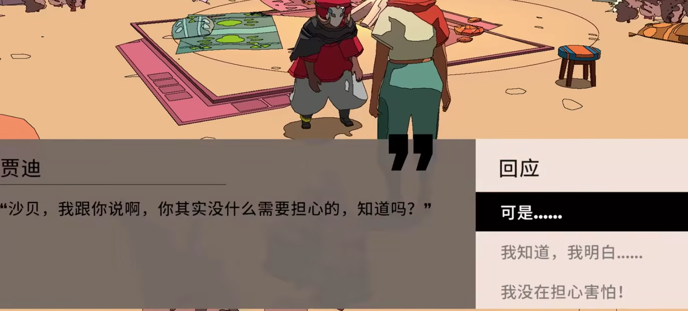

## 地图UI

在这里可以查看地图，以及玩家所在位置

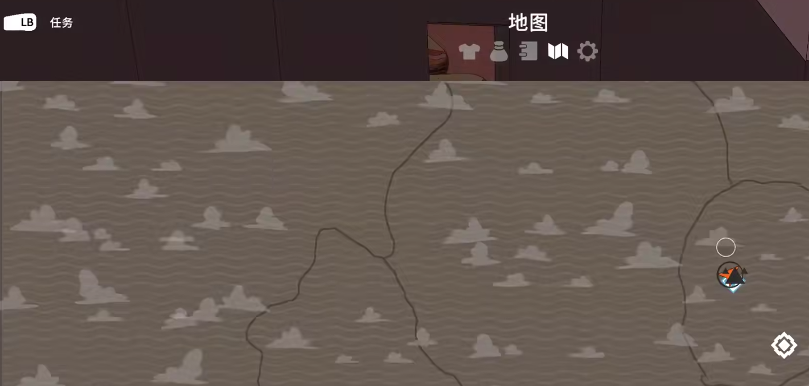

## 任务菜单

在这里可以看到玩家需要完成的任务，以及任务的介绍

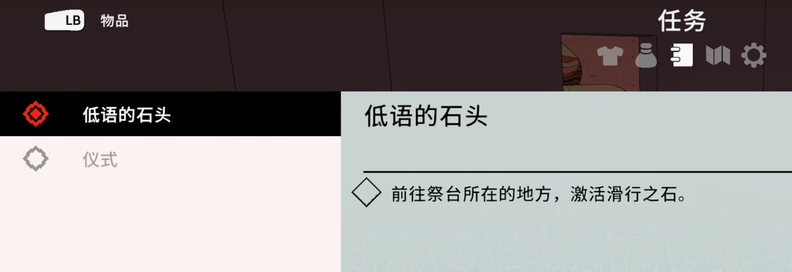

还可以看到已经完成的任务

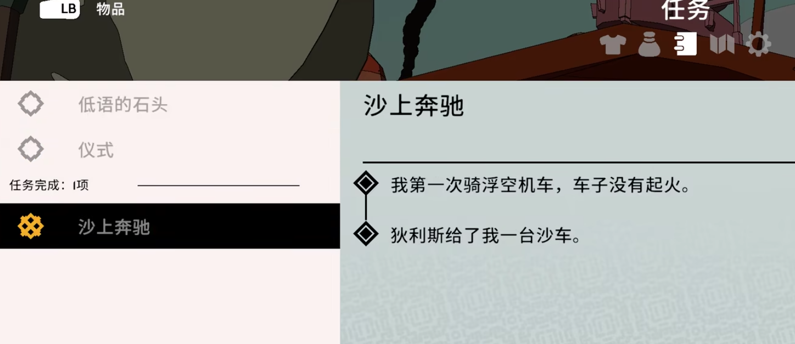

## 选装菜单

在这里可以选择主角的衣服（真的和塞尔达很像）

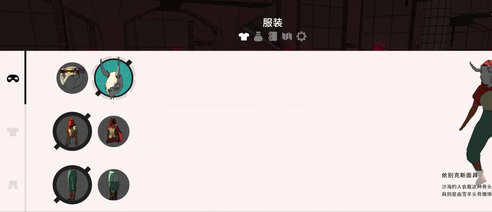

