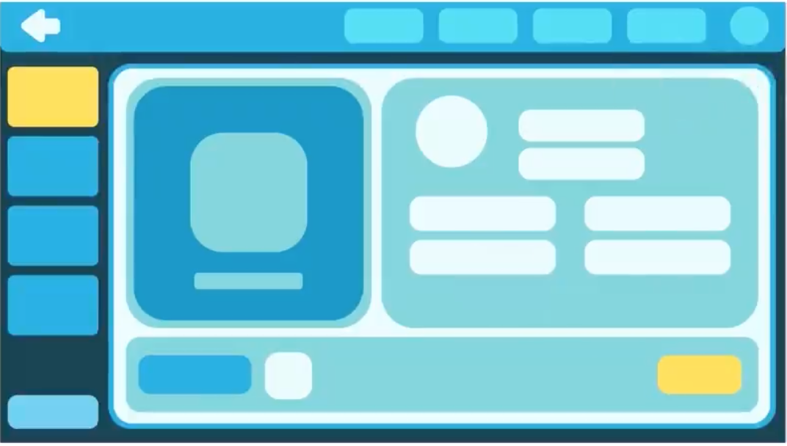
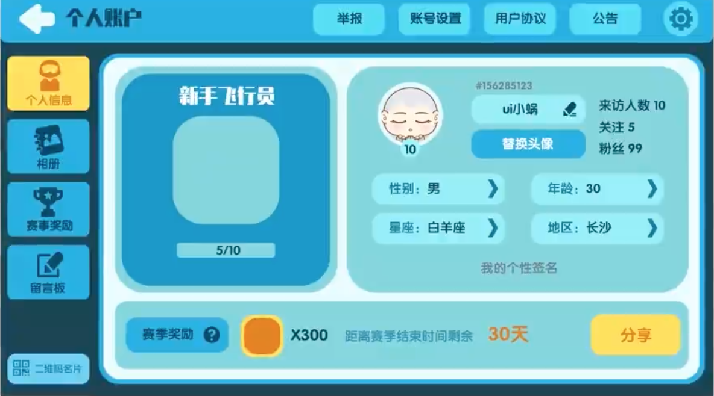
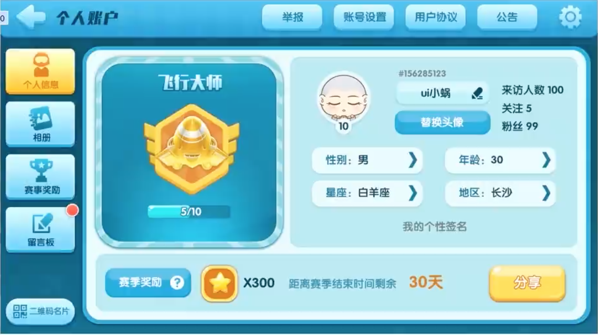

>[https://www.bilibili.com/video/BV1nA411j7Ur](https://www.bilibili.com/video/BV1nA411j7Ur)

参考这个视频，简单做一下笔记，当然这个视频中的案例是针对休闲小游戏的，有其局限性

游戏界面设计的步骤

1. 绘制占位符
2. 确定颜色与剪影（整体色调、设计元素、文字）
3. 添加图层样式，制作细节
4. 最后调整

## 绘制占位图

如上图，一块块的纯颜色的区域就是所谓的“占位符”，表示了最终绘制的区域，以及它的大小、位置、形状、颜色等信息

## 确定颜色与剪影

在第一步的基础上继续增加了图标、文字……

## 添加图层样式

在上一步的基础上添加比如渐变叠加、投影、外发光、内发光等，制作出立体感

## 细节优化与调整

