>[https://www.bilibili.com/video/BV1vr4y1w7EB](https://www.bilibili.com/video/BV1vr4y1w7EB)

游戏UI 也需要考虑材质，比如些UI 界面是纸的质感，有些UI 需要玻璃质感……

## 透明玻璃材质

透明玻璃材质的折射和反射非常明显，这类物体透明较高，有很强的透光性、质地光滑，对环境色反应强烈，这类物体大都高光非常明确，能直接反应出光源的颜色

降低【填充】，比如设置为25%，做出来微微透明的感觉

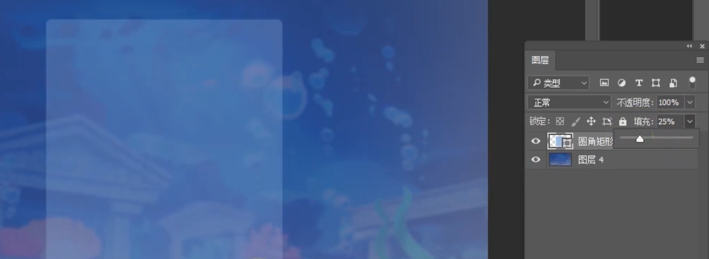

做一点轻微的【内发光】效果，比如设置大小为8 像素

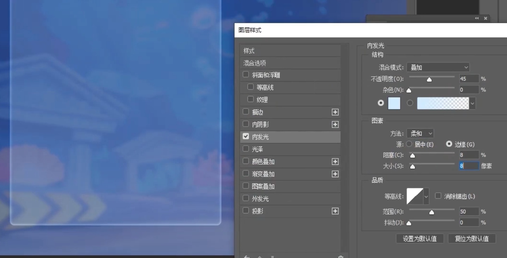

再设置【外发光】，颜色设置为蓝色、大小设置为8 像素

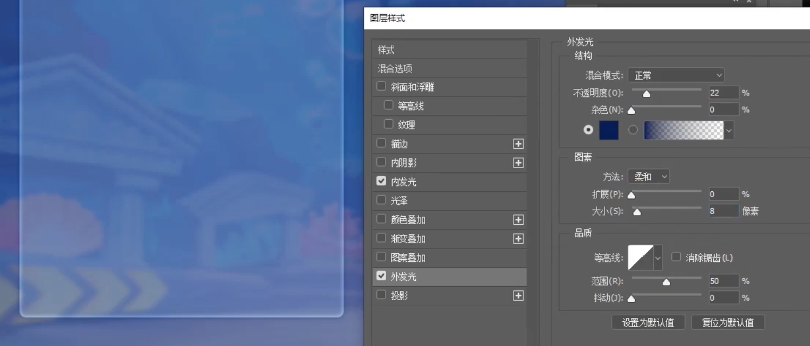

然后通过【蒙版】做高光、反光的效果。在加一个图层，做材质，设置为【叠加】，并设置【填充】为比如35%

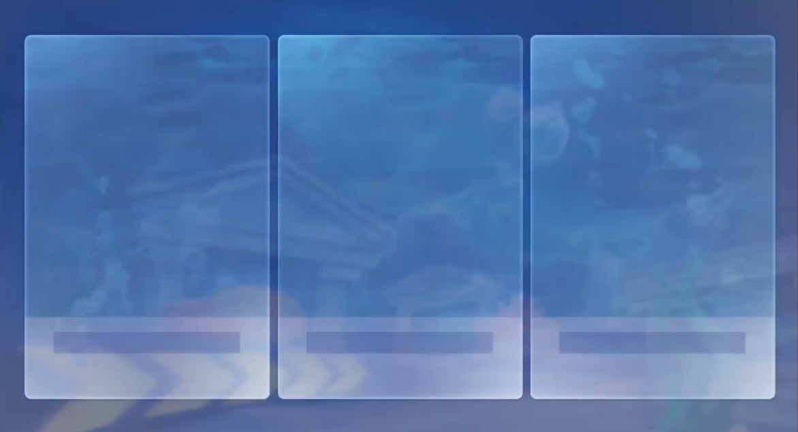

## 木头材质

木头表面是粗糙的质感，比如下面这个简单的Q 版木质效果（这个Q 版的效果还是比较简陋的）

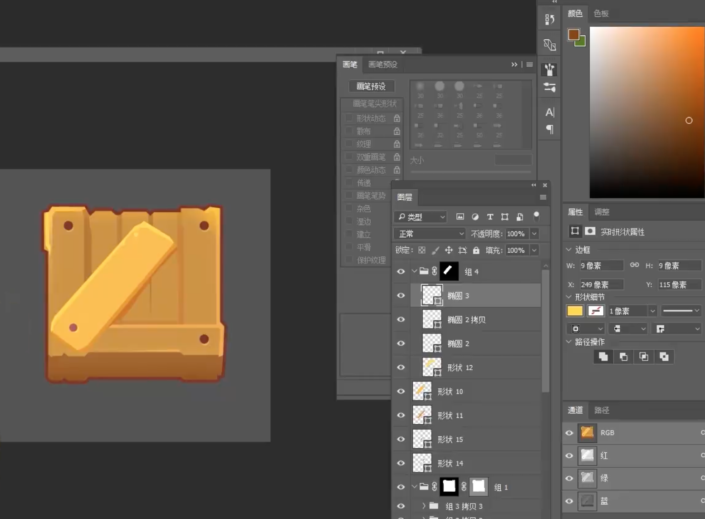

## 纸材质

旧纸张材质在一些神话风格、魔幻风格等的游戏里面是很常用到的！

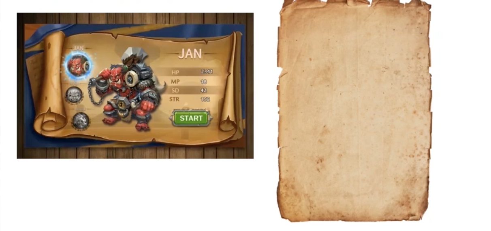

在游戏开发过程中，做模型材质也好，做UI 材质也好，为了有好的视觉效果，其实自己平时多拍一些好的图片素材，然后结合PS 是一个很好的方式，比如可以使用下面的图片配和在PS 中做出来好的纸张材质效果

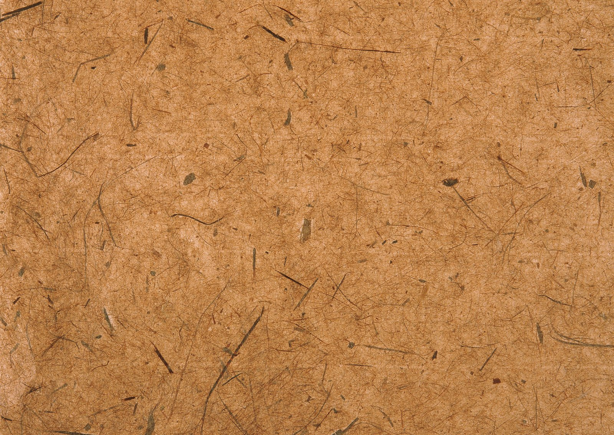

也可以在[花瓣网](https://huaban.com/) 搜索一些云纹等素材，配合PS 做出来纸张的云纹效果

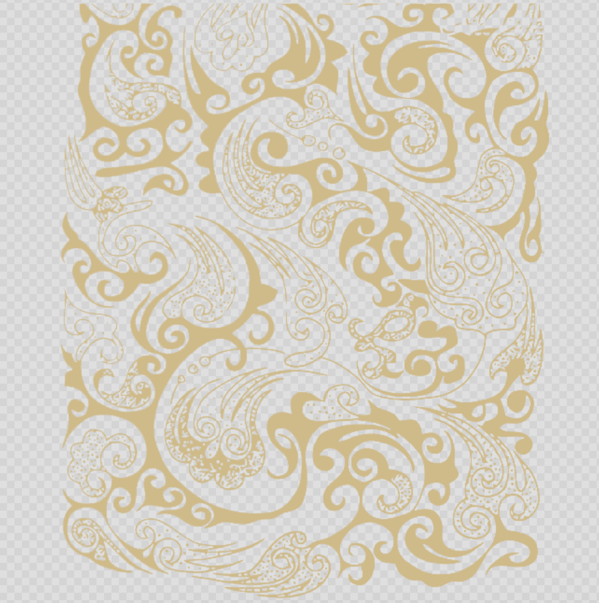

## 金属材质

亮部高光、反光比较强烈，明暗交界线比较重。越光滑的金属，高光、反光、明暗交界处，形状边缘越清晰、锋利；越粗糙的金属表面，颗粒感、材质的体现越强

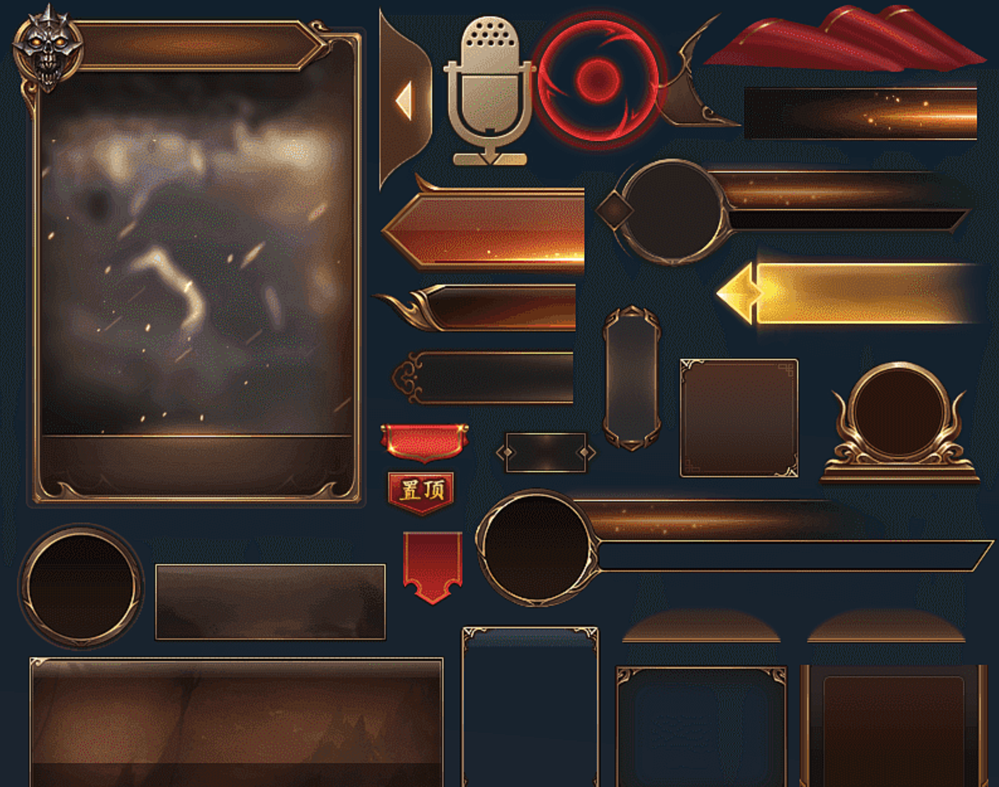

具体的制作过程可以配合一些金属材质贴图在PS 中使用【叠加】方式做出来UI 的金属效果

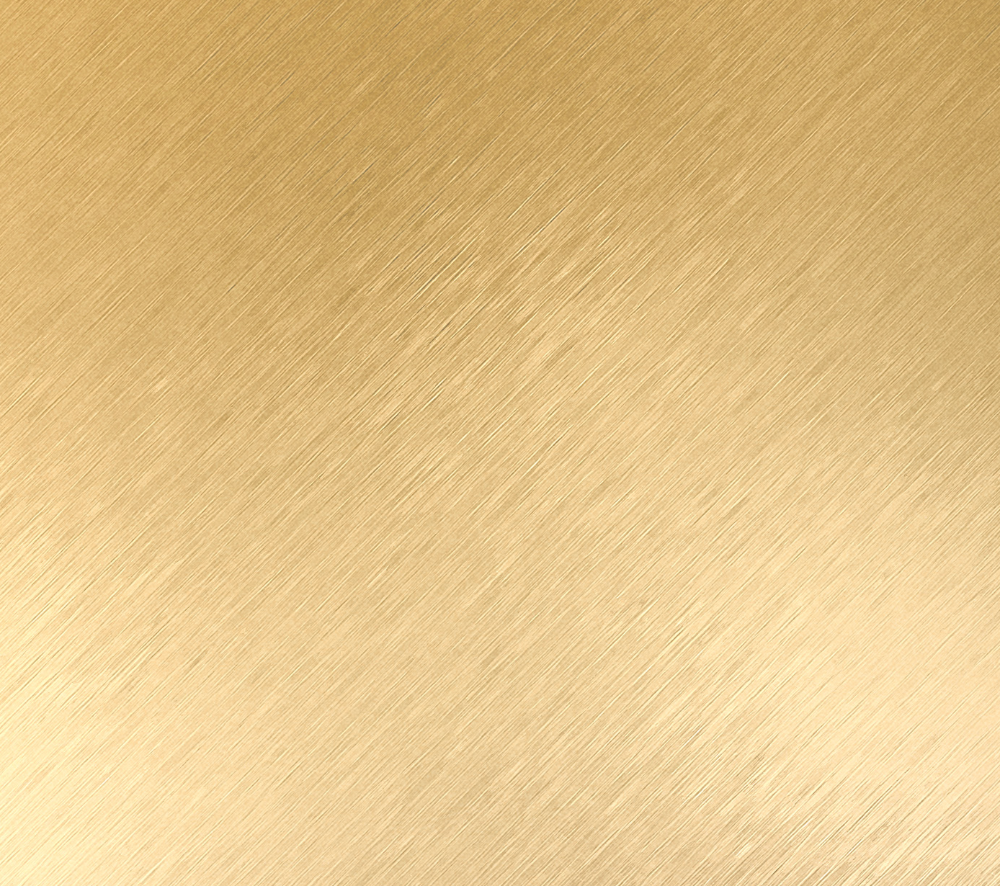

## 布纹材质

布纹在绘制的时候讲究要先把布的主题颜色铺好，前后关系拉开，处理好与周围环境的关系再把亮部一提。提亮部的时候注意前后虚实的处理然后加局部环境色

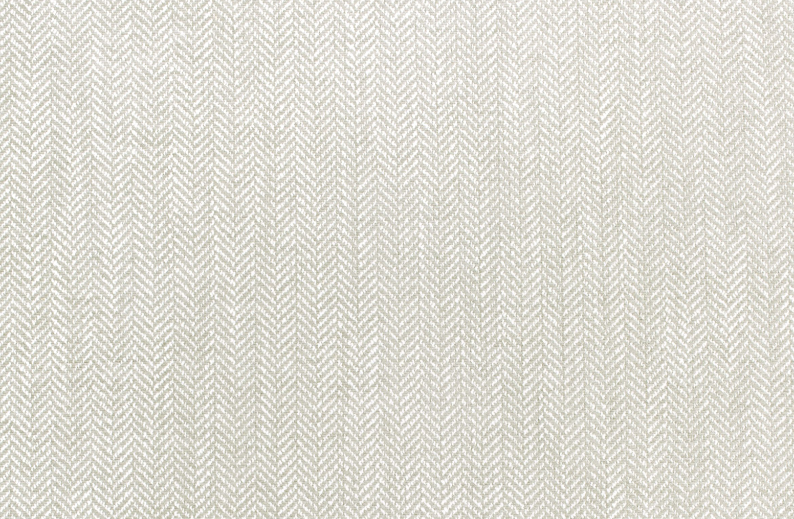

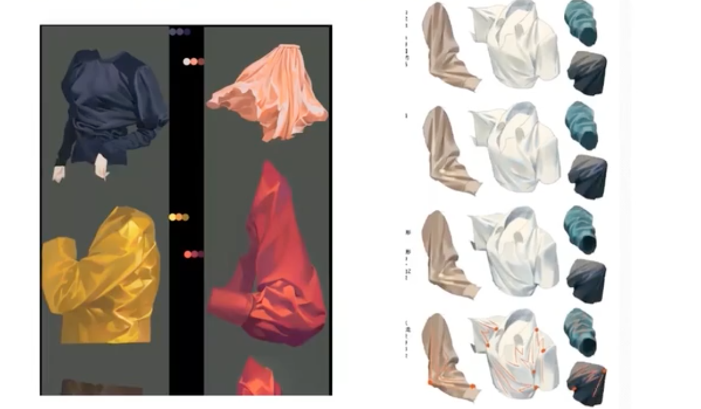

