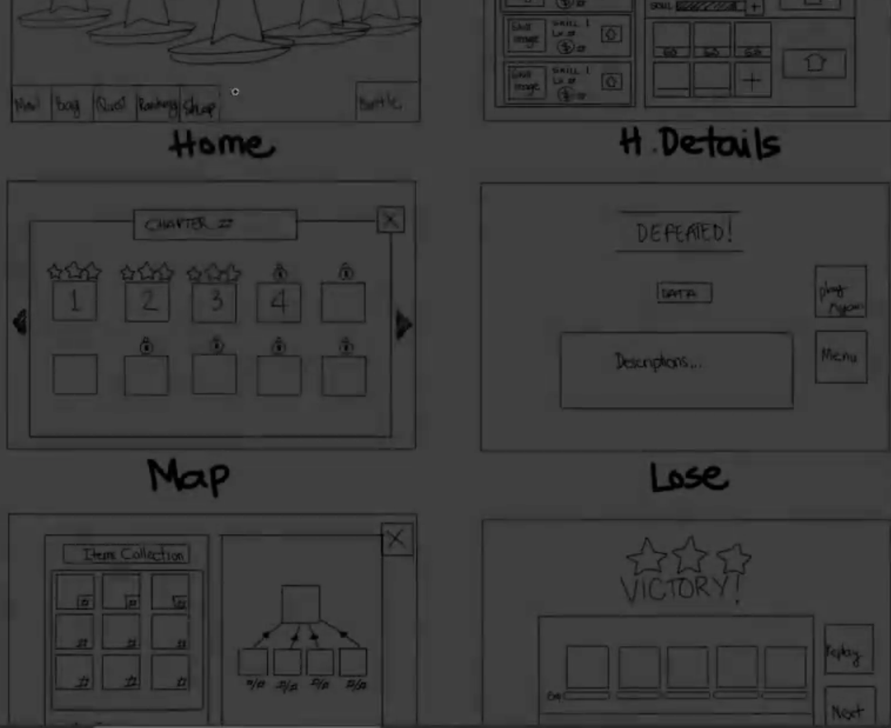
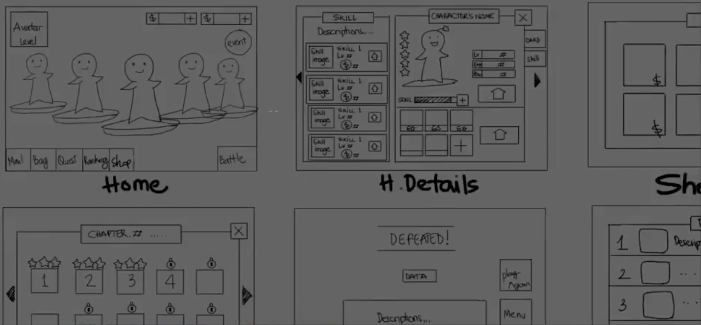
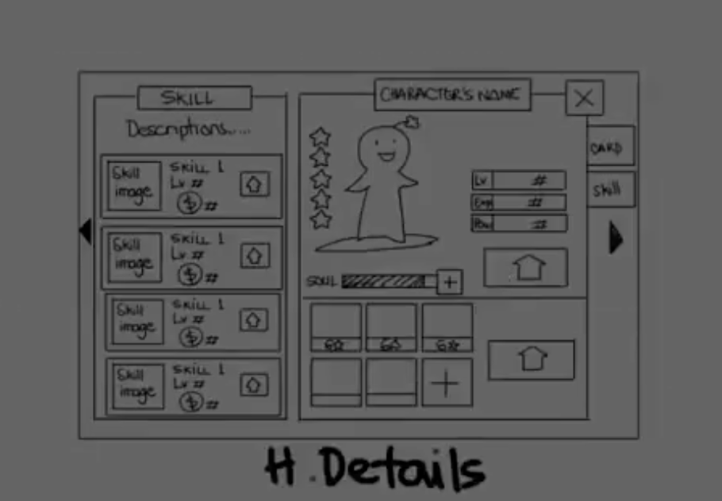
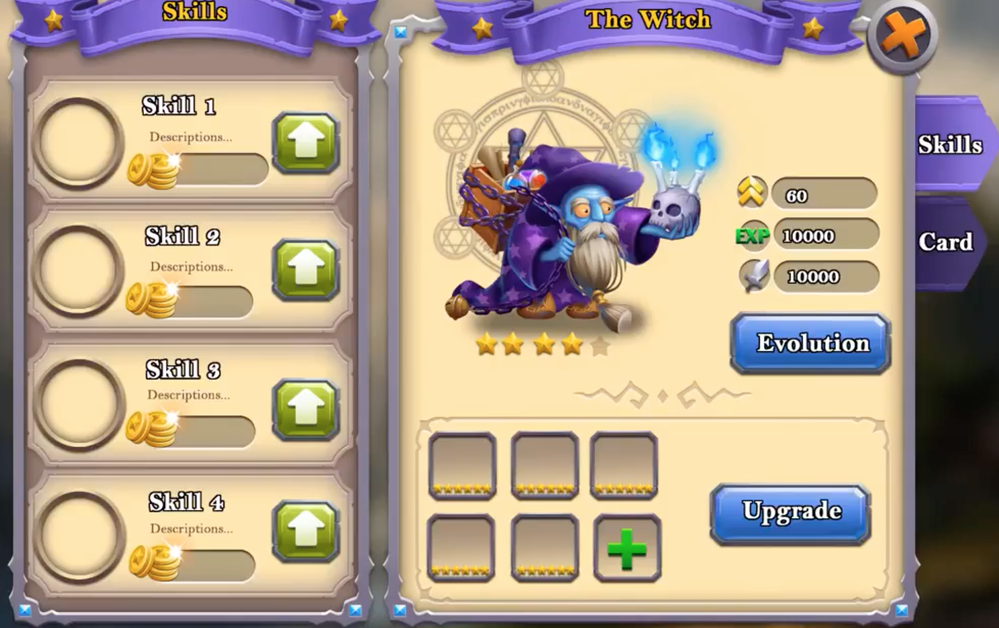

>[界面设计过程](https://www.bilibili.com/video/BV1Hr4y1P7qE)

类似于软件开发，首先要有一个概要设计，把整个游戏的UI 交互流程粗略的绘制出来

然后针对其中的每一个具体的UI 界面再去做详细设计，考虑具体的某个UI 界面需要实现什么功能、需要展示什么信息、需要哪些组件、哪些元素、组件之间的层次关系

最后基于PS 等美术工具制作出来好看的UI 效果

