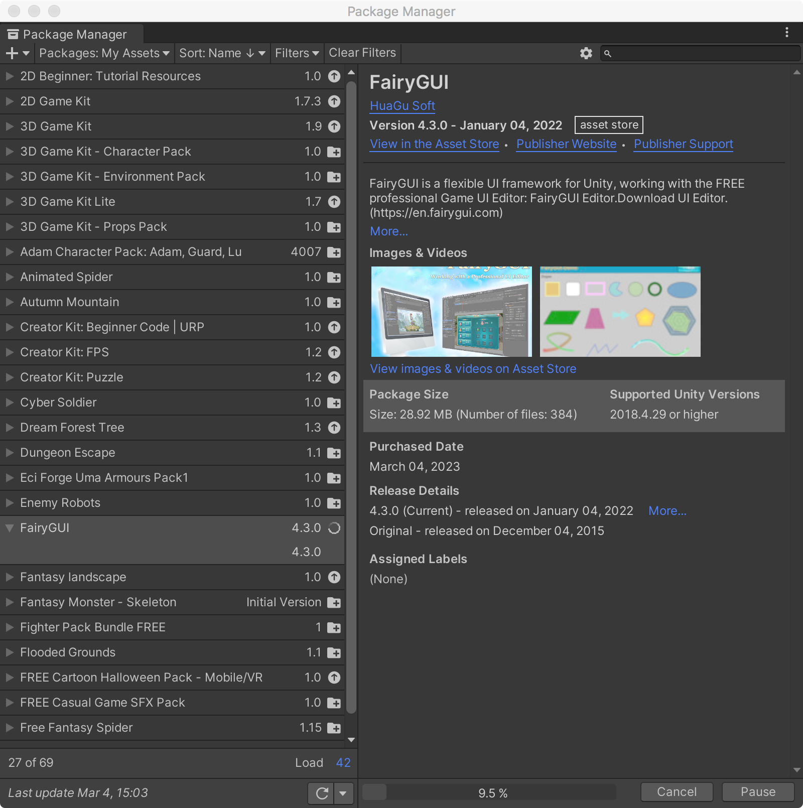
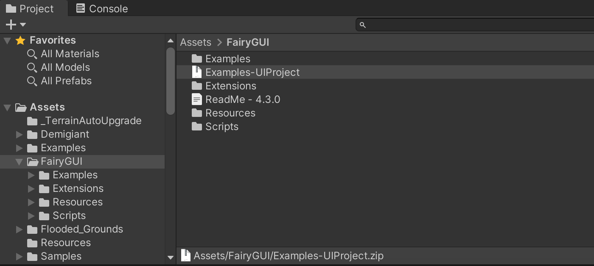
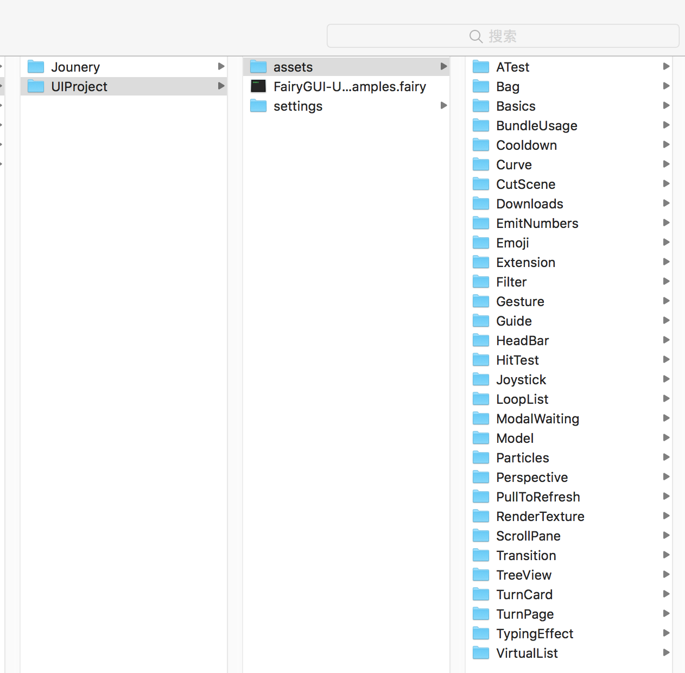
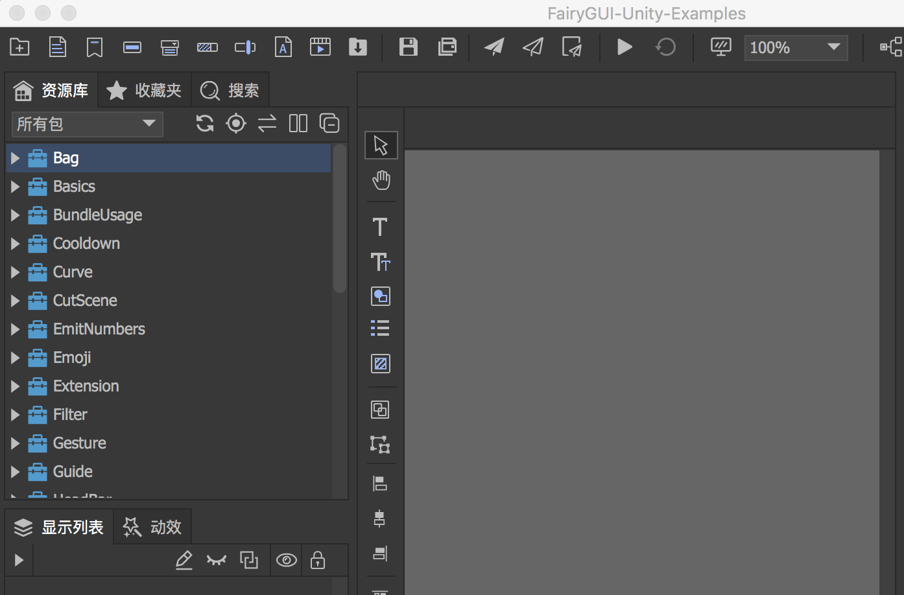
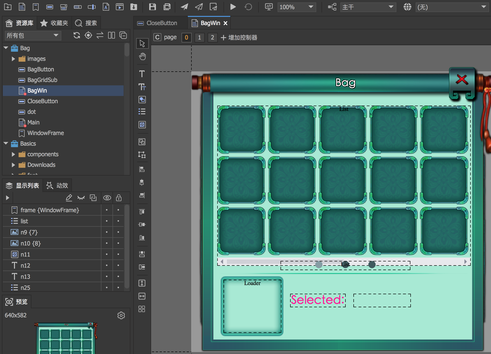
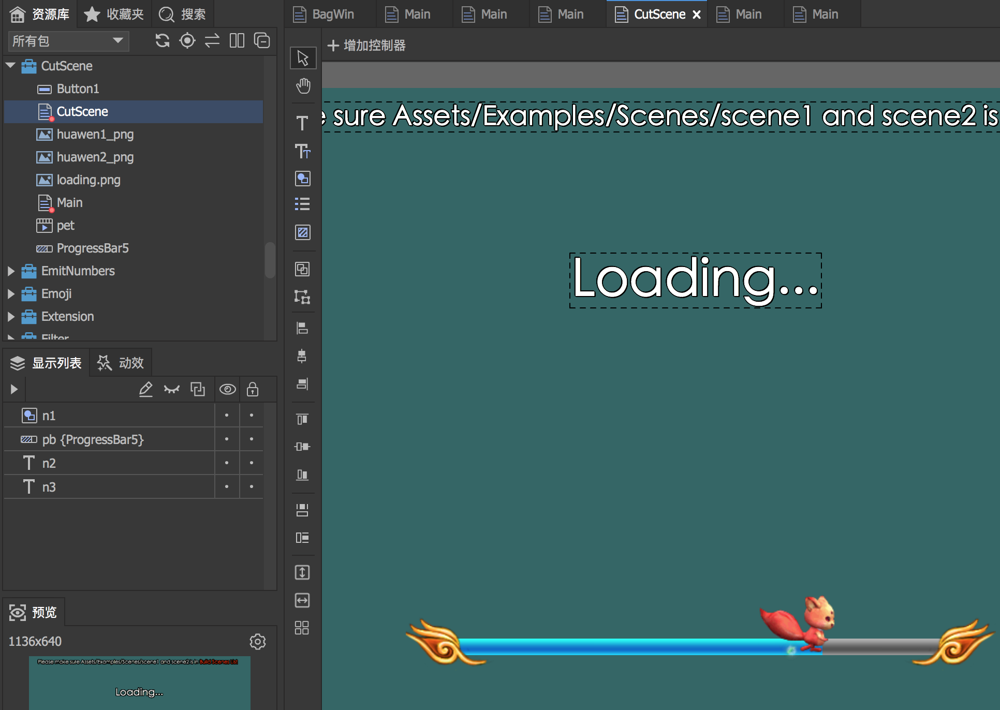
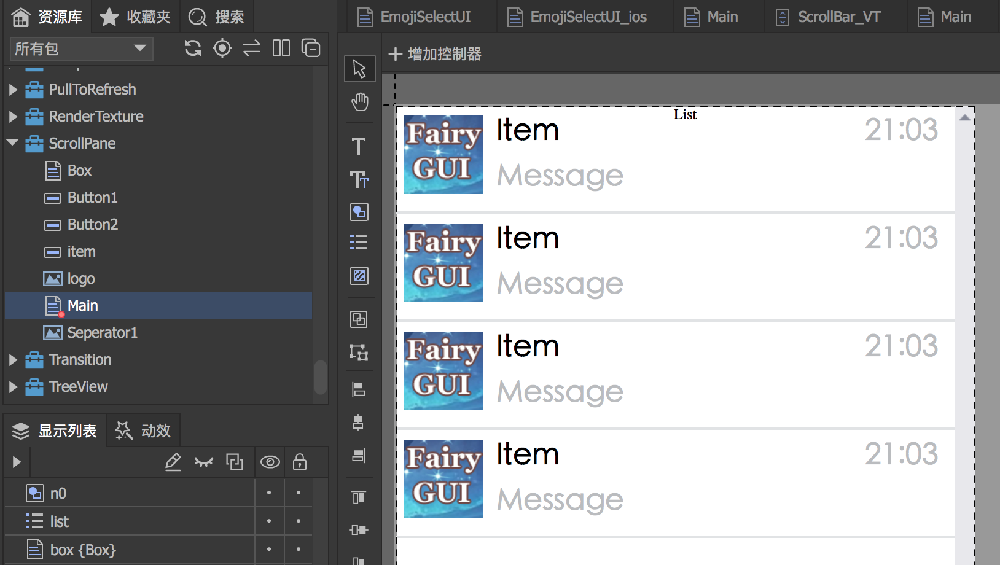

可以直接去Unity Asset Store 下载FairyGUI：[https://assetstore.unity.com/packages/tools/gui/fairygui-49479](https://assetstore.unity.com/packages/tools/gui/fairygui-49479)

下载后，然后可以通过【Window】->【Package Manager】

导入到Unity 之后，其目录结构如下所示，其中Examples-UIProject.zip 是FairyGUI 的工程示例，可以解压后使用FairyGUI 编辑器打开

## FairyGUI 官方示例工程

这个工程实例包括很多的包，如下图所示

然后使用FairyGUI 编辑器打开如下

比如背包系统UI

比如场景切换过渡UI

比如滚动UI

