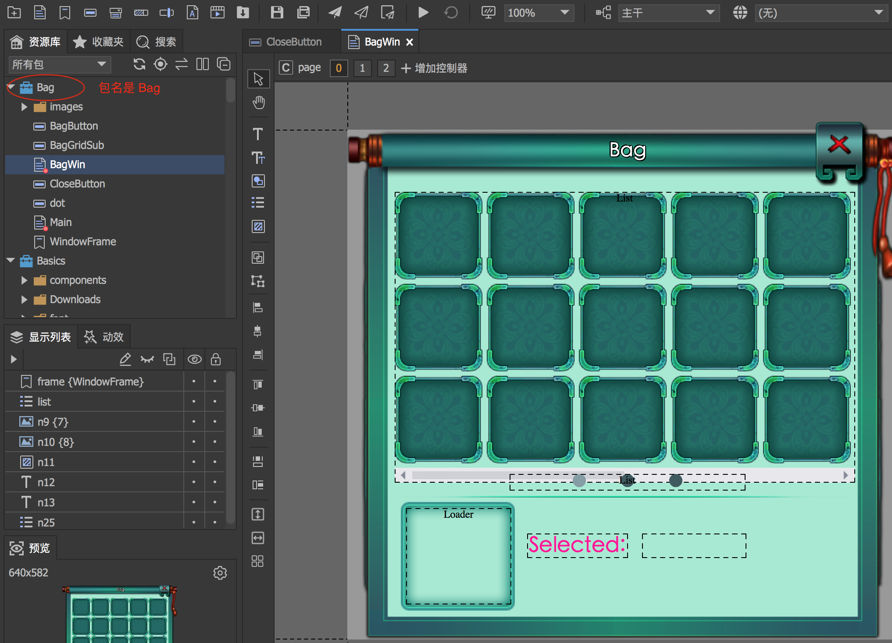
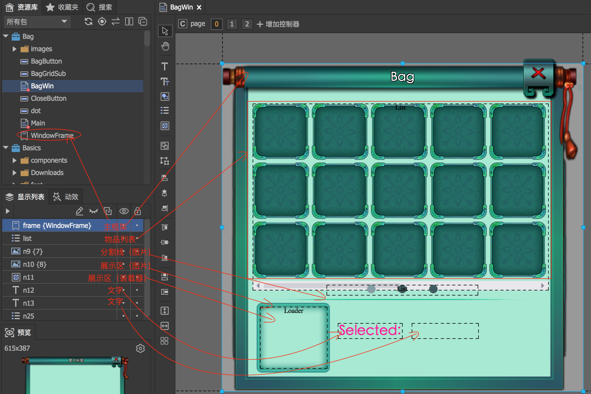
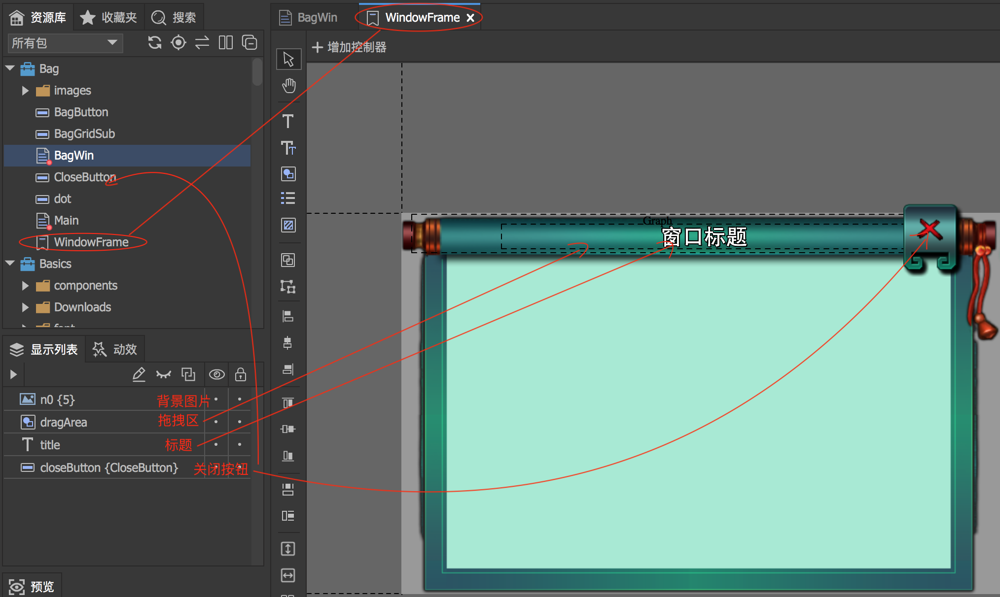
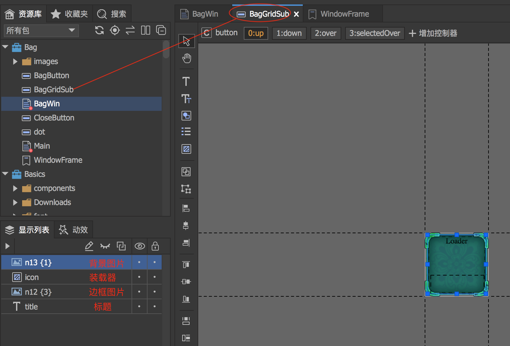
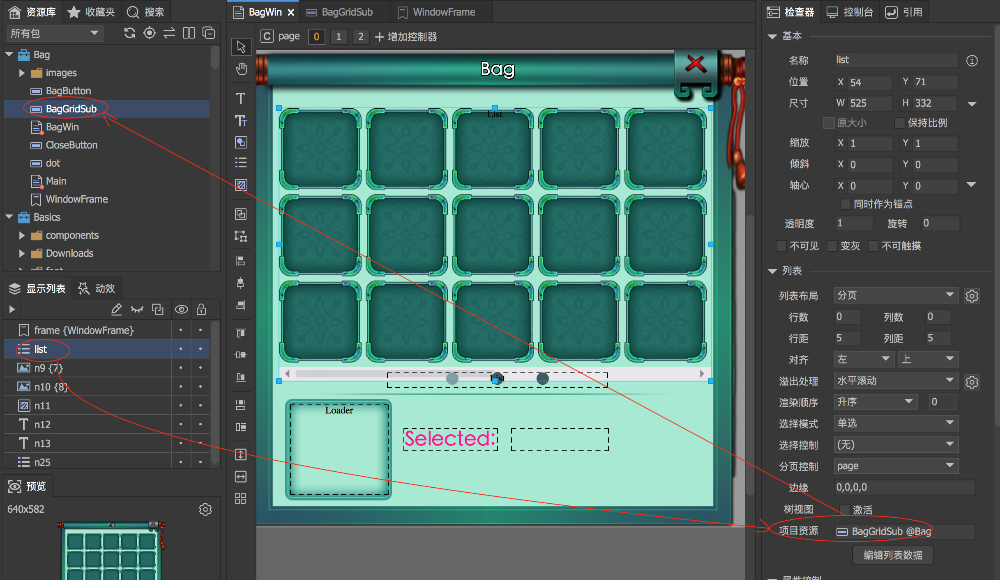
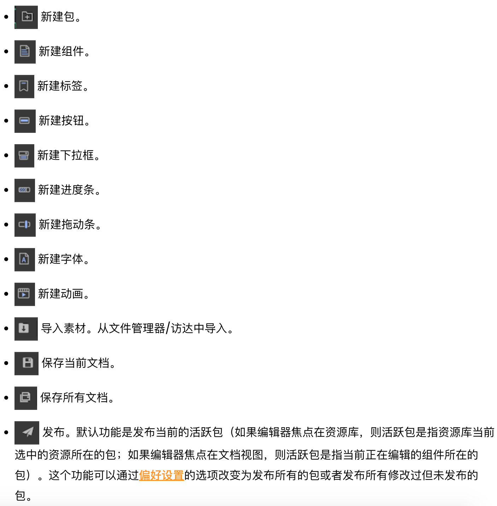
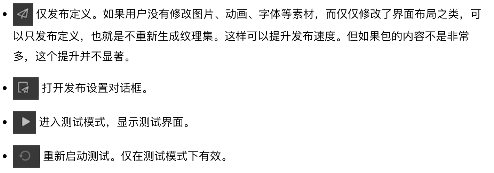
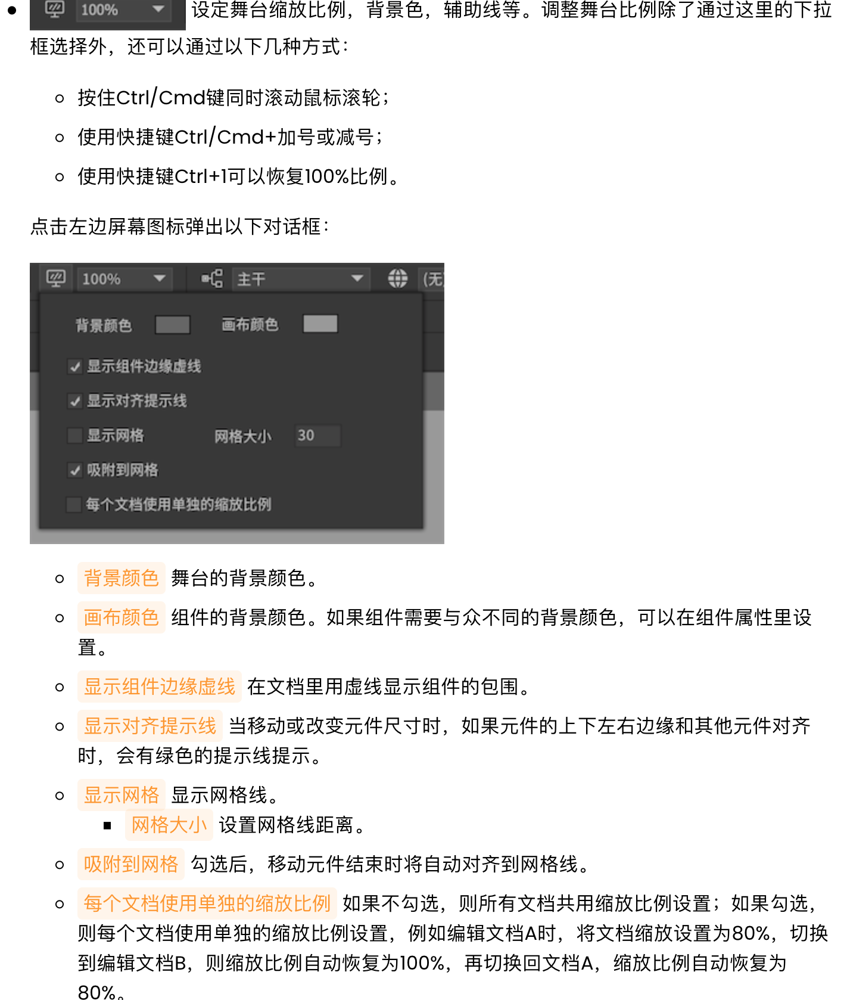
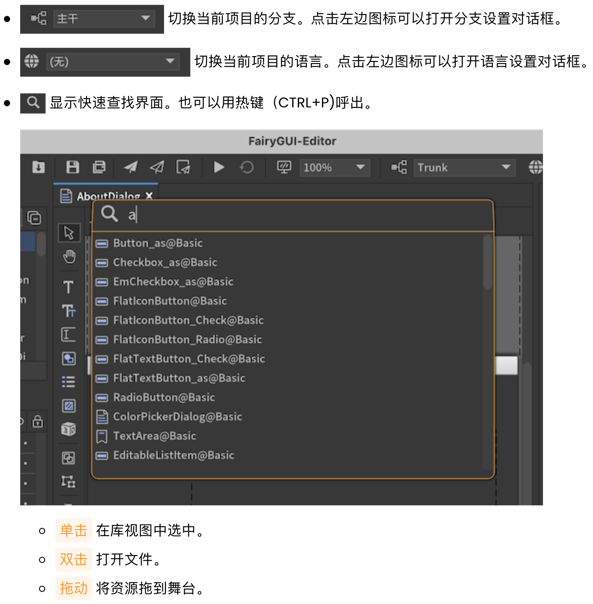
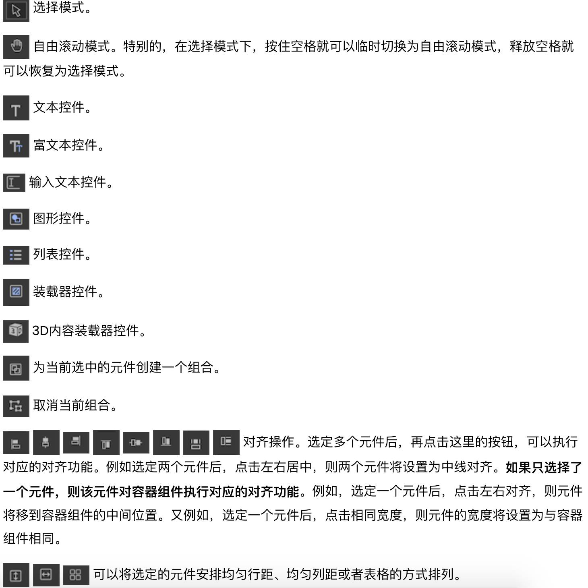

接下来以官方案例中的背包系统UI 为例分析其功能、包结构、交互逻辑等

首先如上图所示，整个背包系统UI 对应的包名是Bag

## 整体结构分析

上图对应的截图是双击打开BagWin 后的效果，所以整个背包UI 的主界面就是BagWin 组件，接下来开始分析这个背包系统的结构和组成

* 主框架：后续会针对这个进行进一步分析，需要双击它看其子结构
* 物品列表：使用list 控件实现背包中物品的显示，接下来双击后继续分析
* 分割线：使用了一个分割线图片
* 展示区：展示区，用于实现点击物品列表中的某一项，在这里展示详情
	* 下面的两个文字控件都是为了配合展示选中物品详情
	* 对应需要实现物品列表中某一项被点击后的事件回调

## frame 主框架分析

双击BagWin 中的frame，其对应Bag 包下面的WindowFrame 【标签】，其结构分析如下图所示

包括背景图片、图拽区控件、标题、关闭按钮

## 物品list 分析

双击BagWin 的物品list，显示的是list 中每一项的结构，其对应Bag 包下面的BagGridSub 组件，其结构如下图所示

list 控件的每一项对应BagGridSub 组件，在这里设置

## Fairy GUI 工具栏介绍

>[FairyGUI 编辑器主工具栏](https://fairygui.com/docs/editor#%E4%B8%BB%E5%B7%A5%E5%85%B7%E6%A0%8F)

在FairyGUI 编辑器上可以看到这些工具

官方文档对这些工具的介绍截图如下

## Fairy GUI 控件介绍

>[FairyGUI 编辑器侧边工具栏](https://fairygui.com/docs/editor#%E4%BE%A7%E5%B7%A5%E5%85%B7%E6%A0%8F)

以下是直接对于官方文档的截图，方便我们理解每个控件的功能，方便我们在做UI 界面的时候选择合适的UI 控件

## 简单总结

结合[《游戏UI 制作思路：UI 制作流程》](http://www.xumenger.com/3-ui-step-20230227/)，以及本文，再复杂的UI 系统，最主要的是先梳理清楚其功能、结构关系、层次关系，然后在FairyGUI 编辑器中可以很方便的实现！

当然也要求开发者尽可能熟悉FairyGUI 的常用控件……

另外，官方提供的这个案例只是展示了功能，其美术质量、与游戏风格的匹配是没有考虑的，这些当然也是我们在做游戏的时候需要考虑的另一个重点！
