上文粗略介绍了FairyGUI 的结构，本文开始使用FairyGUI 只做一个对话系统UI 的demo，具体使用起来看一下效果

实际项目中如果要做游戏UI 系统，工作流程需要参考[《游戏UI 制作思路：UI 制作流程》](http://www.xumenger.com/3-ui-step-20230227/)，本文做的对话系统案例比较简单，所以就先不按照这个流程走，主要参考的是[《游戏UI 案例：沙贝SABLE 的UI 设计解析》](http://www.xumenger.com/2-game-ui-20230226/) 中的UI

## 使用到的UI 素材

>素材来自[花瓣网](https://huaban.com/pins/4435116123)

下载的图片如下图，有边缘空白

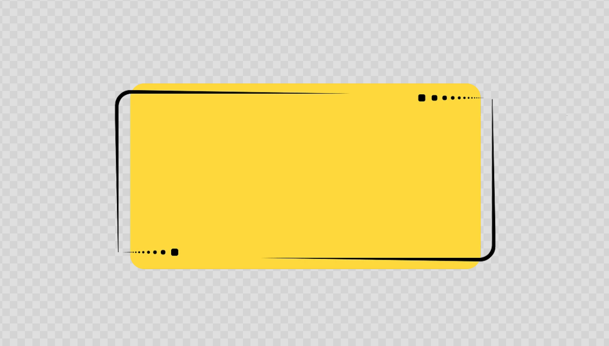

可以在FairyGUI 中【裁剪边缘空白】

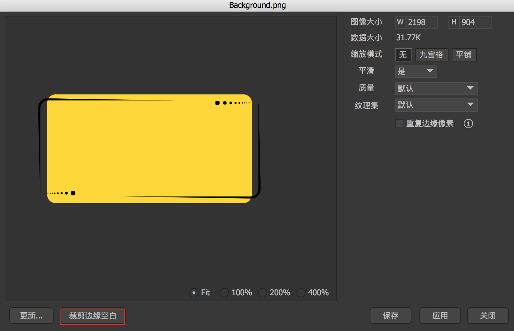

本项目使用到的素材包括，一个对话框图片（如上图）、三个用于按钮不同状态下的图片（如下图）

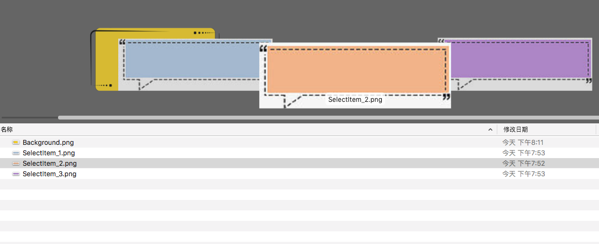

## 包目录结构

结合包结构说明一下对话系统的设计思路，如下图是对话系统的包结构

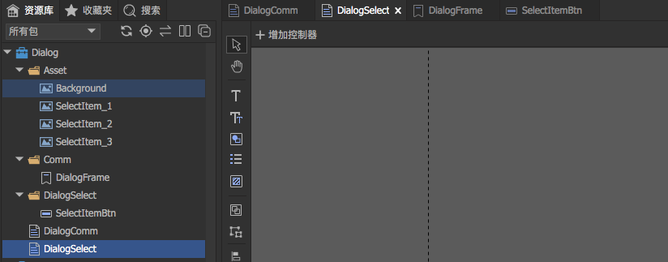

1. Asset 下面放的是使用到的素材，上一节介绍过
2. Comm 下面放置的是一些通用组件，比如这里是不同对话框都共用的
	1. DialogFrame 是一个【标签】，是一个通用的对话框UI 效果
3. DialogSelect 文件夹下放置的是DialogSelect 组件专用的组件
	1. SelectItemBtn 是对话选择按钮，后续会介绍
4. DialogComm 是普通对话UI 组件
5. DialogSelect 是对话选择UI 组件

>UI 工程的包结构管理还是很有必要的，包括各个控件、组件的命名也最好是有其现实含义的。和编程的规范类似

## DialogFrame 标签

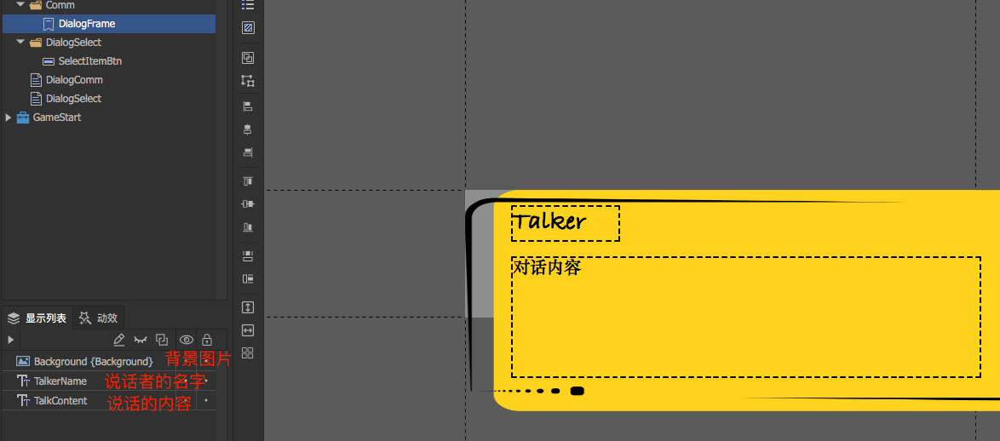

DialogFrame 是给后续DialogComm、DialogSelect 共用的，类似于编程里面抽象出来的通用方法或通用服务

如上图所示，其包括：

1. 背景图，参考素材介绍
2. 一个文本框，显示说话者的名字
	1. 这个是需要在Unity 中动态可设置的
3. 一个文本框，显示说话者说的内容
	1. 这个是需要在Unity 中动态可设置的

>在做UI 的时候，也要考虑哪些是通用的，可以做成公共的库方便使用。同样与编程的规范类似！

## DialogComm 普通对话组件

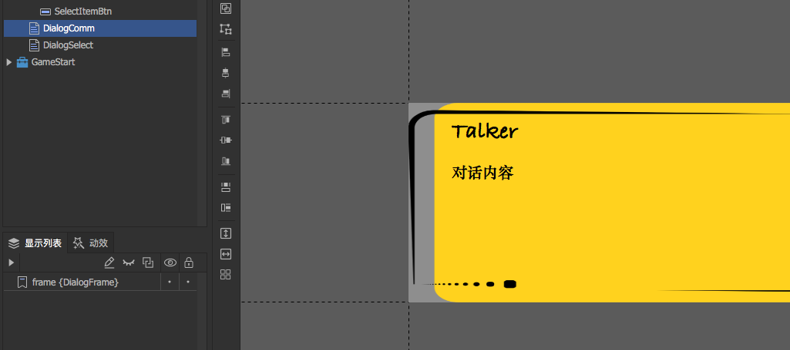

它就很简单，就只是直接引用了DialogFrame 这个通用的UI 元素

## SelectItemBtn选择按钮说明

首先创建按钮的时候，如下图，设置正常状态图片、按下状态图片、鼠标悬浮时图片，使用到的图片参考前面对于素材的介绍

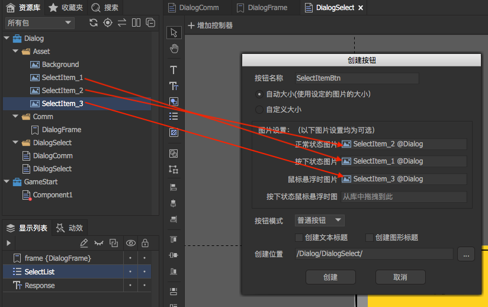

然后看一下这个按钮的结构

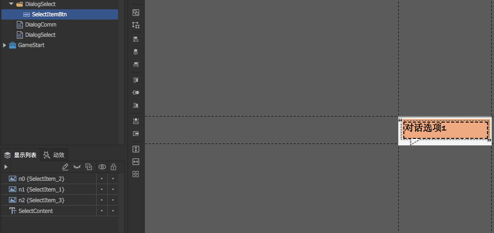

1. n0、n1、n2 对应的就是创建时设置的不同图片
2. 有一个文本，用于展示不同的对话内容选项
	1. 这个是需要在Unity 中动态可设置的
3. 另外需要在Unity 中为按钮点击注册回调逻辑

## DialogSelect 选择对话组件

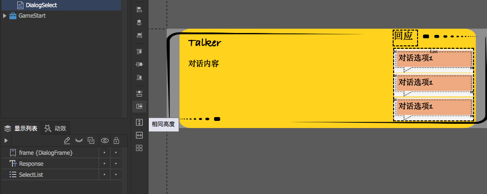

1. 首先也是引用了DialogFrame 这个通用的UI 元素
2. 一个文本，固定是【回应】二字
3. 有一个list，用于展示可以选择的对话内容
	1. 注意这里的每一项的对话内容也都是在游戏运行时可设置的

>显示列表中的内容，排的越靠后，其显示层级越靠前，在视觉上的效果就是后面的内容会挡住前面的内容

## SelectList 组件分析

SelectList 是DialogSelect 控件下的一个组件，List 的每个Item 通过【项目资源】设置，这里设置为SelectItemBtn

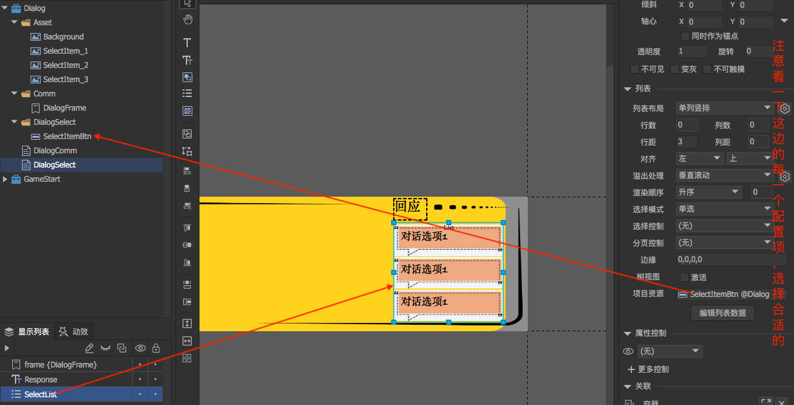

可以通过【编辑列表数据】在FairyGUI 编辑器环境下添加一定数量的条目，方便在编辑环境下看效果

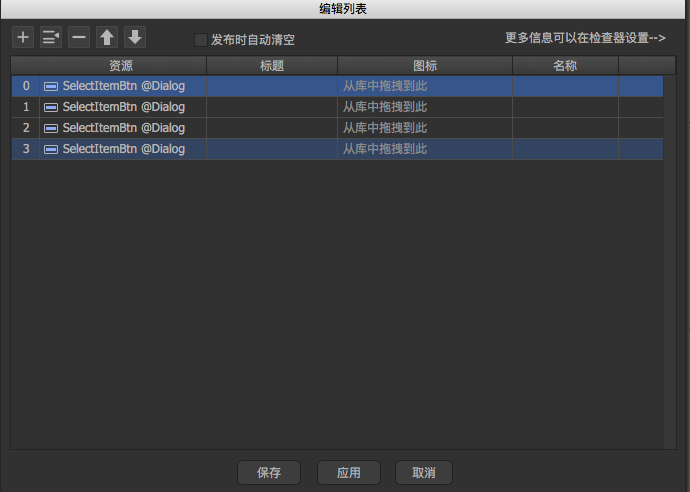

## DialogSelect 运行效果

点击编辑器工具栏上的运行按钮

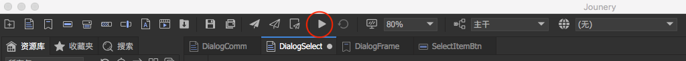

然后运行效果如下

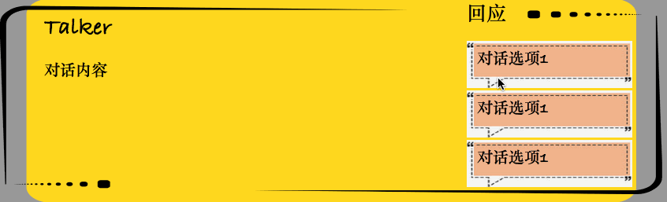

## 特别说明

在具体做UI 的时候，不光要考虑功能、层次结构，还需要考虑各个素材、组件、控件的像素大小以及位置等细节，也还要考虑字体等

另外，这个对话UI 在实现的时候，没有考虑针对不同对话内容长度的UI 适配！
