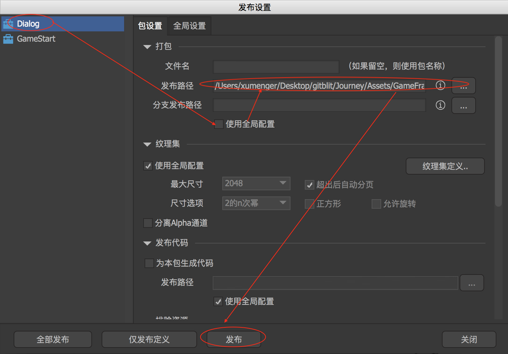
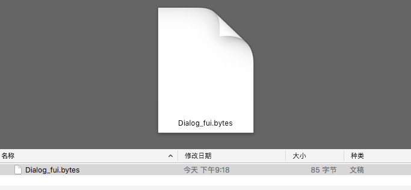
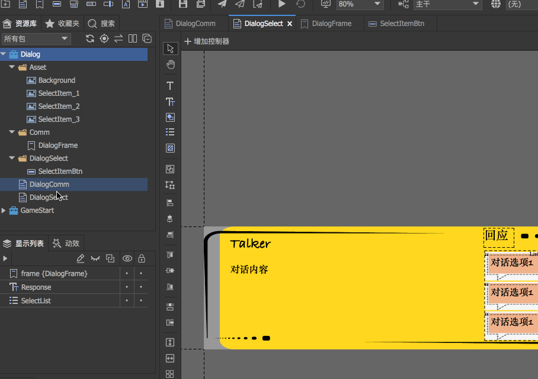
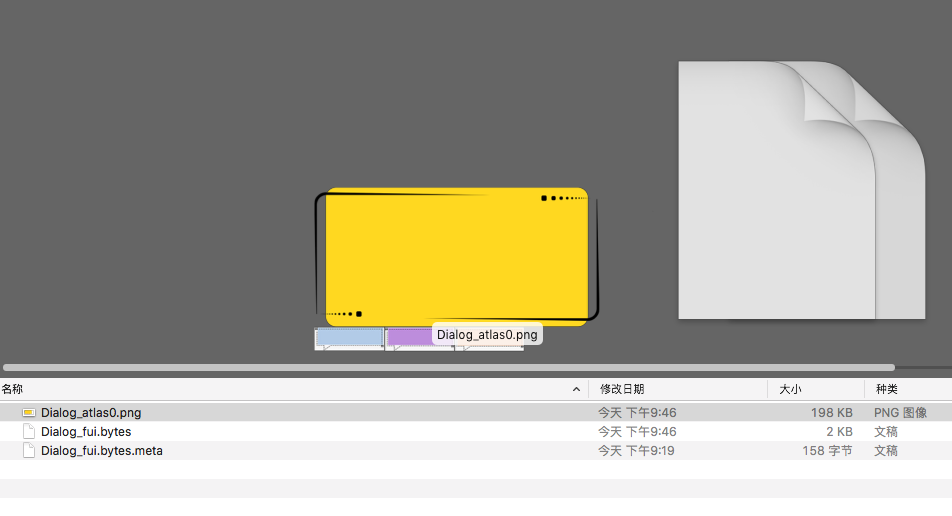
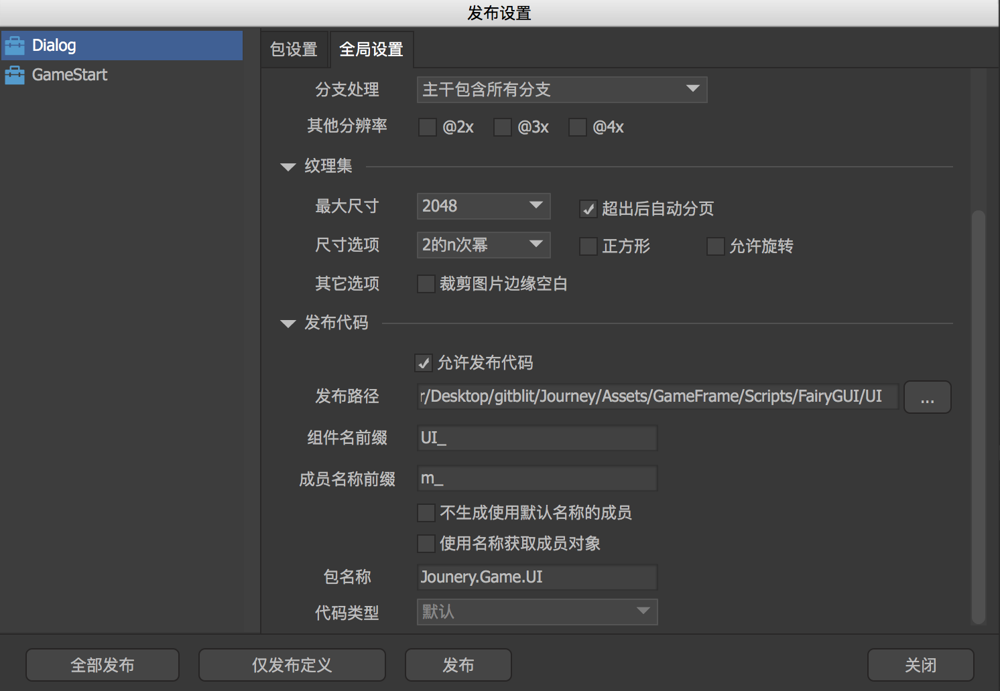
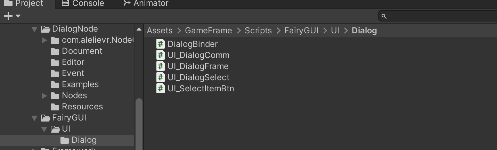

## 发布UI 包

在FairyGUI 编辑器下 =>【文件】=>【发布设置】，暂时只设置【发布路径】



然后点击【发布】，会显示Dialog 发布成功，我选择发布到某个Unity 项目的目录，到对应的目录可以看到



显然，这样导出来的包明显很小，感觉不太对？确实不太对！需要像下面这样操作，然后发布才正确



但是因为Background.png 时2198x904，超过2048，所以显示发布失败，需要修改一下这个图片资源（使用PS、McGimp 等工具都可以），然后重新发布，就可以看到发布的内容包括图片素材



## 发布源码

如果想要在Unity 中使用，那么必须还需要使用FairyGUI 自动为组件生成源码的功能。【文件】->【发布设置】

在【全局设置】中，可以设置对应发布路径、组件名前缀、成员变量名称、包名称



也在【包设置】中，为当前包设置对应的包个性化的发布路径

到发布路径对应的目录可以看到



DialogFrame、SelectItemBtn、DialogComm、DialogSelect 分别的源码如下，同时在代码中也可以看到它们之间的层次关系，与[《FairyGUI 深度使用：对话系统UI》](http://www.xumenger.com/1-ui-project-20230303/) 的分析一致

**DialogBinder**

```c#
/** This is an automatically generated class by FairyGUI. Please do not modify it. **/

using FairyGUI;

namespace Jounery.Game.UI.Dialog
{
    public class DialogBinder
    {
        public static void BindAll()
        {
            UIObjectFactory.SetPackageItemExtension(UI_DialogComm.URL, typeof(UI_DialogComm));
            UIObjectFactory.SetPackageItemExtension(UI_DialogSelect.URL, typeof(UI_DialogSelect));
            UIObjectFactory.SetPackageItemExtension(UI_DialogFrame.URL, typeof(UI_DialogFrame));
            UIObjectFactory.SetPackageItemExtension(UI_SelectItemBtn.URL, typeof(UI_SelectItemBtn));
        }
    }
}
```

**UI_DialogFrame**

```c#
/** This is an automatically generated class by FairyGUI. Please do not modify it. **/

using FairyGUI;
using FairyGUI.Utils;

namespace Jounery.Game.UI.Dialog
{
    public partial class UI_DialogFrame : GLabel
    {
        public GImage m_Background;
        public GRichTextField m_TalkerName;
        public GRichTextField m_TalkContent;

        public const string URL = "ui://at5d2db7l69z3";

        public static UI_DialogFrame CreateInstance()
        {
            return (UI_DialogFrame)UIPackage.CreateObject("Dialog","DialogFrame");
        }

        public UI_DialogFrame()
        {
        }

        public override void ConstructFromXML(XML xml)
        {
            base.ConstructFromXML(xml);

            m_Background = (GImage)this.GetChildAt(0);
            m_TalkerName = (GRichTextField)this.GetChildAt(1);
            m_TalkContent = (GRichTextField)this.GetChildAt(2);
        }
    }
}
```

**UI_SelectItemBtn**

```c#
/** This is an automatically generated class by FairyGUI. Please do not modify it. **/

using FairyGUI;
using FairyGUI.Utils;

namespace Jounery.Game.UI.Dialog
{
    public partial class UI_SelectItemBtn : GButton
    {
        public Controller m_button;
        public GImage m_n0;
        public GImage m_n1;
        public GImage m_n2;
        public GRichTextField m_SelectContent;

        public const string URL = "ui://at5d2db7l69za";

        public static UI_SelectItemBtn CreateInstance()
        {
            return (UI_SelectItemBtn)UIPackage.CreateObject("Dialog","SelectItemBtn");
        }

        public UI_SelectItemBtn()
        {
        }

        public override void ConstructFromXML(XML xml)
        {
            base.ConstructFromXML(xml);

            m_button = this.GetControllerAt(0);
            m_n0 = (GImage)this.GetChildAt(0);
            m_n1 = (GImage)this.GetChildAt(1);
            m_n2 = (GImage)this.GetChildAt(2);
            m_SelectContent = (GRichTextField)this.GetChildAt(3);
        }
    }
}
```

**UI_DialogComm**

```c#
/** This is an automatically generated class by FairyGUI. Please do not modify it. **/

using FairyGUI;
using FairyGUI.Utils;

namespace Jounery.Game.UI.Dialog
{
    public partial class UI_DialogComm : GComponent
    {
        public UI_DialogFrame m_frame;

        public const string URL = "ui://at5d2db7l69z0";

        public static UI_DialogComm CreateInstance()
        {
            return (UI_DialogComm)UIPackage.CreateObject("Dialog","DialogComm");
        }

        public UI_DialogComm()
        {
        }

        public override void ConstructFromXML(XML xml)
        {
            base.ConstructFromXML(xml);

            m_frame = (UI_DialogFrame)this.GetChildAt(0);
        }
    }
}
```

**UI_DialogSelect**

```c#
/** This is an automatically generated class by FairyGUI. Please do not modify it. **/

using FairyGUI;
using FairyGUI.Utils;

namespace Jounery.Game.UI.Dialog
{
    public partial class UI_DialogSelect : GComponent
    {
        public UI_DialogFrame m_frame;
        public GRichTextField m_Response;
        public GList m_SelectList;

        public const string URL = "ui://at5d2db7l69z2";

        public static UI_DialogSelect CreateInstance()
        {
            return (UI_DialogSelect)UIPackage.CreateObject("Dialog","DialogSelect");
        }

        public UI_DialogSelect()
        {
        }

        public override void ConstructFromXML(XML xml)
        {
            base.ConstructFromXML(xml);

            m_frame = (UI_DialogFrame)this.GetChildAt(0);
            m_Response = (GRichTextField)this.GetChildAt(1);
            m_SelectList = (GList)this.GetChildAt(2);
        }
    }
}
```
