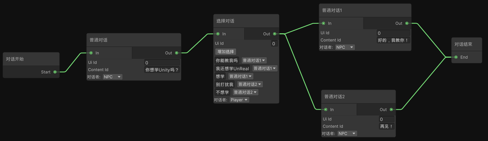
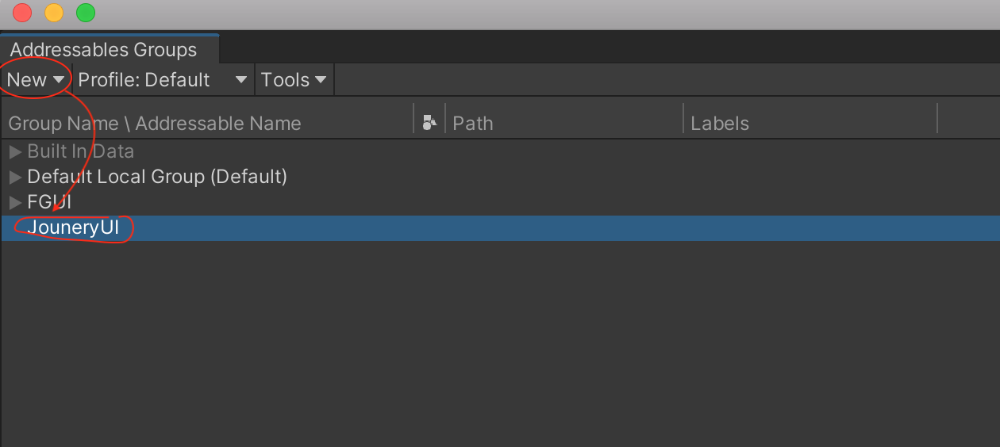
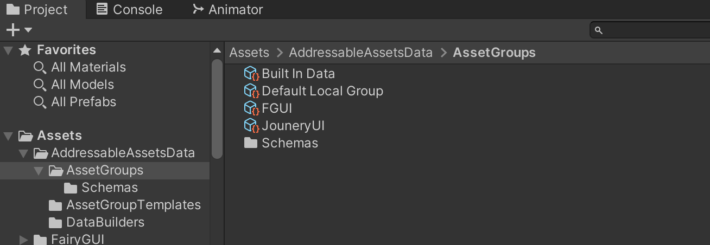
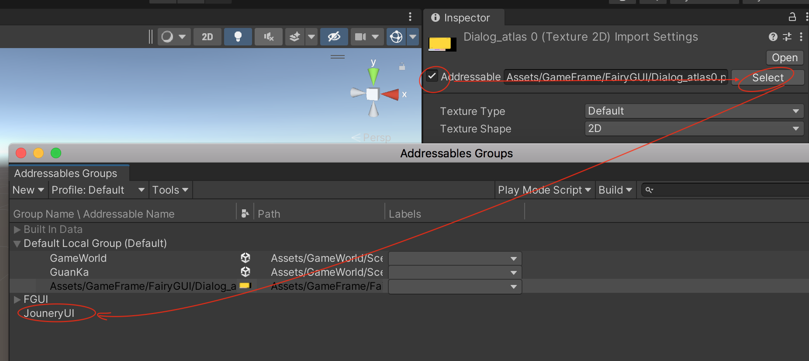
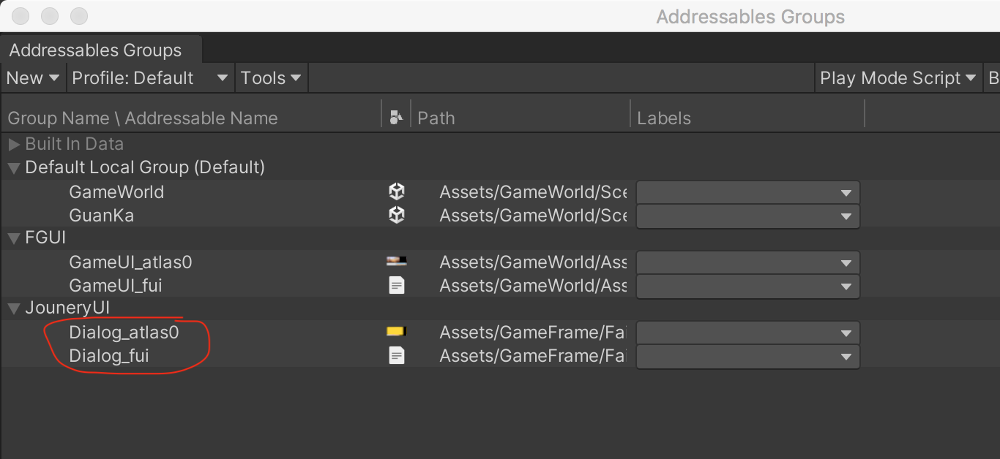

上一篇中，在FairyGUI 编辑器中制作好了对话框UI，本文就是展示怎么用到Unity 中

首先参考[《FairyGUI 深度使用：官方案例简介》](http://www.xumenger.com/1-fairy-gui-example-20230302/) 在Unity 中安装FairyGUI 的资源包

另外请参考官方文档[Unity SDK 教程](https://fairygui.com/docs/unity)

## 简单分析

基于上文在FairyGUI 编辑器中制作对话UI 时进行的分析，有如下几个是需要在Unity 中实现的

1. 在对话框中动态显示对话者的名字
2. 在对话框中动态显示对话者说的内容
3. 在选择列表中动态展示选项
4. 点击选项按钮触发相应逻辑

接下来的对话UI 的测试基于下面这个对话内容来进行

## Addressables 使用

之前写过一篇博客介绍Unity 与FairyGUI 的使用：[http://www.xumenger.com/fairy-gui-20190922/](http://www.xumenger.com/fairy-gui-20190922/)，但是这种方式需要固定将FairyGUI 包发布到Unity 项目的Resources 目录或子目录下

本文使用Addressables 的方式处理UI 资源，当然需要先安装Addressables 包

【Window】->【Asset Management】->【Addressables】->【Groups】，【New】->【Packed Asset】创建一个新的组

然后在项目的Assets/AddressableAssetsData/AssetGroups 下面可以看到这个Group

在Unity 资源目录下，选择上面导出的FairyGUI 包，勾选【Addressables】，然后Select 打开窗口选择刚才创建的Group，默认将这个资源分到Default Local Group 下面，需要手动拖拽到你希望放置的Group 下面

所有的资源都如此处理，并且对其重命名后

## UIPanel 相关属性

**Render Mode 属性**

Render Mode 取值由三种

1. Screen SPace Overlay。是默认值，表示在这个UI 屏幕空间显示，这时Transform 的Scale 将被锁定，而且不建议修改Transform 中的其他内容（让它们保持为0）。如果要修改面板在屏幕上的位置，使用 UI Transform
2. Screen Space Camera。表示这个UI 在屏幕空间显示，但不使用FairyGUI 默认的正交相机，而是使用指定的正交相机
3. World Space。表示这个UI 在世界空间显示，由透视相机显示。默认使用场景的主相机，如果不是，那么设置Render Camera。当使用这个模式时，使用Transform 修改UI 在世界空间的位置、缩放、旋转。但你仍然可以使用UI Transform

Render Mode 只定义了FairyGUI 对待这个UI 的方式，通常是坐标相关的操作（如点击检测等），但和渲染无关。UI 由哪个相机渲染是由GameObject 的Layer 决定的。如果发现UI 没有显示出来，可以检查一下GameObject 的Layer 是否正确。例如如果是Screen Space，GameObject 应该在UI 层，如果是World Space，则是在Default 层或其他自定义的层次

**Render Camera 属性**

当Render Mode 是Screen Space Camera 或者World Space 时可以设置。如果不设置，默认为场景的主相机。注意，当RenderMode 为World Space 时，如果这里没有设置相机，那么场景一定要有主相机，否则UI 无法点击

>更多属性及其作用，请参考[https://fairygui.com/docs/unity](https://fairygui.com/docs/unity)

## 注意事项

UIPanel 最常用的地方就是3D UI。它可以方便地将UI 挂到任意GameObject 上。当然，UIPanel 在2D UI 中也可以使用，它的优点是可以直接摆放到场景中，符合Unity 的ECS 架构。缺点时这种用法对于UI 管理带来很多麻烦，特别是中大型游戏

使用UIPackage.CreteObject 可以直接使用代码创建任何界面，可以应用在传统的设计模式中，Lua 支持也十分方便。不过必须要小心处理生成的对象的生命周期，因为它需要手动显式销毁，并且永远不要将使用CreateObject 创建出来的对象挂到其他一些普通的GameObject 上，否则那些GameObject 销毁时会一并销毁这个UI 里的GameObject，但这个UI 又还处于正常使用状态，就会出现空引用错误

## 性能相关

在Unity 项目中，UI 也可能导致性能问题，那么排查和优化的思路是什么样的？

在Fairy GUI 的官方文档中对于性能提到了几点

1. 一般不建议包进行频繁装载卸载，因为每次装载卸载必然是要消耗CPU 时间（意味着耗电）和产生大量GC 的
2. UI 系统占用的内存是可以精确估算的，你可以按照包的使用频率设定哪些包是常驻内存的（建议尽量多）
3. AddPackage 只有用到才会载入贴图、声音等资源。如果你需要提前全部载入，调用UIPackage.LoadAllAssets
4. UIPanel 可以用来制作头顶血条，但是放在3D 对象上的UIPanel 是无法和其他UIPanel 进行DrawCall 合并的，因此如果同屏人物很多，DC 就很高
5. 将发布后的文件打包为两个AssetBundle，即定义文件和资源各打包为一个bundle（desc\_bundle、res\_bundle）
	1. 这样的好处是一般UI 的更新都是修改原件位置什么的，不涉及图片资源的更新
	2. 那么只需要重新打包和推送desc\_bundle 就行了
	3. 不需要让玩家更新通常体积比较大的res\_bundle，节省流量