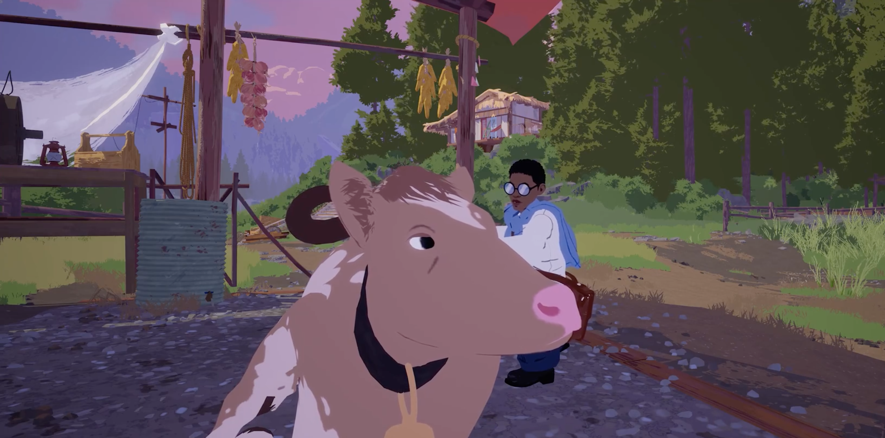
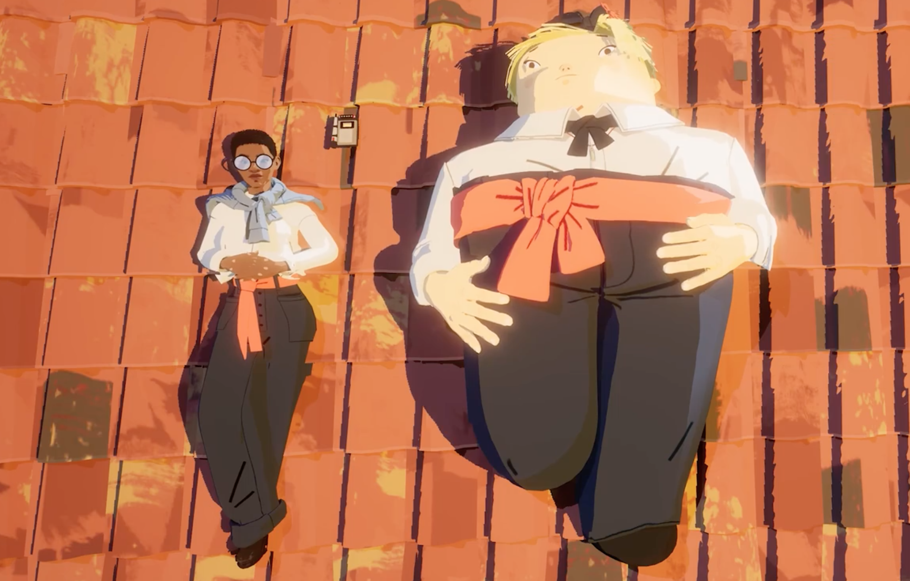

>之前对这款游戏的UI 做过一些分析，[《游戏UI 案例：寄梦远方SEASON 的UI 设计解析》](http://www.xumenger.com/1-game-ui-20230226/)

## 整体渲染风格

风格化渲染效果；远处有雾效；树木渲染是大色块，只通过浅绿和深绿来体现光照阴影；墙面使用了贴图；路应该也是用了贴图

草地分为绿色和黄色；建筑渲染？

人物渲染？动物渲染？牛棚渲染？

## 人物风格化渲染

## 玩法简单总结

关键词：骑行、旅行、拍照、录音、日记、记忆点、回忆、战争、圣坛

科奇的观光之旅：一个小男孩带着女主探索场景的玩法。小男孩和女主一样，都失去了自己的父亲（共情设计）

