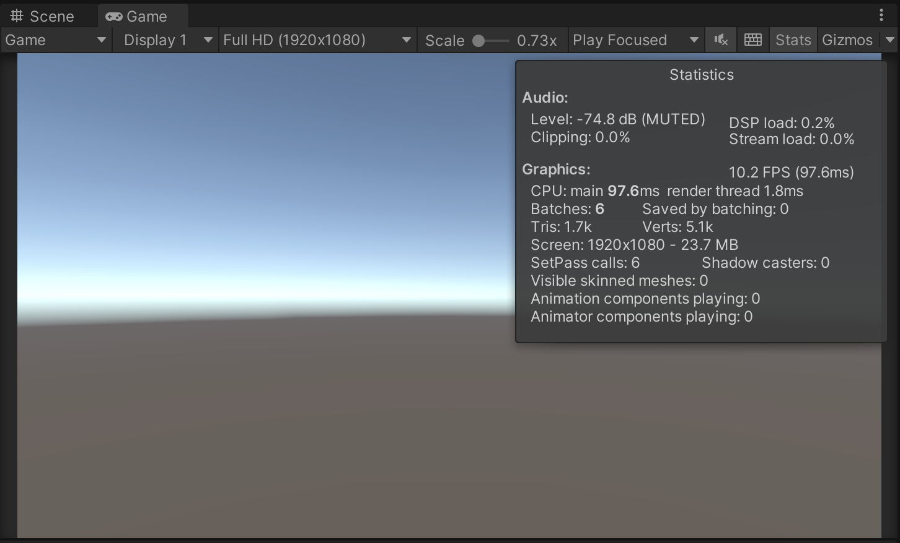
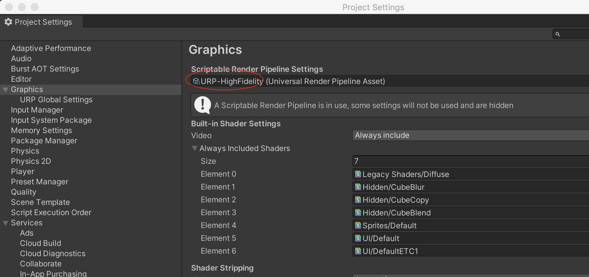
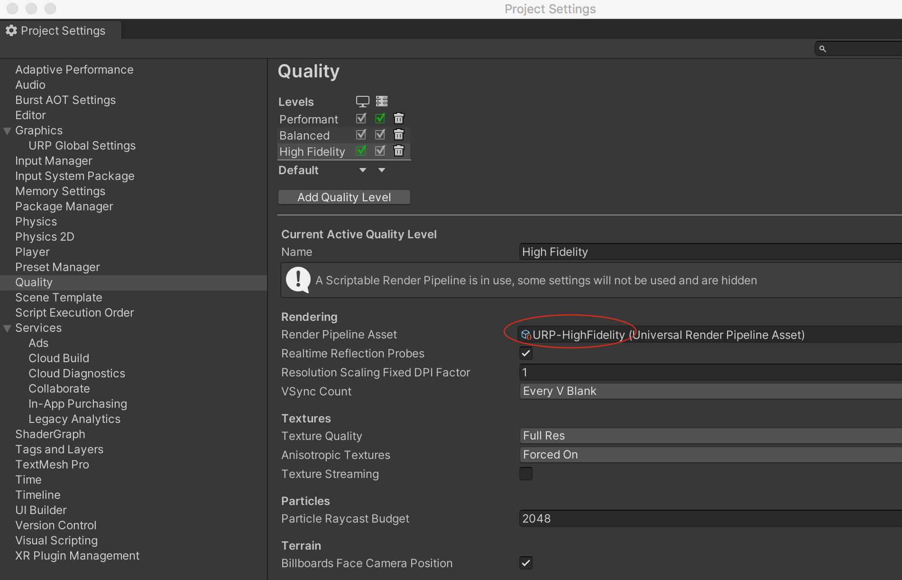
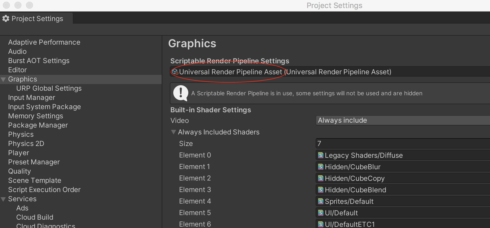
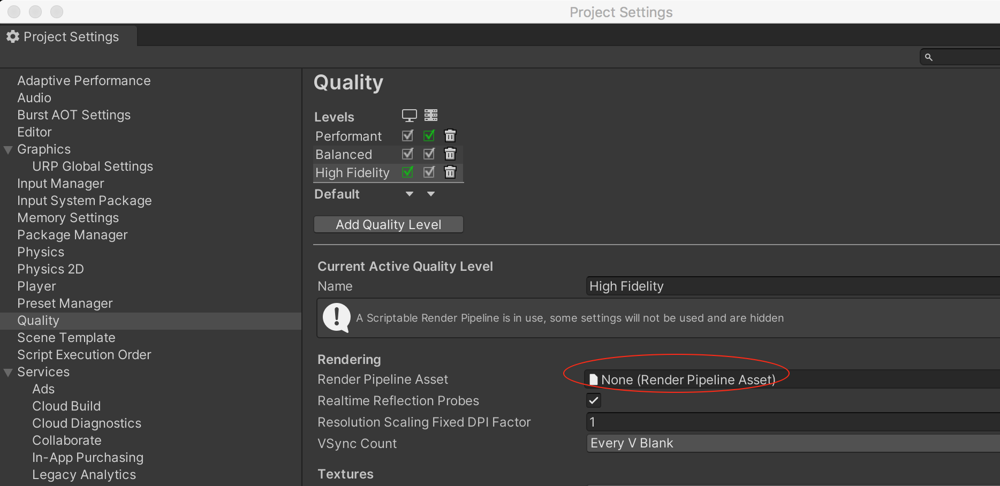
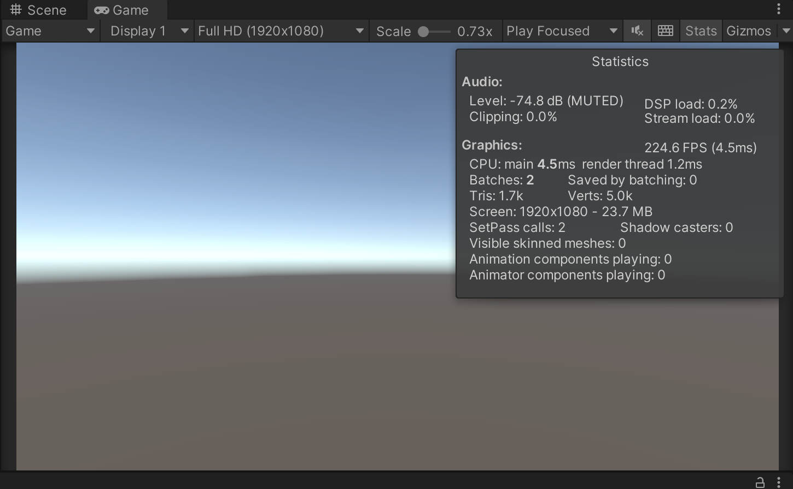

空场景，运行起来后，FPS 只有10 左右，很离谱

Window -> Analysis -> Profiler。发现主要消耗在Gfx.WaitForPresentOnGfxThread()

检查Project Settings，Graphics、Quality 部分的渲染管线都选择了URP-HighFidelity

暂时的解决方案是，自己创建一个URP 渲染管线配置文件，然后在Graphics 设置新建的渲染管线配置，在Quality 设置为None

然后重新运行，发现FPS 达到了正常的200 多

