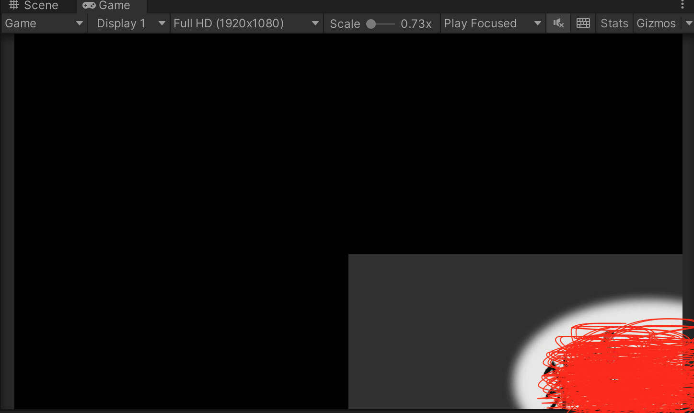

比如基于FairyGUI 制作的游戏开始UI 界面，但是运行游戏后发现其显示是这样的，没有居中

进行如下设置即可

* Main Camera 的Render Type 设置为Base
* Main Camera 的Projection 设置为Perspective
* Main Camera 的Culling Mask 取消勾选 UI
* Main Camera 的Stack 增加Stage Camera
* Stage Camera 设置为Overlay
* Stage Camera 设置为Orthographic

如果还是有问题，那么可能需要删除Stage Camera，重新在场景中创建，然后进行如上的设置

另外建议使用FairyGUI 的相关版本如下

* FairyGUI Editor 使用2022.1.0p1 版本
* FairyGUI Unity 插件，使用4.3.0
