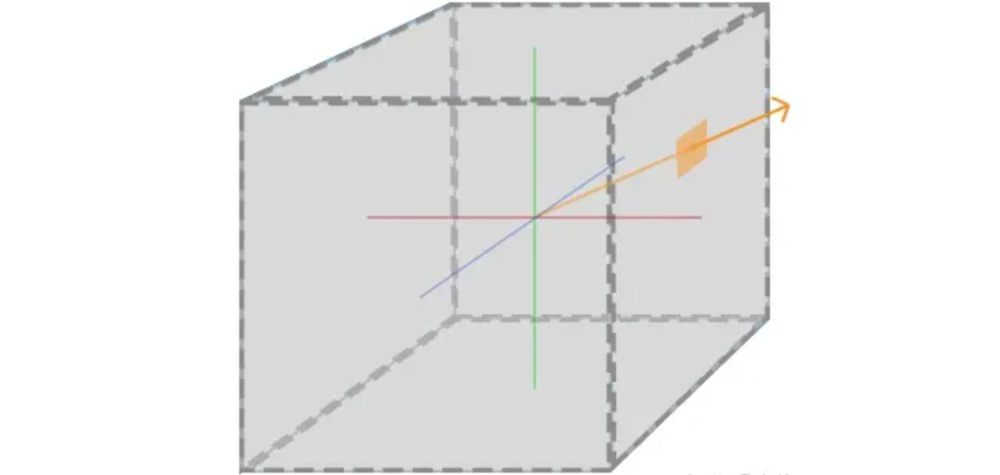
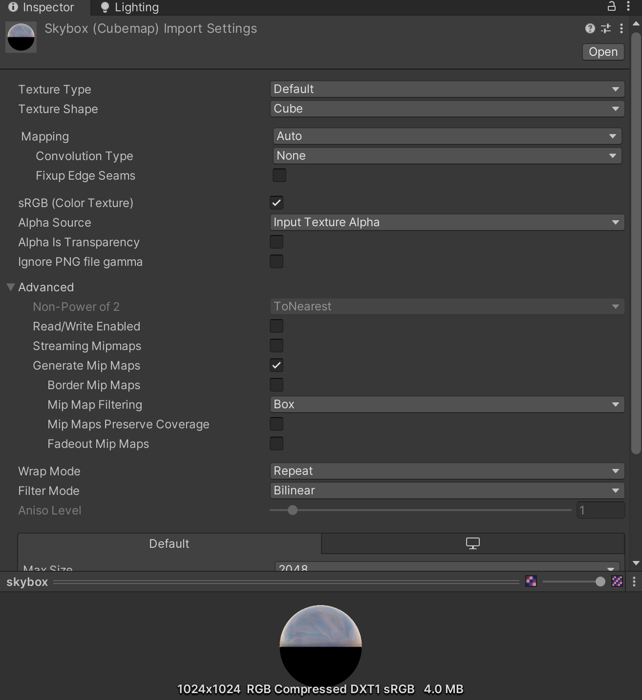
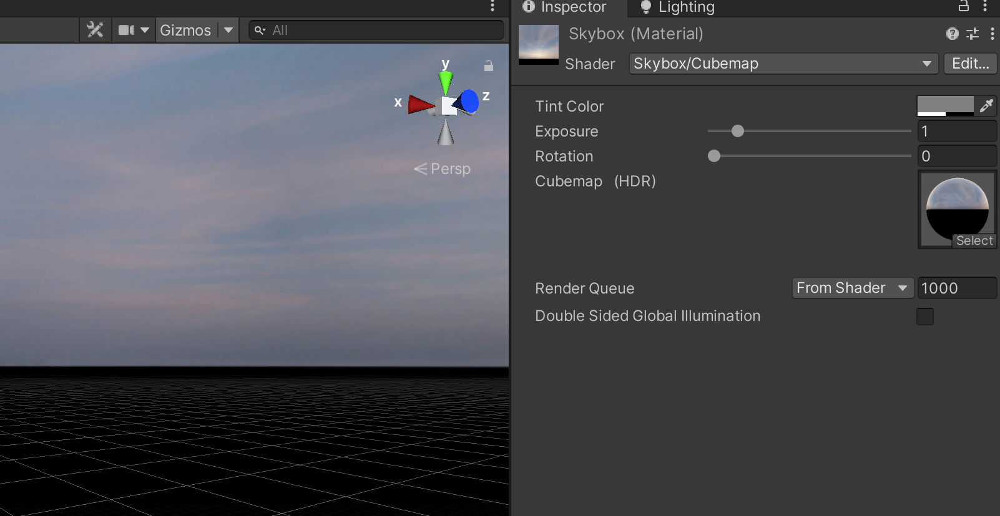
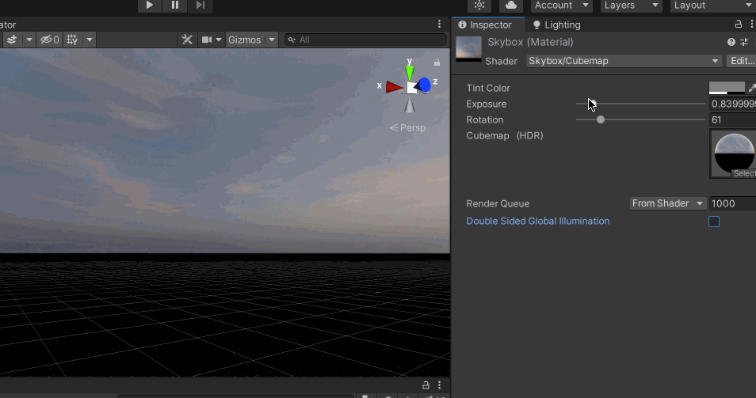
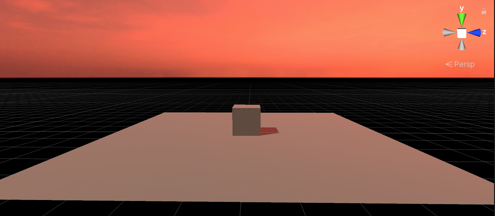
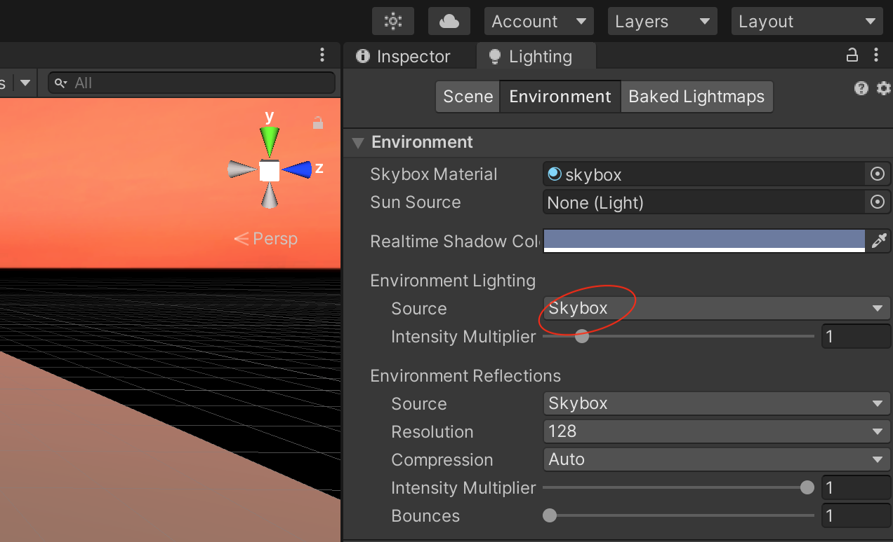
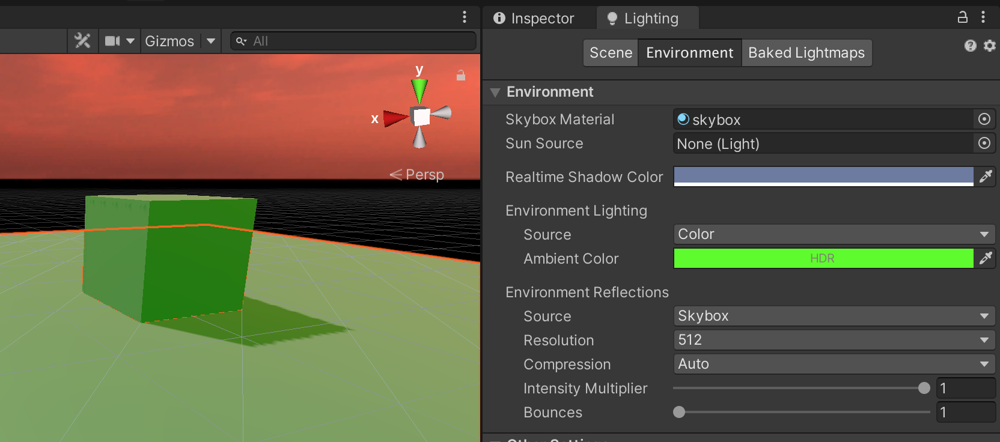
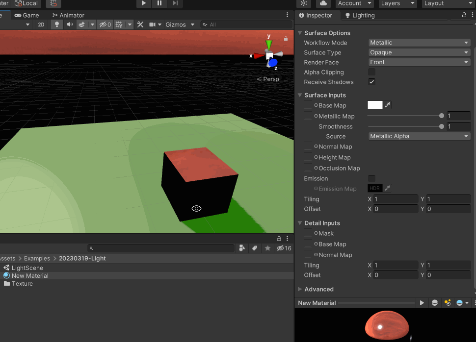

>[游戏引擎养成《十三》 天空盒](https://zhuanlan.zhihu.com/p/64461167)

>[https://learnopengl.com/Advanced-OpenGL/Cubemaps](https://learnopengl.com/Advanced-OpenGL/Cubemaps)

>[一步步学OpenGL(25) -《Skybox天空盒子》](https://zhuanlan.zhihu.com/p/150570683)

>[Unity天空盒子CubeMap制作](https://blog.csdn.net/AMalways/article/details/82322047)

天空盒子是影响游戏整体氛围的一个很关键的点

一般天空盒子对应的贴图是一个立方体的展开图，引擎会将天空贴图做出一个“小盒子”，它是内壁着色的，摄像机是在这个盒子里面，所以可以看到天空。天空盒需要用到立方体贴图，与2D 纹理不同，一个立方体贴图（Cube Map）包含6 个2D 纹理，每个2D 纹理是立方体的一个面，可以直接通过一个方向向量对CubeMap 采样

SkyBox 本质上是一个位置（不包括旋转）固定在相机坐标系原点的立方体，用CubeMap 给立方体贴上纹理后，可以用立方体的位置作为纹理坐标进行采样

## 制作天空盒子

可以下载CubeMap，也可以在[https://cc0textures.com/](https://cc0textures.com/) 等网站下载HDRI 资源，在Unity 中将其Texture Shape 设置为Cube

然后将这个Texture 拖到场景中，会自动生成一个材质球，并且也可以看到天空盒子变成了刚才的贴图

可以针对材质球调整天空盒子的材质效果：色彩、曝光度、旋转等。可以简单做出来阴天、晚霞等效果

## 环境光

比如将天空盒子设置为红色，然后场景中添加一个Cube，可以看到其颜色被天空盒子所影响

因为在【Window】->【Rendering】->【Lighting】->【Environment】下面将Source 默认设置为Skybox

可以将其修改为Color，然后比如设置为绿色，就可以看到Cube 不再受天空盒子影响了

>具体的游戏开发过程中，如何设置环境光，还是要基于游戏去考虑的，是室外场景，还是室内场景等考量

## 环境反射

同样在【Lighting】->【Environment】下面，还有一个Environment Lighting 菜单项，这个指的是环境反射，默认也是Skybox

可以为Cube 增加一个材质（工作流是Metallic），然后将Metallic Map（金属度）、Smoothness（光滑度）都拉到最大，即1，可以看到Cube 又开始反射天空盒子了

这里面可能看到的反射效果不好，可以通过【Lighting】->【Environment】->【Environment Reflections】的Resolution 设置分辨率，默认是128，可以调整为比如512，当然设置的越大，对于性能的消耗越大

## 遗留问题

另外，我们也可以看到，场景中Cube 投射的阴影的锯齿还是很明显的

## 一些免费的材质、纹理资源网站

Unity Asset Store 可以根据关键字SkyBox 找到一些合适的天空盒子资源

>[https://polyhaven.com/](https://polyhaven.com/) 可以下载到免费的天空盒、贴图、模型资源

>[https://cc0textures.com/](https://cc0textures.com/) 可以下载到免费的天空盒、贴图、模型资源

>[https://www.poliigon.com/](https://www.poliigon.com/)

>[https://freepbr.com/](https://freepbr.com/)

>[https://3dtextures.me/](https://3dtextures.me/)