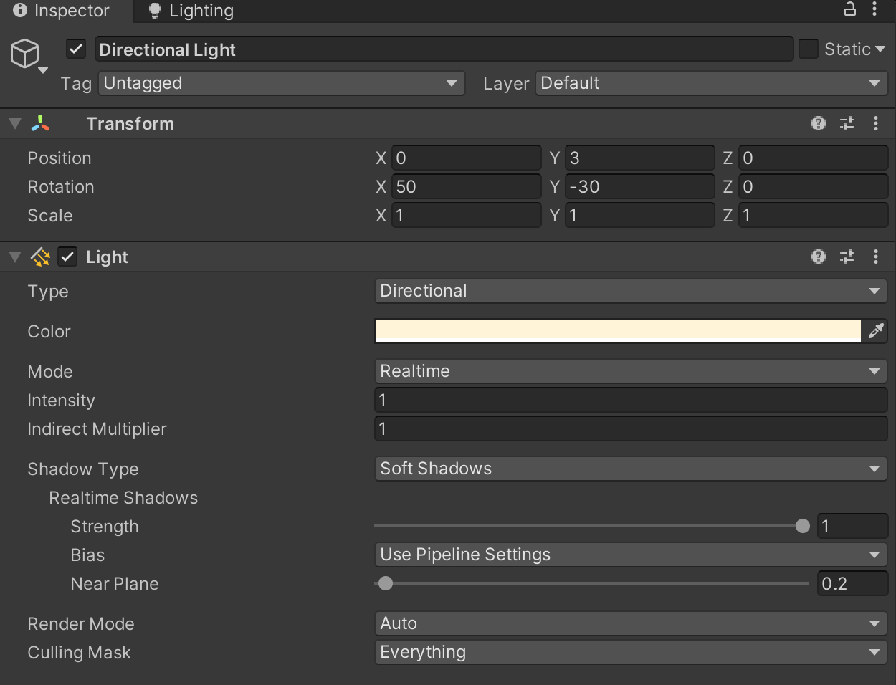
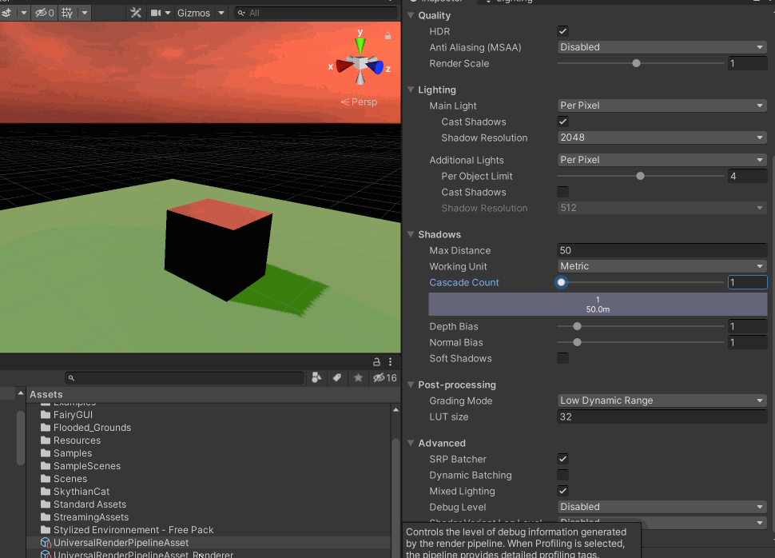
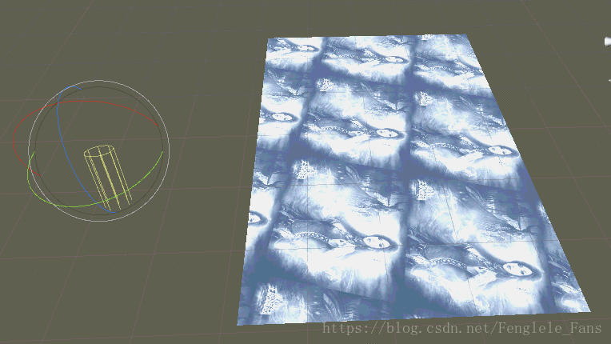
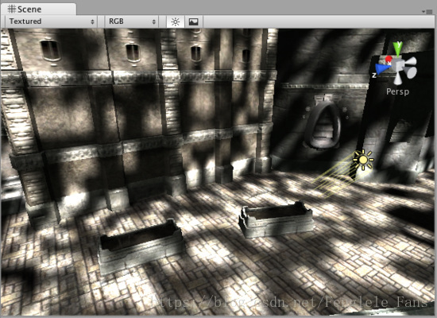
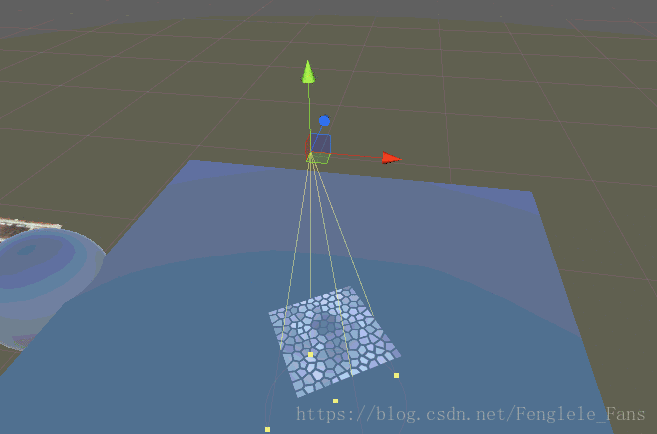
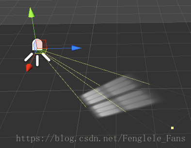
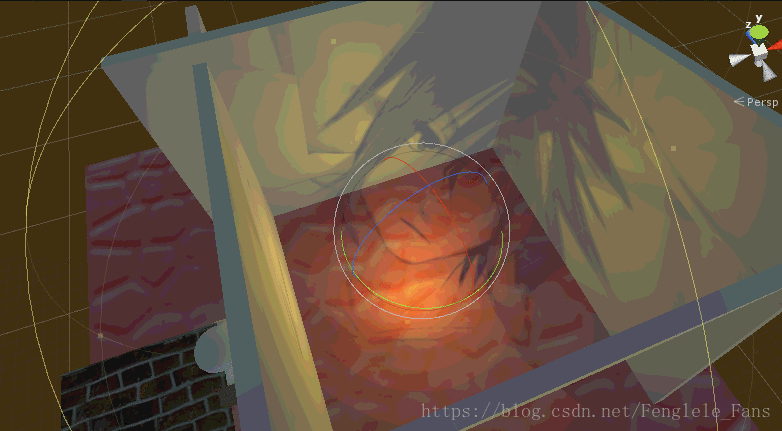
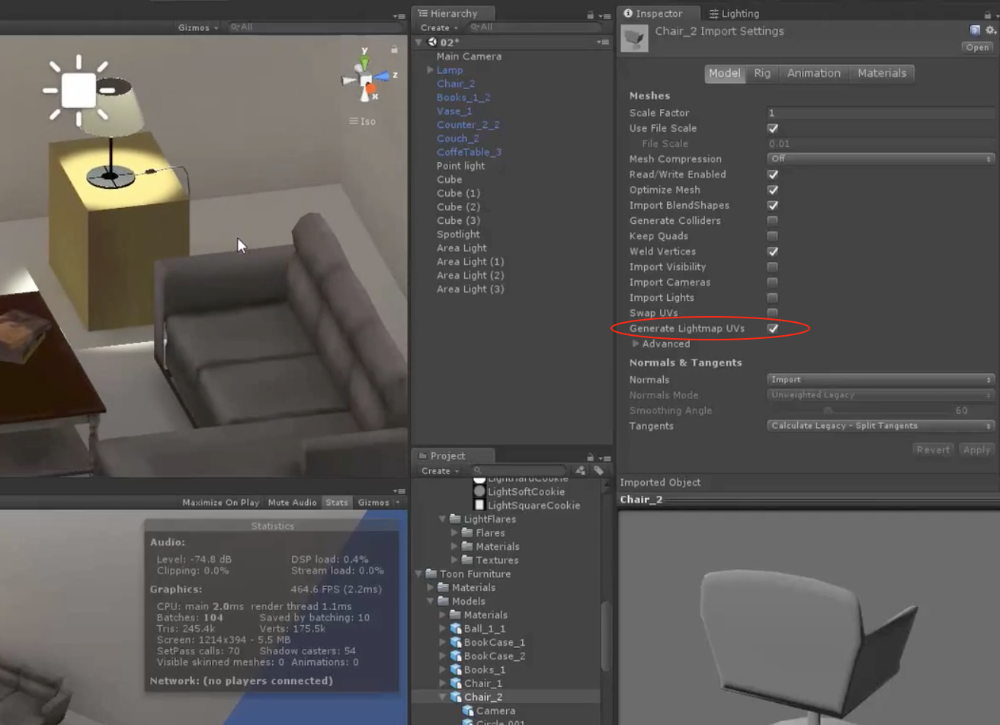

Unity 的灯光类型有：Directional Light、Point Light、SpotLight、Area Light

## 平行光

一般用来模拟太阳光，其配置面板如下所示（颜色、Realtime还是Bake、强度、间接光照强度、影子类型、阴影强度、阴影分辨率等）

Shadow Type 可以选择为Hard Shadows（锯齿明显、更省性能）、Soft Shadows、No Shadows（不产生影子）

在URP 渲染管线下面，可能会发现将Directional Light 的Shadow Type 设置为Soft Shadows 还是可以看到锯齿感，那么就需要在渲染管线层面进行调整

Cascade Count 控制Shadow Cascade（阴影级联）的数量。摄像机近处的阴影比远处的阴影分辨率更低，会有一些明显的锯齿产生，这一情况被叫做透视阴影（Perspective Aliasing）。解决这一现象的方式就是Shadow Cascade。增加Cascade Count 可以有效改善近处阴影的分辨率（不过阴影级联只对定向光有效）

>[从零开始独立游戏开发学习笔记（四十四）--Unity学习笔记20-- Creative Core3上](https://www.bilibili.com/read/cv16850350)

B 处比 A 处锯齿更多。这是因为这两个地方用的是同一个阴影分辨率。当然，你可以直接通过增加阴影的分辨率来完成这一效果，不过这样性能消耗就比较大，因为远处用不到这么高的分辨率

这是因为在 unity 中，我们的摄像机是应用了透视效果的视椎体。也就是近大远小。远处的大物体和近处的小物体是一样的尺寸

提高级联数量（Cascade Count）会增加分割份数，会更真实平滑，当然也会提高性能消耗。不过无论如何，这也比直接提高总体阴影质量要好

注意上面Cascade Count 的调整不是越多越好，比如针对上面的场景，当设置为3 时，配合Directional Light 的Soft Shadows 配置，是可以“完全”解决锯齿问题的，但是如果再增加到4，可能发现又有锯齿了

## Cookie

Unity 中的Light 结合Cookie 贴图可以制作出比如光影斑驳的效果。要求提前将Texture 的Texture Type 设置为Cookie 类型（法线贴图也可以当做cookie使用），并且Alpha Source要选择From Gray Scale

>[unity中l光源cookie的发散性应用](https://blog.csdn.net/Fenglele_Fans/article/details/80794092)

可以通过Directional Light + Cookie 来实现 光影斑驳的效果

Spot Light 的Cookie 使用: 同样需要Cookie 格式的图片，不过这里要注意聚光灯使用的Cookie 图片的长宽要相等，不然会报错；Alpha Source要选择From Gray Scale

例如光透过窗户照在地面上的效果就可以使用Spot Light + Cookie

Point Light 的Cookie 使用：不再是Cookie 格式的图片，而是要立方体贴图（Cube Map），将图片属性中的Texture Sharp 从2d 变成Cube 即可；Alpha Source要选择From Gray Scale

## 点光源

制作室内场景的时候，比如白炽灯、火把等适合选择使用点光源进行模拟

## 聚光灯

一般模拟探照灯、台灯、车灯、手电筒等效果

## 区域光

和其他几个光类型不同的点是，它是Baked Only 的，不能设置为Real Time，如果想要使得场景中的物体受到Area Light 的影响，那么需要将对应的物体设置为Static

只有Static 物体才会受到烘焙光照的影响，才会根据光照贴图去贴上它真正的光影

如果在烘焙光照贴图的时候出现报错，显示光照贴图和Mesh 不符合，那么需要修改对应模型的设置：

区域光也适合室内场景的照明

## 遗留问题

光照贴图大小、烘焙时间等的优化

## 色彩空间

>[简单弄懂Unity3D的色彩空间](https://zhuanlan.zhihu.com/p/88317263)

这里是Unity 官方对于色彩空间的详细说明[https://docs.unity.cn/cn/current/Manual/LinearRendering-LinearOrGammaWorkflow.html](https://docs.unity.cn/cn/current/Manual/LinearRendering-LinearOrGammaWorkflow.html)

使用Gamma 渲染时，提供给着色器的颜色和纹理已经应用了伽马校正。在着色器中使用它们时，高亮度的颜色实际上比预期亮度值更亮（相对于线性光照）。这意味着，随着光照强度的增加，表面会以非线性方式变亮。这将导致许多位置的光照亮度过高。此外还可能给模型和场景带来褪色的感觉

使用线性渲染时，在表面上产生的响应随着光照强度增加仍保持线性。因此，带来的表面着色真实得多，表面产生的颜色响应也好得多

一般不建议使用Gamma 色彩空间（除非对应的平台硬件不支持）。Linear 色彩空间，颜色更为自然，细节和阴影更为丰富
