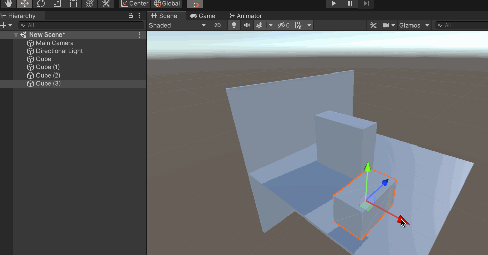
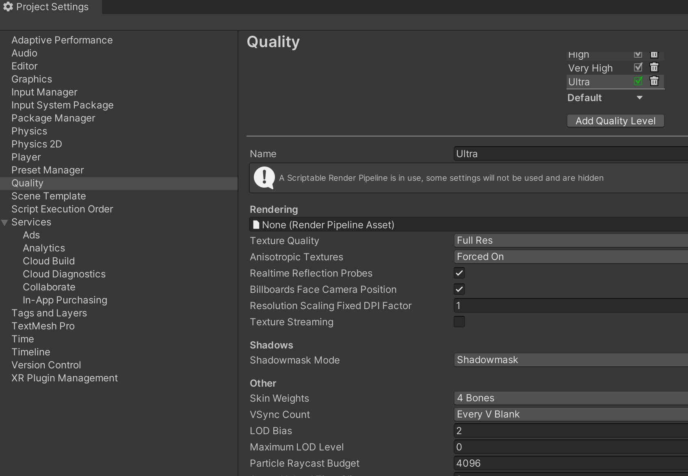
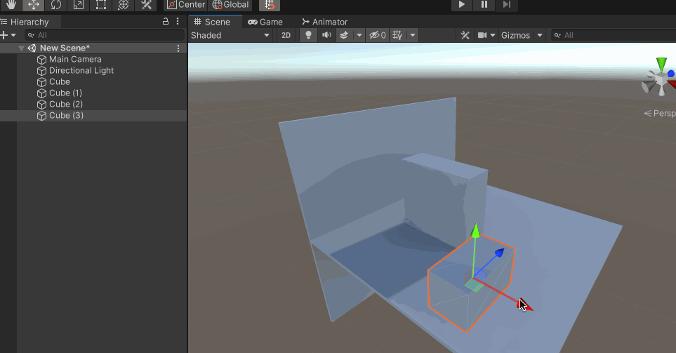
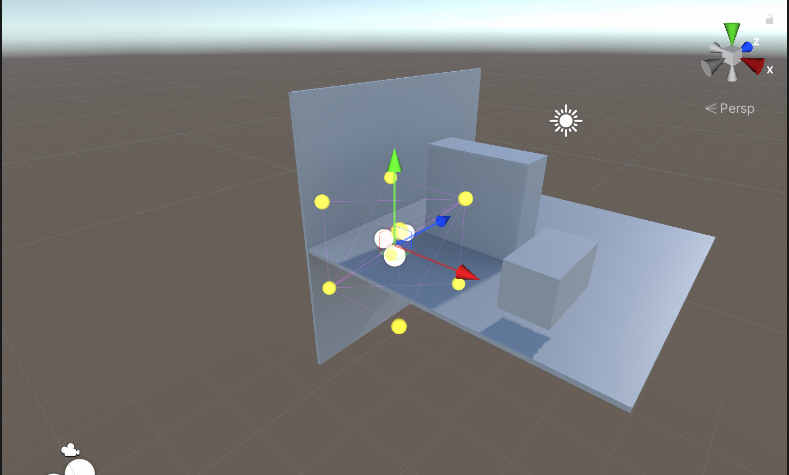

比如下面的场景，场景中只有一个Directional Light，并且设置为Realtime，不将场景中的静态物体设置为Static，也不烘培光照贴图的时候，移动一个Cube，可以看到其他的静态物体的阴影会正确投射到该移动的物体上

在Project Settings 下面的Quality 中，选择Shadowmask Mode 为Shadowmask

然后将场景中不动的物体设置为Static，并且灯光设置为Mixed，然后去烘焙光照贴图，再去移动非Static 的Cube，可以看到静态物体的阴影并不会对这个移动的物体产生实时的影响。因为光照贴图只是直接贴到场景中，没有办法产生实时阴影去影响游戏物体

一个解决方案是，在Project Settings 下面的Quality 中，选择Shadowmask Mode 为Distance Shadowmask，但是这个方案比较耗费性能

另一个方案就是使用Light Probes，使用灯光探针把场景中所有的光照信息记录下来，然后去影响非Static 的游戏物体，使其受场景中光的影响

在场景中，右键 -> Light -> Light Probe Group，可以看到在场景中有多个黄色小球，每个小球就是一个灯光探针，每个灯光探针会记录当前的光照信息，多个小球一起组成了一个灯光探针组

