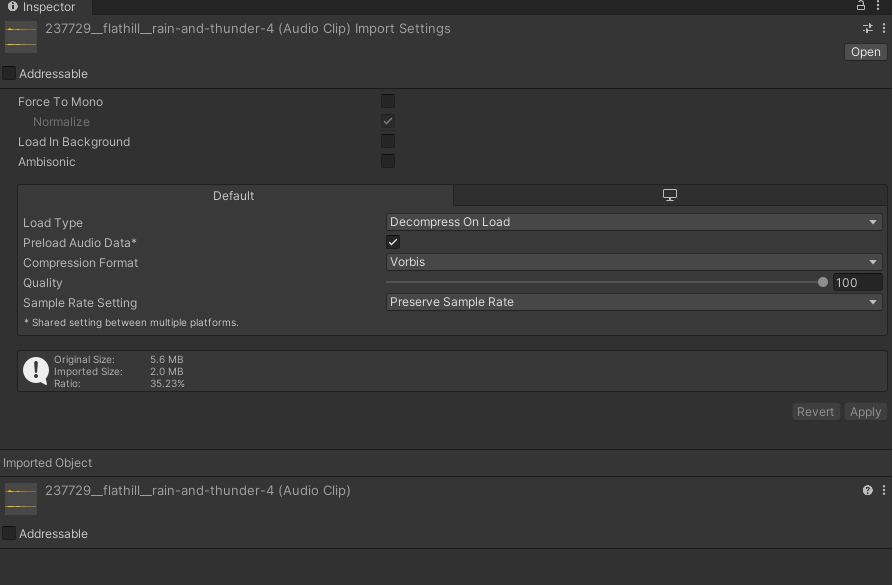
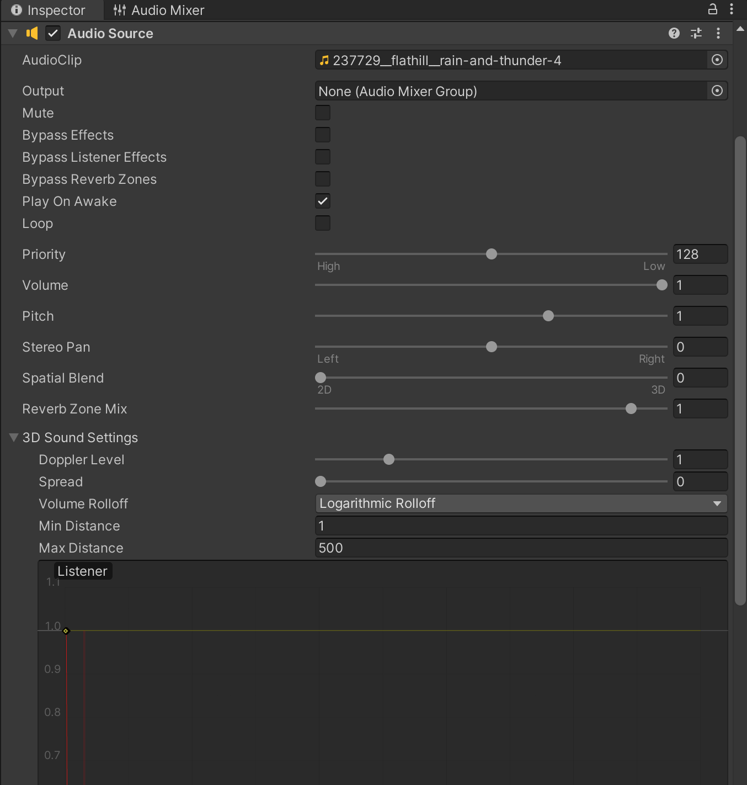
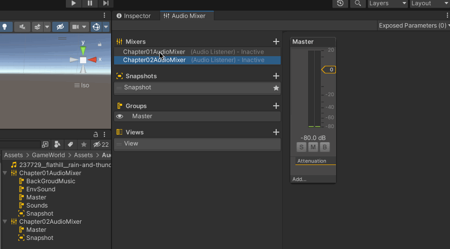
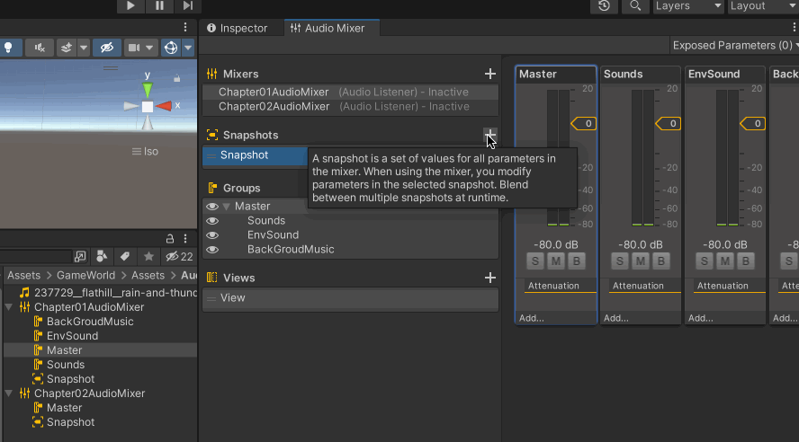
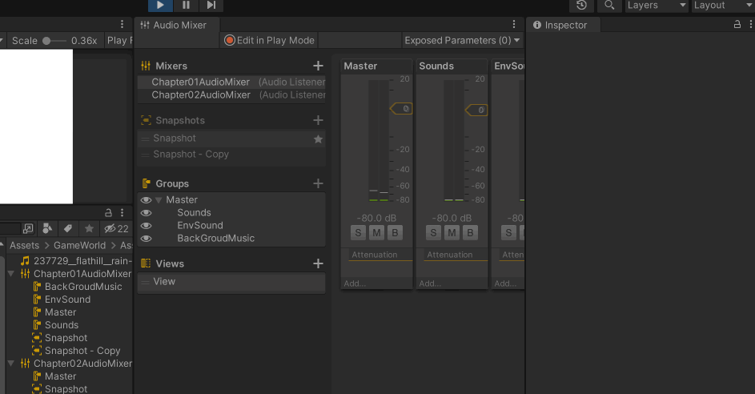
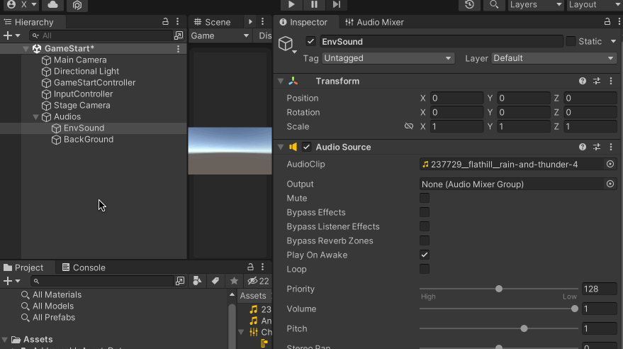
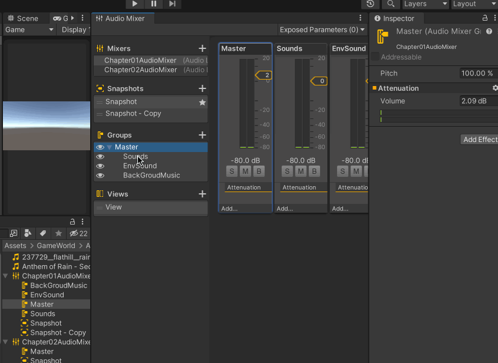

在电子游戏中，背景音乐、音效是提升玩家沉浸感的一个极其重要的因素，放松、恐怖、紧张等都需要背景音、音效的配合

>[https://docs.unity3d.com/cn/current/Manual/Audio.html](https://docs.unity3d.com/cn/current/Manual/Audio.html)

>[https://www.bilibili.com/video/BV1DB4y1r74d](https://www.bilibili.com/video/BV1DB4y1r74d)

## Unity 音效系统

Unity 音频系统构成如下：

* Audio Clip：音频片段
* Audio Source：音频源
* Audio Listener：音频监听
* Audio Mixer：音频混音器。给声音加混响、切低频等效果

## Aduio Clip

具体的声音文件，支持主流的音乐格式

Load In Background：启用该选项时，这个Clip 会放在单独的线程中加载，因此不会阻塞主线程

Load Type

* Decompress On Load：音频文件将在加载后立即解压缩
* Compressed In Memory：保持声音压缩在内存中，当播放时才解压
* Streaming：动态解码声音。该方法使用最少的内存来缓冲从磁盘中增量读取并动态解码的压缩数据

Preload Audio Data：启用之后，此音频Clip 将会在场景加载前被预加载

Compression Format：压缩格式

## Audio Source

连接Audio Listener 和Audio Mixer 的通道

* Output：输出，将Clip 输出到Audio Mixer
* Priority：优先级
* Volume：音量大小
* Pitch：播放速度
* Stereo Pan：2D 模式下播放的音频的位置
* Spatial Blend：声音为2D 还是3D
* Reverb Zone Mix：回声效果
* 3D 声音设置
	* Doppler Level：多普勒声音效应
	* Spread：声音发射的方向
	* Volume Rolloff：声音淡出的方式

3D Sound Settings

* 多普勒效应
* 传播衰减曲线

## Audio Listener

Audio Listener 通常与Audio Source 一起工作，用于接受音频

通常放在Camera 上，新建一个场景的时候，默认有一个Main Camera，这个Main Camera 上也是默认带了一个Audio Listener 的！

## Audio Mixer

游戏具有不同的音轨，比如游戏的背景音乐、游戏的特殊音效、环境的音效。混音器可以对其进行分开控制

无论是否在进行游戏时进行更改，其更改都会被保留，因为其是独立于关卡，直接存在于Project 中的

可以新建一个Audio Mix，然后在其Mixer 界面将它自己拖给其他Audio Mix，此时其他的Audio Mix 就可以整体控制其Audio Mix

在Project 中新建一个Audio Mixer

左边部分是管理音轨、快照等内容的；右边部分是具体的不同的音轨，在Project 中的一个Audio Mixer 文件对应一个音轨

也可以在【Group】点击【+】添加不同的组，比如在上面的动图中，Chapter01AudioMixer 下面有一个组Master，Master 层级下面有三个Sounds、EnvSound、BackGroudMusic。这个层级关系的作用是，Master 的效果会影响它下面的所有Group

比如这里分出来的Group，可以一个设置背景音乐、一个设置环境音乐、一个来对音效进行处理

快照是用来设置Group 的参数的，比如（具体请进行合理的命名）

## 混音器使用

在场景中的Audio Source 组件上面，有一个Output 属性，可以设置Audio Mixer 的某个音轨，这个时候Audio Source 就会发射到对应的这个混音器下面，然后还可以在对应的Group 上增加混响等音效

所以到这里才是游戏音效设置的关键

常见音效包括这些：

* Low Pass 低通滤波器。只允许低频率的音效播放
* High Pass 高通滤波器。只允许高频率的音效播放
* Echo 回声。即该Group 播放的声音将会产生回音
* Reverb 混响。设置音频的空间效果

>[https://docs.unity3d.com/cn/current/Manual/AudioMixer.html](https://docs.unity3d.com/cn/current/Manual/AudioMixer.html)

## 多Audio Source

比如在场景中设置两个Audio Source，一个是背景音乐，一个是雷雨的音效，并且分别设置对应的Group

Audio Effect 可以给不同的音轨添加不同的音效，音效可以设置一个发射者和接收者，可以用专门的音轨来处理特殊音效

然后播放之后，就会发现背景音乐和雷雨音效混响在一起了

这里只是简单介绍了Unity 音效系统的使用，具体做游戏的时候，需要哪些音效、哪些BGM，如何设置音轨等这些需要具体项目具体分析

以及如何使用Unity 音效系统做出来令玩家沉浸的音乐，也需要团队有专业的音乐从业者的，音乐领域的专业性还是很强的

>[https://docs.unity3d.com/cn/current/Manual/AudioMixer.html](https://docs.unity3d.com/cn/current/Manual/AudioMixer.html)

## 免费的音效、音乐素材

>在游戏制作过程中，请注意版权问题

**音乐**

[https://freemusicarchive.org/](https://freemusicarchive.org/) - 免费音乐档案是免费音乐的档案。确保您通过FMA 而不是 Pro 搜索以访问高质量的免费音乐

[https://www.jamendo.com/start](https://www.jamendo.com/start) - 国外音乐素材网站，独立艺术家创作平台，这里面有250000+的音乐素材，全部都是创作者亲自上传。分类清晰，可以根据任何场景搜索音乐素材，个人可以免费使用音乐资源，商业用途就需要遵守该网站的条款

**音效**

[https://freesound.org/](https://freesound.org/) 是一个免费音效下载的网站，这个网站分享了很多的音效档，你可以在这里找到森林、打雷、鸟叫、流水的声音等录自大自然的声音，也可以找到各种器具制造厨来的音效。只要你遵守创用CC 的规范 

**理论知识**

[AAA游戏艺术——由浅入深了解游戏音频技术（上）——游戏背景音乐篇](https://zhuanlan.zhihu.com/p/337161736)

[AAA游戏艺术——由浅入深了解游戏音频技术（中）——游戏音效篇](https://zhuanlan.zhihu.com/p/454703632)

[AAA游戏艺术——由浅入深了解游戏音频技术（下）——HRTF篇](https://zhuanlan.zhihu.com/p/454755546)
