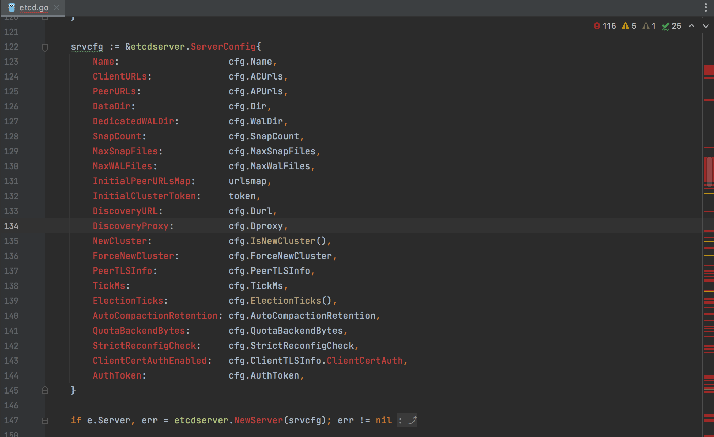
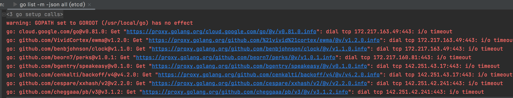

版本信息如下所示

1. etcd-3.2.0
2. go 1.19.2

直接使用GoLand 打开，可能出现大量这样的编译报错



进入etcd-3.2.0 的目录下执行

```shell
go mod init etcd-3.2.0
```

会发现生成了一个go.mod 文件，然后修改内容如下（参考[https://github.com/etcd-io/etcd/blob/main/go.mod](https://github.com/etcd-io/etcd/blob/main/go.mod)）

```
module etcd-3.2.0

go 1.19

replace (
	go.etcd.io/etcd/api/v3 => ./api
	go.etcd.io/etcd/client/pkg/v3 => ./client/pkg
	go.etcd.io/etcd/client/v2 => ./client/internal/v2
	go.etcd.io/etcd/client/v3 => ./client/v3
	go.etcd.io/etcd/etcdctl/v3 => ./etcdctl
	go.etcd.io/etcd/etcdutl/v3 => ./etcdutl
	go.etcd.io/etcd/pkg/v3 => ./pkg
	go.etcd.io/etcd/server/v3 => ./server
	go.etcd.io/etcd/tests/v3 => ./tests
)

require (
	github.com/bgentry/speakeasy v0.1.0
	github.com/cheggaaa/pb/v3 v3.1.2
	github.com/coreos/go-semver v0.3.1
	github.com/dustin/go-humanize v1.0.1
	github.com/spf13/cobra v1.7.0
	github.com/stretchr/testify v1.8.2
	go.etcd.io/bbolt v1.3.7
	go.etcd.io/etcd/api/v3 v3.6.0-alpha.0
	go.etcd.io/etcd/client/pkg/v3 v3.6.0-alpha.0
	go.etcd.io/etcd/client/v2 v2.306.0-alpha.0
	go.etcd.io/etcd/client/v3 v3.6.0-alpha.0
	go.etcd.io/etcd/etcdctl/v3 v3.6.0-alpha.0
	go.etcd.io/etcd/etcdutl/v3 v3.6.0-alpha.0
	go.etcd.io/etcd/pkg/v3 v3.6.0-alpha.0
	go.etcd.io/etcd/server/v3 v3.6.0-alpha.0
	go.etcd.io/etcd/tests/v3 v3.6.0-alpha.0
	go.etcd.io/raft/v3 v3.0.0-20221201111702-eaa6808e1f7a
	go.uber.org/zap v1.24.0
	golang.org/x/time v0.3.0
	google.golang.org/grpc v1.51.0
	google.golang.org/protobuf v1.30.0
)

require (
	cloud.google.com/go v0.81.0 // indirect
	github.com/VividCortex/ewma v1.2.0 // indirect
	github.com/benbjohnson/clock v1.1.0 // indirect
	github.com/beorn7/perks v1.0.1 // indirect
	github.com/cenkalti/backoff/v4 v4.2.0 // indirect
	github.com/cespare/xxhash/v2 v2.2.0 // indirect
	github.com/coreos/go-systemd/v22 v22.5.0 // indirect
	github.com/davecgh/go-spew v1.1.1 // indirect
	github.com/fatih/color v1.14.1 // indirect
	github.com/go-logr/logr v1.2.3 // indirect
	github.com/go-logr/stdr v1.2.2 // indirect
	github.com/gogo/protobuf v1.3.2 // indirect
	github.com/golang-jwt/jwt/v4 v4.5.0 // indirect
	github.com/golang/groupcache v0.0.0-20210331224755-41bb18bfe9da // indirect
	github.com/golang/protobuf v1.5.3 // indirect
	github.com/google/btree v1.1.2 // indirect
	github.com/google/go-cmp v0.5.9 // indirect
	github.com/gorilla/websocket v1.4.2 // indirect
	github.com/grpc-ecosystem/go-grpc-middleware v1.3.0 // indirect
	github.com/grpc-ecosystem/go-grpc-prometheus v1.2.0 // indirect
	github.com/grpc-ecosystem/grpc-gateway v1.16.0 // indirect
	github.com/grpc-ecosystem/grpc-gateway/v2 v2.7.0 // indirect
	github.com/inconshreveable/mousetrap v1.1.0 // indirect
	github.com/jonboulle/clockwork v0.4.0 // indirect
	github.com/mattn/go-colorable v0.1.13 // indirect
	github.com/mattn/go-isatty v0.0.17 // indirect
	github.com/mattn/go-runewidth v0.0.12 // indirect
	github.com/matttproud/golang_protobuf_extensions v1.0.4 // indirect
	github.com/olekukonko/tablewriter v0.0.5 // indirect
	github.com/pmezard/go-difflib v1.0.0 // indirect
	github.com/prometheus/client_golang v1.15.0 // indirect
	github.com/prometheus/client_model v0.3.0 // indirect
	github.com/prometheus/common v0.42.0 // indirect
	github.com/prometheus/procfs v0.9.0 // indirect
	github.com/rivo/uniseg v0.2.0 // indirect
	github.com/sirupsen/logrus v1.8.1 // indirect
	github.com/soheilhy/cmux v0.1.5 // indirect
	github.com/spf13/pflag v1.0.5 // indirect
	github.com/tmc/grpc-websocket-proxy v0.0.0-20201229170055-e5319fda7802 // indirect
	github.com/xiang90/probing v0.0.0-20190116061207-43a291ad63a2 // indirect
	go.opentelemetry.io/contrib/instrumentation/google.golang.org/grpc/otelgrpc v0.37.0 // indirect
	go.opentelemetry.io/otel v1.14.0 // indirect
	go.opentelemetry.io/otel/exporters/otlp/internal/retry v1.11.2 // indirect
	go.opentelemetry.io/otel/exporters/otlp/otlptrace v1.11.2 // indirect
	go.opentelemetry.io/otel/exporters/otlp/otlptrace/otlptracegrpc v1.11.2 // indirect
	go.opentelemetry.io/otel/metric v0.34.0 // indirect
	go.opentelemetry.io/otel/sdk v1.14.0 // indirect
	go.opentelemetry.io/otel/trace v1.14.0 // indirect
	go.opentelemetry.io/proto/otlp v0.19.0 // indirect
	go.uber.org/atomic v1.7.0 // indirect
	go.uber.org/multierr v1.11.0 // indirect
	golang.org/x/crypto v0.8.0 // indirect
	golang.org/x/net v0.9.0 // indirect
	golang.org/x/sys v0.7.0 // indirect
	golang.org/x/text v0.9.0 // indirect
	google.golang.org/genproto v0.0.0-20211118181313-81c1377c94b1 // indirect
	gopkg.in/natefinch/lumberjack.v2 v2.2.1 // indirect
	gopkg.in/yaml.v2 v2.4.0 // indirect
	gopkg.in/yaml.v3 v3.0.1 // indirect
	sigs.k8s.io/json v0.0.0-20211020170558-c049b76a60c6 // indirect
	sigs.k8s.io/yaml v1.3.0 // indirect
)
```

打开GoLand 之后会看到这样的报错



```
go: cloud.google.com/go@v0.81.0: Get "https://proxy.golang.org/cloud.google.com/go/@v/v0.81.0.info": dial tcp 172.217.163.49:443: i/o timeout
go: github.com/VividCortex/ewma@v1.2.0: Get "https://proxy.golang.org/github.com/%21vivid%21cortex/ewma/@v/v1.2.0.info": dial tcp 172.217.163.49:443: i/o timeout
go: github.com/benbjohnson/clock@v1.1.0: Get "https://proxy.golang.org/github.com/benbjohnson/clock/@v/v1.1.0.info": dial tcp 172.217.163.49:443: i/o timeout
go: github.com/beorn7/perks@v1.0.1: Get "https://proxy.golang.org/github.com/beorn7/perks/@v/v1.0.1.info": dial tcp 172.217.160.81:443: i/o timeout
go: github.com/bgentry/speakeasy@v0.1.0: Get "https://proxy.golang.org/github.com/bgentry/speakeasy/@v/v0.1.0.info": dial tcp 142.251.43.17:443: i/o timeout
go: github.com/cenkalti/backoff/v4@v4.2.0: Get "https://proxy.golang.org/github.com/cenkalti/backoff/v4/@v/v4.2.0.info": dial tcp 142.251.43.17:443: i/o timeout
go: github.com/cespare/xxhash/v2@v2.2.0: Get "https://proxy.golang.org/github.com/cespare/xxhash/v2/@v/v2.2.0.info": dial tcp 142.251.42.241:443: i/o timeout
go: github.com/cheggaaa/pb/v3@v3.1.2: Get "https://proxy.golang.org/github.com/cheggaaa/pb/v3/@v/v3.1.2.info": dial tcp 142.251.42.241:443: i/o timeout
go: github.com/coreos/go-semver@v0.3.1: Get "https://proxy.golang.org/github.com/coreos/go-semver/@v/v0.3.1.info": dial tcp 142.251.42.241:443: i/o timeout
go: github.com/coreos/go-systemd/v22@v22.5.0: Get "https://proxy.golang.org/github.com/coreos/go-systemd/v22/@v/v22.5.0.info": dial tcp 142.251.42.241:443: i/o timeout
```

经过验证这个方式是行不通的！！！

## 参考资料

* [etcd源码分析 - 0.搭建学习etcd的环境](https://cloud.tencent.com/developer/article/2185072?areaSource=&traceId=)
* [etcd源码分析 - 1.【打通核心流程】etcd server的启动流程](https://cloud.tencent.com/developer/beta/article/2185073?areaSource=&traceId=)
* [etcd源码分析 - 2.【打通核心流程】PUT键值对匹配处理函数](https://cloud.tencent.com/developer/beta/article/2185074?areaSource=&traceId=)
* [etcd源码分析 - 3.【打通核心流程】PUT键值对的执行链路](https://cloud.tencent.com/developer/beta/article/2185075?areaSource=&traceId=)
* [etcd源码分析 - 4.【打通核心流程】processInternalRaftRequestOnce四个细节​](https://cloud.tencent.com/developer/beta/article/2185076?areaSource=&traceId=)
* [etcd源码分析 - 5.【打通核心流程】EtcdServer消息的处理函数](https://cloud.tencent.com/developer/beta/article/2185077?areaSource=&traceId=)