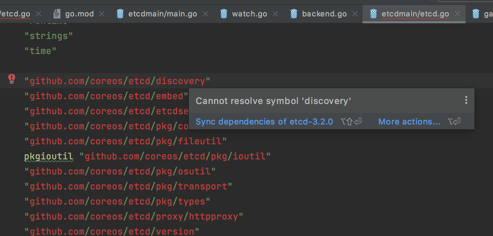
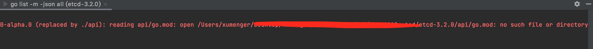
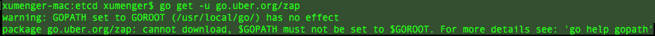

在[https://github.com/etcd-io/etcd](https://github.com/etcd-io/etcd) 用tag 的方式下载的源码因为目录下面缺少go.mod、go.sum 文件，然后自己去手动添加的话可能版本不对

因为在api/ 下面还需要一些go.sum，比如我手动在根目录下加了go.mod 之后，在GoLand 里面针对import 里面的报错点击【Sync dependencies of etcd-3.2.0】



会出现这个报错，说明还是缺少其他目录的go.mod



我现在的方案是下载[https://github.com/etcd-io/etcd](https://github.com/etcd-io/etcd) 的main 分支，它是带有go.mod 和go.sum 的，下载下来后直接用GoLand 打开即可（当前的etcd 版本不再是3.2.0，所以代码和3.2.0 会有所不同）

>当然也可以去找一下带有go.mod 的3.2.0 版本的etcd 源码包！

>main 分支下载的好像不是完整的代码，简单看了一下Documentation 里面缺少很多文档；raft、lease、mvcc、rafthttp、snap、store 等包没有

还可能会出现报错，比如在etcdmain/etcd.go （和3.2.0 版本的代码稍微不同）里面的import 中

```go
import (
	"fmt"
	"os"
	"runtime"
	"strings"
	"time"

	"go.uber.org/zap"
	"google.golang.org/grpc"

	"go.etcd.io/etcd/client/pkg/v3/fileutil"
	"go.etcd.io/etcd/client/pkg/v3/logutil"
	"go.etcd.io/etcd/client/pkg/v3/types"
	"go.etcd.io/etcd/pkg/v3/osutil"
	"go.etcd.io/etcd/server/v3/embed"
	"go.etcd.io/etcd/server/v3/etcdserver/api/v2discovery"
	"go.etcd.io/etcd/server/v3/etcdserver/errors"
)
```

在GoLand 中会发现`go.uber.org/zap` 部分还是编译报错，点击【Sync dependencies of etcd】，还是会报错

试着在终端中执行命令，还是出现报错



```
xumenger-mac:etcd xumenger$ go get -u go.uber.org/zap
warning: GOPATH set to GOROOT (/usr/local/go/) has no effect
package go.uber.org/zap: cannot download, $GOPATH must not be set to $GOROOT. For more details see: 'go help gopath'
```

这个警告就很关键了，说我把GOPATH 环境变量设置为GOROOT 了

翻看之前搭建Golang 环境的文章：[一篇学会Golang！](http://www.xumenger.com/golang-20221020/)，我确实是这样设置环境变量的

```shell
export GOPATH="/usr/local/go/"

# 注意设置GOOS 很重要，否则后续syscall.Sethostname 等syscall 下面的API 调用都会报错：undefined: syscall.Sethostname
export GOOS="linux"

export PATH=$PATH:$GOPATH/bin
```

所以专门新建一个路径作为GOPATH 的环境变量值，设置为

```shell
export GOPATH="/Users/xumenger/Desktop/library/gopath/"
```

然后使配置生效之后，再次在GoLand 里面为import 报错的地方点击【Sync dependencies of etcd】，现在所有的依赖包都可以正确下载了，然后编译报错的问题都正常解决了
