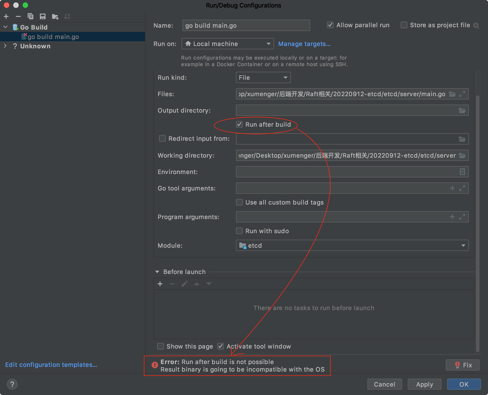

经过上面的两篇文章的梳理，对于go 的依赖管理、环境变量、GoLand 的使用等还是有所熟悉了的

etcd 服务端的入口是./server/main.go；etcdctl 客户端的入口是./etcdctl/main.go

试着在./server/main.go 开始debug 调试分析其启动流程

```go
func main() {
	etcdmain.Main(os.Args)
}
```

在MacOS 上配置调试选项的时候会出现这样的Error：

```
Error: Run after build is not possible 
Result binary is going to be incompatible with the OS
```



再回到[一篇学会Golang！](http://www.xumenger.com/golang-20221020/)，当时在~/.bash_profile 里面加了这个配置

```shell
# 注意设置GOOS 很重要，否则后续syscall.Sethostname 等syscall 下面的API 调用都会报错：undefined: syscall.Sethostname
export GOOS="linux"
```

当时是为了在MacOS 里面仿写Docker，一个教程里面提到的，为了解决那个问题，结果埋下了一个大雷，我的机器是MacOS，但是配置了这个支持linux 的配置，当然在GoLand 里面调试设置的时候就出现上面的报错

将这行配置注释掉，然后执行`source ~/.bash_profile` 使其生效

再重启GoLand，然后就可以发现可以正常调试了！

这次搭建etcd 的调试环境，一个是GOPATH 与GOROOT 冲突，一个是GOOS 乱设置，两个环境变量的问题搞了我一整天的时间，因为我自己不是很熟悉Golang，之前胡乱配置的东西在今天搞死我了！

peace and love

问题解决了就好！

接下来就可以在GoLand 里面任意调试分析etcd 的源码了

芜湖！起飞！🛫️！
