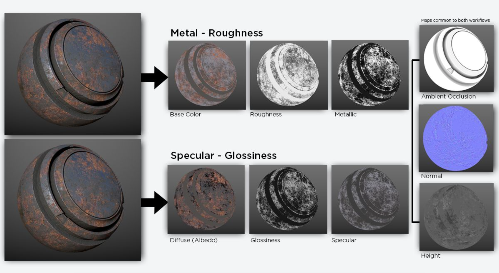
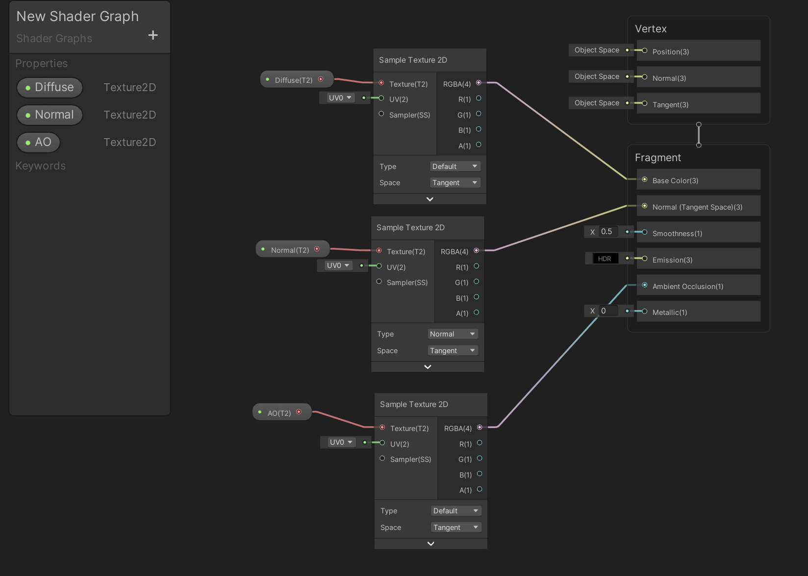
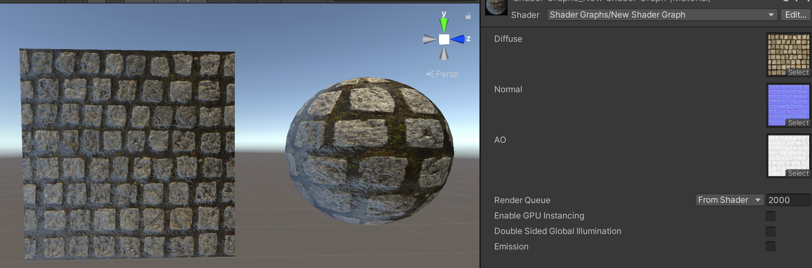

>[https://blog.unity.com/technology/introduction-to-shader-graph-build-your-shaders-with-a-visual-editor](https://blog.unity.com/technology/introduction-to-shader-graph-build-your-shaders-with-a-visual-editor)

>[https://blogs.unity3d.com/2018/08/07/shader-graph-updates-and-sample-project](https://blogs.unity3d.com/2018/08/07/shader-graph-updates-and-sample-project)

## 贴图介绍

游戏模型制作中用到了很多贴图类型，通过不同类型贴图的组合使用以达到最终需要得到的模型效果。最常见的类型有Diffuse、Emissive、Normal、Opacity、Specular、Roughness。游戏制作中根据项目资产的需要使用不同的贴图类型

常见的PBR 工作流程是：金属/粗糙度工作流、高光反射/光泽度工作流

**金属/粗糙度工作流**

* Base Color
* Roughtness：粗糙度贴图，0（黑色-0 sRGB）表示光滑，1（白-255 sRGB）表示粗糙
* Metallic

**高光反射/光泽度工作流**

* Diffuse（Albedo）：一般认为等同于Base Color
* Glossiness：光泽度贴图，定义材质得粗糙度信息，跟Roughness 相反，0（黑色-0 sRGB）表示粗糙，1（白-255 sRGB）表示光滑
* Specular：高光贴图，颜色越亮高光越强，黑色表示没有高光

**通用贴图**

* Ambient Occlusion：环境光遮蔽贴图，描述了较大尺度的光线遮蔽信息，通常由高模烘培得到。指表面某点能获得多少环境中的光，用来模拟物体之间所产生的阴影，在不打光的时候增加体积感
* Normal
* Height

参考资料：[《游戏资源中常见的贴图类型》](https://zhuanlan.zhihu.com/p/260973533)

## Shader Graph 使用贴图

>注意：Unity 2020 之后，PBR Master 节点就不再存在了，被Vertex、Fragment 所取代

在Shader Graph 中创建一个Texture2D 类型的属性，**拖到**节点编辑器中，然后创建一个Sample Texture 2D 贴图采样节点

Texture2D 属性连接到Sample Texture 2D，Sample Texture 2D 再连接到Fragment 的相应属性，比如这里分别连了Base Color、Normal、Ambient Occlusion

>关键是中间需要一个Sample Texture 2D 节点！Texture 3D、CubeMap 等也类似，需要配合对应的采样节点使用

>对于法线贴图还需要强调一点，在Sample Texture 2D 需要选择Type 为Normal

然后可以创建材质，设置对应的贴图，应用到对应的模型上，可以看到使用了法线贴图后，模型表面的细节还是很丰富的

>但是这个表面仔细看出来有一点油油的感觉，应该是金属度相关的设置不正确导致的
