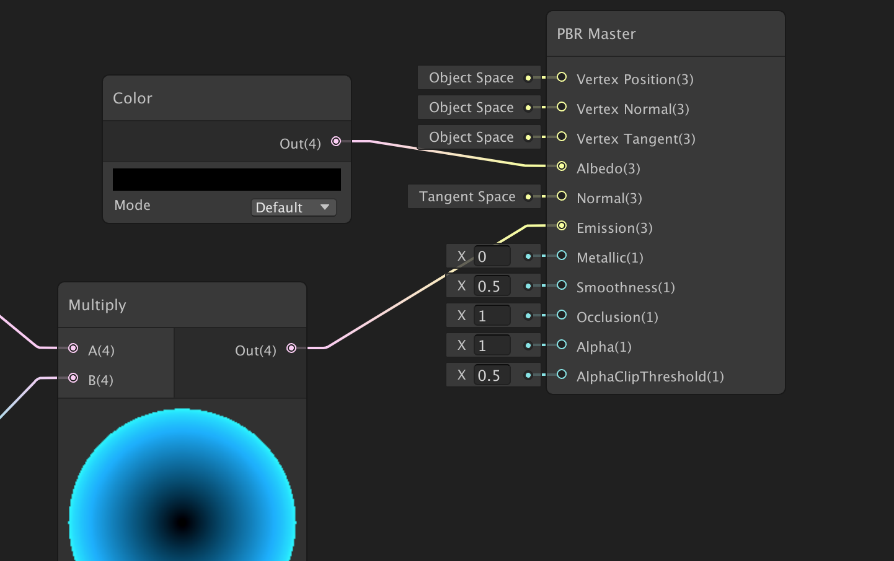
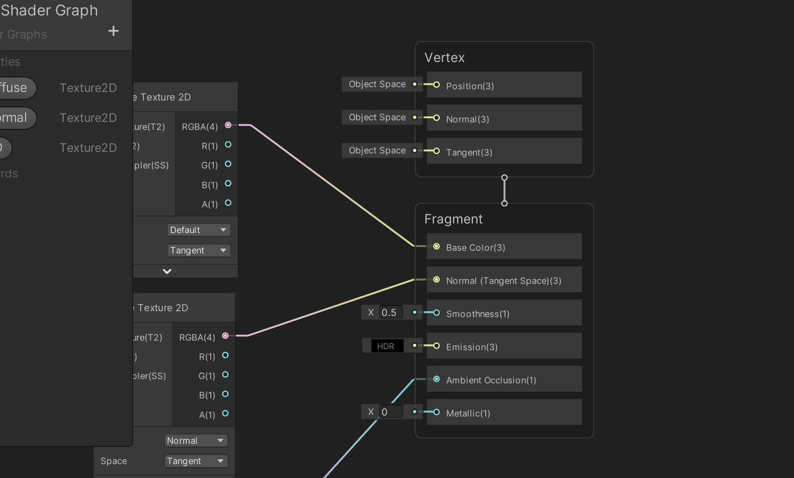

## Unity 2020 前后对比

在Unity 2020 之前，Shader Graph 里面有一个PBR Master 节点

可以看到它的Input 包括

* Vertex Position：顶点位置，可以用来做顶点动画
* Vertex Normal：顶点法线
* Vertex Tangent：顶点切线
* Albedo：颜色贴图，漫反射颜色，物体的固有色，类似Diffuse
* Normal：法线贴图
* Emission：自发光贴图，一些赛博朋克、科幻类的游戏适合使用自发光材质
* Metallic：金属度贴图
* Smoothness：光滑度
* Occlusion：环境遮蔽
* Aplha：控制透明
* AlphaClipThreshold：Alpha剔除阈值

在Unity 2020 及以后，变成了这样

## 一些PBR 资料

以下资料对于每种贴图的原理做了详细的介绍，是很好的学习资料！

* [Albedo Color and Transparency](https://docs.unity3d.com/2017.3/Documentation/Manual/StandardShaderMaterialParameterAlbedoColor.html)
* [Metallic mode: Metallic Parameter](https://docs.unity3d.com/2017.3/Documentation/Manual/StandardShaderMaterialParameterMetallic.html)
* [Specular mode: Specular parameter](https://docs.unity3d.com/2017.3/Documentation/Manual/StandardShaderMaterialParameterSpecular.html)
* [Normal map (Bump mapping)](https://docs.unity3d.com/2017.3/Documentation/Manual/StandardShaderMaterialParameterNormalMap.html)
* [Smoothness](https://docs.unity3d.com/2017.3/Documentation/Manual/StandardShaderMaterialParameterSmoothness.html)
* [Occlusion Map](https://docs.unity3d.com/2017.3/Documentation/Manual/StandardShaderMaterialParameterOcclusionMap.html)
* [Emission](https://docs.unity3d.com/2017.3/Documentation/Manual/StandardShaderMaterialParameterEmission.html)
* [Material charts (Tablas de material)](https://docs.unity3d.com/es/2018.1/Manual/StandardShaderMaterialCharts.html)

下图针对我们常用的材质怎么设置相关PBR 参数有进行详细的介绍，可以对照这个表做出来对应的材质效果！

>怎么在Substance Painter 中分别制作这些贴图？
