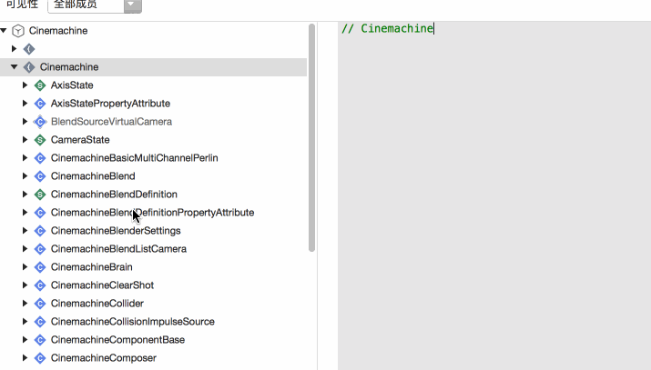
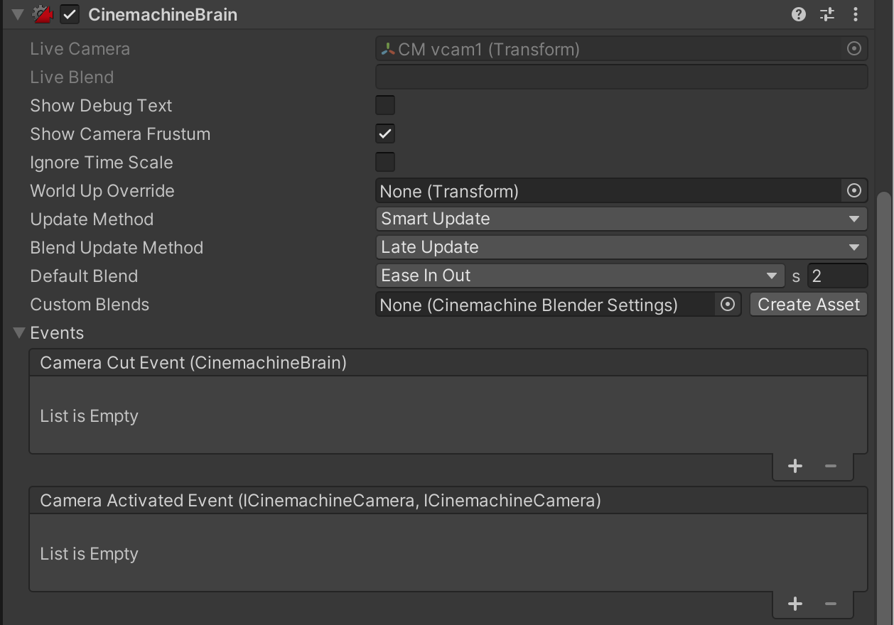
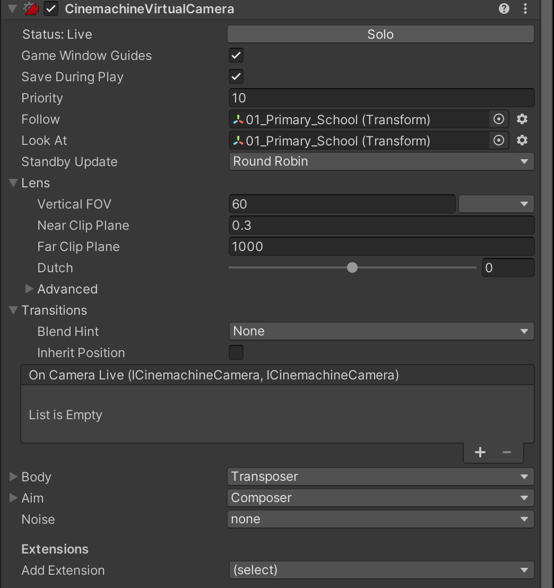

[好好玩游戏：Cinemachine 实现角色跟随](http://www.xumenger.com/cine-machine-20210914/) 这篇文章只是介绍了Cinemachine 在Unity 的操作面板，这个只是Cinemachine 的最初级的功能，更强大的功能还是需要结合Cinemachine 提供的API 编程使用

可以看到Cinemachine 提供的API 是非常丰富的

游戏开发过程中有很多是要参考电影制作的，分镜设计等，不过在游戏领域成本会低很多，不需要购买昂贵的相机，在代码里面就可以实现

>[https://docs.unity.cn/cn/current/Manual/CamerasOverview.html](https://docs.unity.cn/cn/current/Manual/CamerasOverview.html)

>[https://docs.unity.cn/Packages/com.unity.cinemachine@2.8/manual/index.html](https://docs.unity.cn/Packages/com.unity.cinemachine@2.8/manual/index.html)

## 相机原理介绍

相机能够渲染的空间是有限的，如下图，相机只能渲染如图视锥体中的内容，近裁剪面（Near clipping）以内、远裁剪面（Far clipping plane）之外、视锥体FOV（视野）之外的都是无法渲染的

## Cinemachine使用介绍

Cinemachine 的种类包括如下这些：

* Virtual Camera
* FreeLook Camera
* Blend List Camera
* State-Driven Camera
* ClearShot Camera
* Dolly Camera with Track
* Dolly Track with Cart
* Target Group Camera
* Mixing Camera
* 2D Camera

比如在场景中新建了一个Virtual Camera 之后（默认名称为CM vcam1），可以看到在原来的Main Camera 游戏对象上面多了一个CinemachineBrain 组件，且Live Camera 属性就是CM vcam1

## CinemachineBrain 介绍

CinemachineBrain 会读取场景中某个虚拟相机的配置，并以此配置来控制相机的行为，如果要改变相机的位置、视野之类的属性，必须到虚拟相机这里进行修改

其实就很好的理解了Cinemachine 的结构了，最终结果的渲染还是靠Camera 的，虚拟相机则是管理各种配置。所以在场景中可以根据需要定义任意数量的虚拟相机，并随时在这些虚拟相机之间进行切换

如上图，继续介绍CinemachineBrain 的各种属性

* Live Camera：当前正在使用哪个虚拟相机的配置
* Live Blend：当前的虚拟相机的切换过程（百分比格式的切换进度）
* Show Debug Text：勾选后，可以在Game 窗口中看到上面的两个属性
* Show Camera Frustum：显示当前的视锥体（相机的可视范围）
* Ignore Time Scale：相机的行为是否受时间缩放值的影响
* World Up Override
* Update Method
* Blend Update Method
* Default Blend：默认的相机切换模式，以及切换时间
	* Cur：瞬间切换
	* Ease In Out：从一个相机慢慢地加速切出，向另一个相机慢慢地减速切入
	* Ease In：匀速切出，慢慢地减速切入
	* Ease Out：慢慢地加速切出，匀速切入
	* Hard In：加速切入
	* Hard Out：快速地加速切出
	* Linear：全程匀速切换
	* Custom：自定义切入切出曲线
* Custom Blends：可以创建资源文件，针对不同的两两相机制定不同的切换模式
* Events：相机的一些事件触发

## Virtual Camera 属性介绍

Virtual Camera 看起来就像是一个普通的组件，可以通过编写脚本，在游戏进行时修改它的各个属性。不过在概念上，建议将Virtuak Camera 当作一种相机行为的配置文件

在游戏开发过程中，相机有几种行为，就建议为相机制作几个虚拟相机，比如为角色移动准备一个第三人称的虚拟相机，为角色的举枪瞄准准备一个第一人称的虚拟相机，为过场剧情准备几个固定机位的虚拟相机和几个滑轨相机，把这几种虚拟相机的属性配置好，保存在这个场景中，当需要改变相机的行为时，直接切换虚拟相机即可

**【Status】**：当前虚拟相机的状态

* Live（激活）：表示CinemachineBrain 正在使用这个虚拟相机的属性来控制相机
* Standby（待机）：表示虚拟相机未被CinemachineBrain 使用，但虚拟相机自身还在运行当中，下面的跟随、瞄准等计算不一定会停止。它的计算频率或者说刷新频率，由下面的Standby Update 决定
* Disable（禁用）：不再占用系统资源
* 点击后面的【Solo】按钮，可以让当前的虚拟相机立即处于激活状态，方便在开发时随时观察虚拟相机的工作状态，并进行调整

**【Game Window Guide】**：游戏窗口引导，打开后会在游戏窗口显示一些提示信息

**【Save During Play】**：在游戏运行模式下对虚拟相机属性的修改会被保存下来

**【Priority】**：Cinemachine 会使用优先级最好的虚拟相机，可以用修改优先级的方式来切换虚拟相机；Timeline 中使用虚拟相机，该属性无作用。虚拟相机自己也提供了一些内置的相机切换方案

**【Follow】**：虚拟相机会跟随这里的游戏对象移动，具体的跟随移动行为设置在下面的Body 设置里面。详见下一篇博客

**【Look At】**：虚拟相机会看向这个游戏对象，具体的Look At 行为设置在下面的Aim 中。详见下下篇博客

**【Standby Update】**：参考Status 的Stanby 状态

**【Lens】** ：镜头设置

* Vertical FOV：视野角度
* Near Clip Plane：近裁剪平面，与相机距离小于这个数值的游戏对象，不会被渲染
* Far Clip Plane：远裁剪平面，与相机距离大于这个数值的游戏对象，不会被渲染
* Dutch：斜角镜头的角度
* Advanced 下面可以把相机修改为正交、透视、物理

**【Transitions】**：虚拟相机切换时候的一些属性

* Blend Hint：相机切换的行为具有怎样的物理（空间）特征
	* None：对角度和位置做插值，也就是一条线性的切换
	* Spherical Position：球形切换，如果Look At 有对象的话，那么就以它为球心做一个球形的切换，也就是相机划过的路径大致处于一个球面上
	* Cylindrical Position：圆柱切换，如果Look At 有对象的话，就以它为中心在水平平面上做圆形切换，在垂直方向上做线性切换，相机划过的路径大致处于一个圆柱体的表面上
	* Screen Space Aim When Targets Differ：当两个虚拟相机Look At 的目标不同时，在屏幕空间之间做切换，这种切换在位置上使用世界坐标系，表现出的是普通的线性切换，在角度上则会根据两个相机所构成的屏幕空间的夹角间做切换
* Inherit Position：表示这个相机被激活时，不是让相机移动到虚拟相机的位置，而是虚拟相机移动到相机的位置

**【Noise】**：可以为相机添加晃动效果

**【Extensions】**：可以添加一些额外的功能，比如相机碰撞检测等

## 参考资料

* [根据人物构图计算镜头位置](https://zhuanlan.zhihu.com/p/372617646)
* [Cinemachine API 第三人称跟随案例与参数调节](https://blog.csdn.net/qq_23841127/article/details/119005689)
