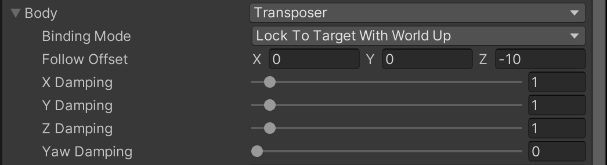
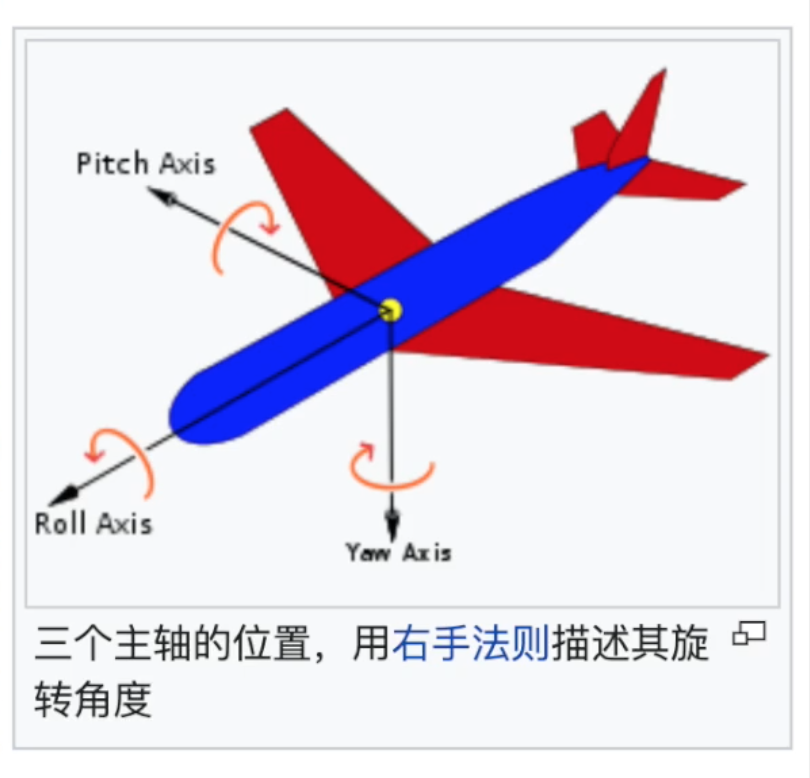

【Follow】属性表示虚拟相机会跟随这里的游戏对象移动，具体的跟随移动行为设置在下面的Body 设置里面

Body 的模式有

* Do nothing
* 3rd Person Follow：第三人称跟随
* Framing Transposer
* Hard Lock To Target
* Orbital Transposer：环绕对象的相机
* Tracked Dolly
* Transposer

Body 的默认模式是Transposer，表示虚拟相机将在某个固定的偏移或距离上跟随目标移动，也就是下面的Follow Offset

介绍Blending Mode 之前，先对照参考下图

Blending Mode 的取值如下

**Lock To Target On Assign**：当虚拟相机和Follow 的目标建立关系时，也就是On Assign 的时候，虚拟相机会出现在Follow 目标本地坐标系下Follow Offset 位置，此后它们之间的位置关系就锁定了

**World Space**：与Lock To Target On Assign 类似，不过此时的坐标是世界坐标系下的坐标，而不是本地坐标系

**Lock To Target With World Up**：如上图，相机照着飞机垂直方向的偏航轴，也就是Yaw Axis 旋转，虚拟相机自己不旋转。Yaw Damping 可以设置绕偏航轴旋转的延迟程度

**Lock To Target No Roll**：相机可以绕着飞机的偏航轴和俯仰轴旋转，但是不能绕着横滚轴旋转，可以通过Pitch Damping、Yaw Damping 设置对应旋转的阻尼

**Lock To Target**：相机此时可以绕着Follow 目标的三个轴旋转，Pitch Damping、Yaw Damping、Roll Damping

**Simple Follow With World Up**：相机不会绕对象的任何一个轴旋转，且尽量不会在横向移动

下面的各种Damping 是一些阻尼系数，可以理解为相机移动的延迟，系数越小，相机的反应速度就越快

>注意：Follow 和Body 影响的是虚拟相机的Position；Look At 和Aim 影响的是虚拟相机的Rotation！