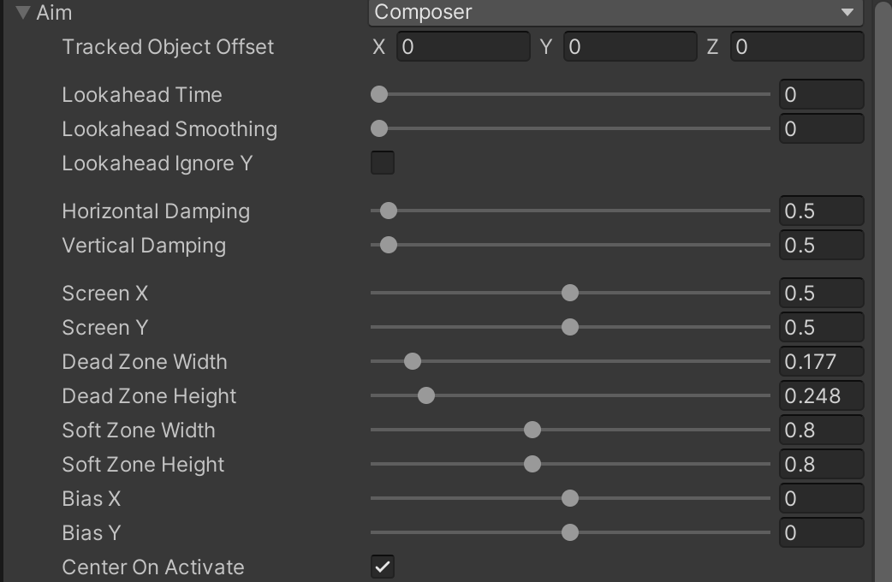
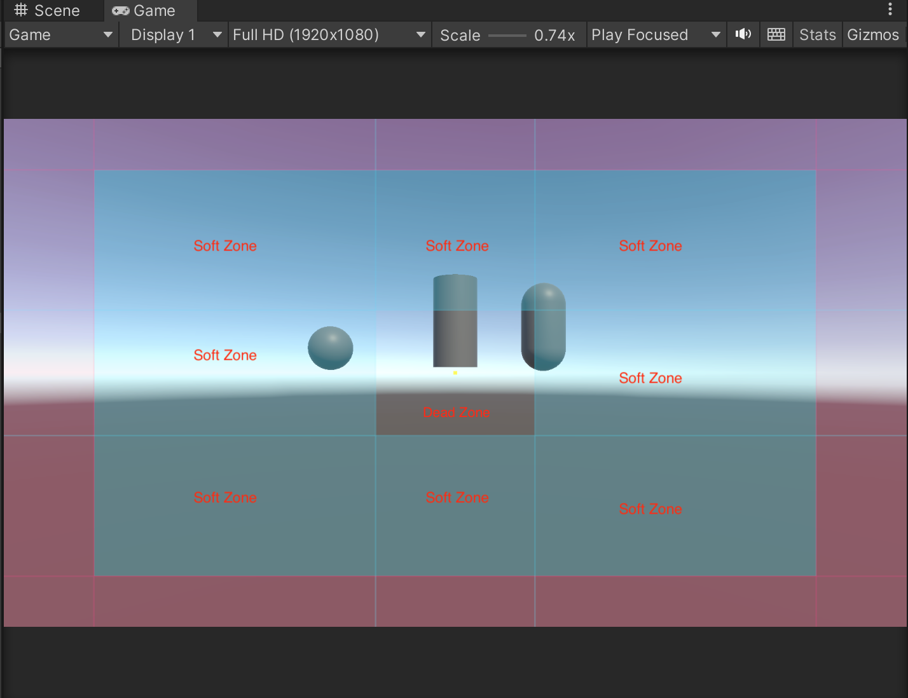
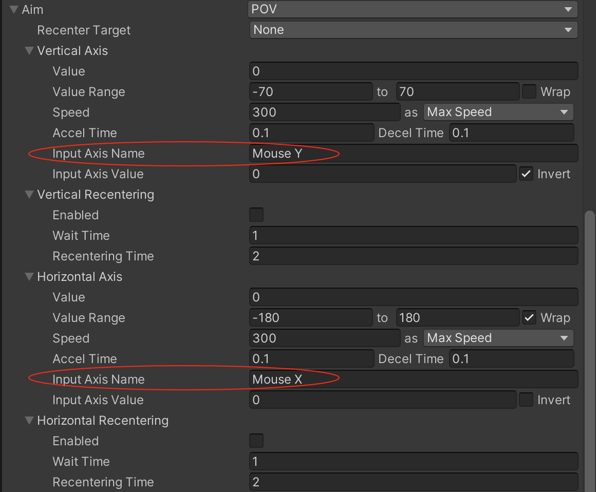
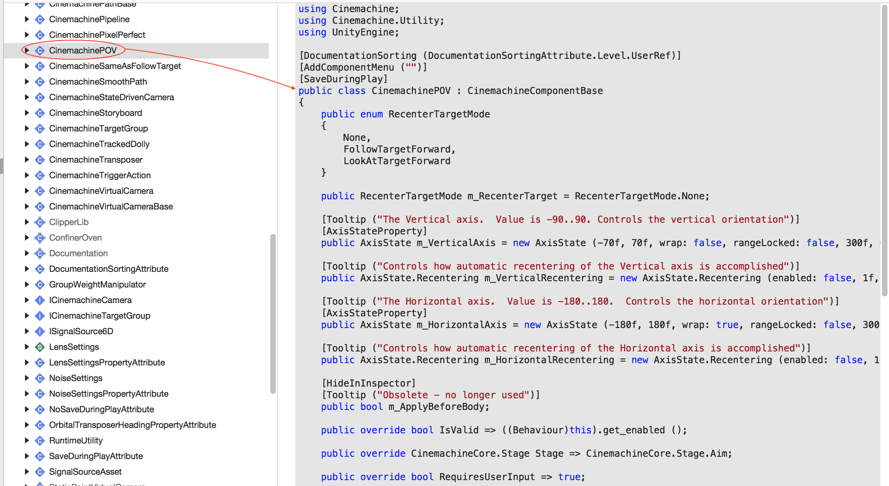
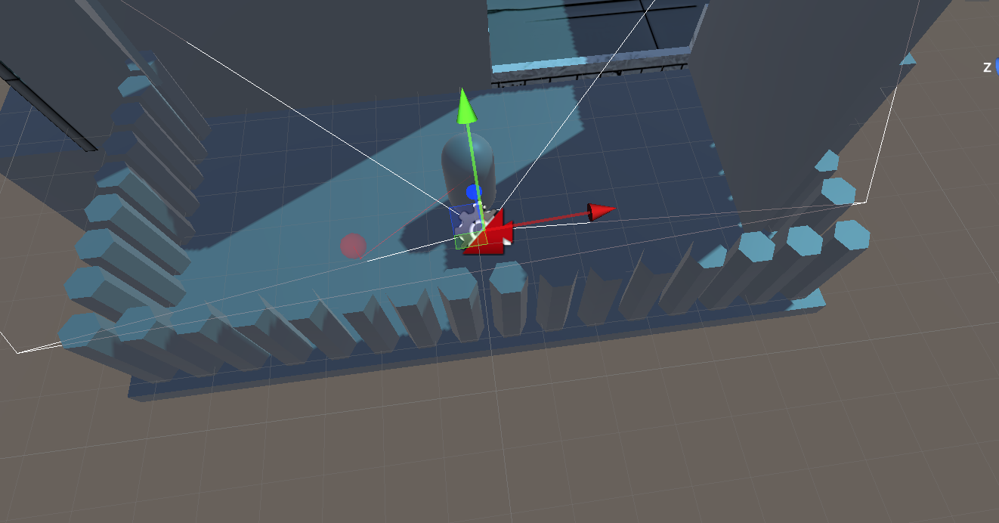
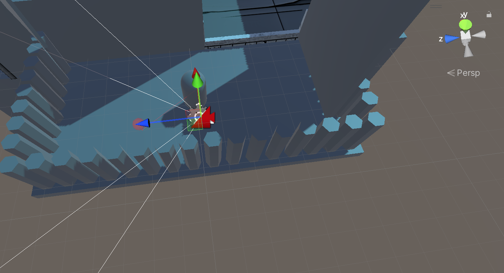

【Look At】属性表示虚拟相机会看向这个游戏对象，具体的Look At 行为设置在下面的Aim 中

Aim 的模式有

* Same As Follow Target：虚拟相机的行为和“瞄准”没有什么关系，纯粹就是复制目标的角度，通过Damping 设置阻尼系数，数值越大，相机跟随的速度就越慢
* Do nothing：和将Look At 设置为Null 一样
* Composer：默认模式，标准的瞄准模式，保证相机看向这个游戏对象
* POV：自定义鼠标控制屏幕摄像头旋转

## 先介绍一下Composer

**Tracked Object Offset**：相机瞄准的这个位置，是否要在对象的位置的基础上做一定量的偏移

**Lookahead Time**：根据目标当前的移动速度推测出一个偏移量，指的是Cinemachine 会计算当前目标的速度，并预测出一段时间后目标的位置，然后添加一个偏移量

**Lookahead Smoothing**：可以让上面的预测算法更加平滑，当目标的运动情况变化比较大时，可以调整这里的数值以消除镜头的抖动；但如果数值过大会导致预测的延迟

**Lookahead Ignore Y**：勾选的话就不会预测目标垂直方向上的运动

**Horizontal Damping**：水平方向上的阻尼，值越大，相机转动的就越慢

**Vertical Damping**：垂直方向上的阻尼

**Screen X、Screen Y** 是Dead Zone 的中心位置，0.5/0.5 表示屏幕的正中间

**Dead Zone Width/Height**：Dead Zone 的宽和高。Dead Zone 是减少相机的敏感程度

**Soft Zone Width/Height**：Soft Zone 的宽和高

**Bias X/Y**：Soft Zone 的偏移量

下图中，Dead Zone 的范围由周边的淡蓝色直线围出来，它的作用是减少相机的敏感程度，只要当前的黄点（也就是Look At 的Aim）还落在Dead Zone 中，相机就不做转动；对应的Soft Zone 就是下图中蓝色区域，当黄点落入蓝色的Soft Zone 时，虚拟相机会通过转动让黄点回到透明的Dead Zone 里 

## 再看看POV

注意，需要支持Input Manager（Old）输入控制系统

POV 对应的Cinemachine 组件是CinemachinePOV

在实际使用的时候会遇到这样的问题，比如设置为Composer 模式的时候，默认是看向【Look At】对应的游戏物体的

但是如果设置为POV，则并不是看向【Look At】的。如下图所示的视锥体，可以看到，它看向了其他地方

