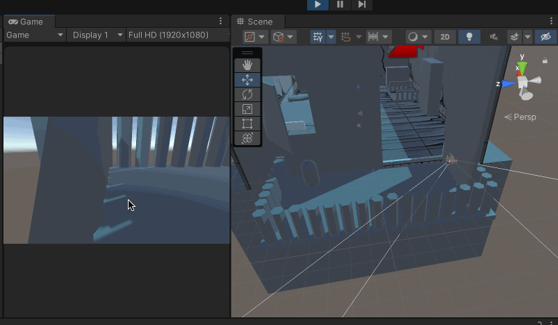
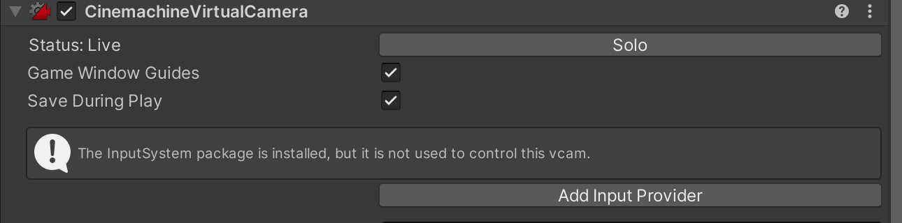
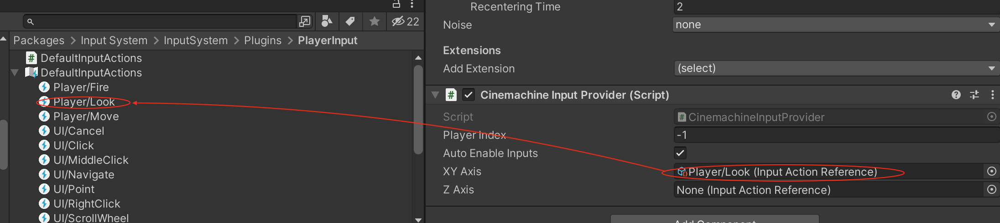
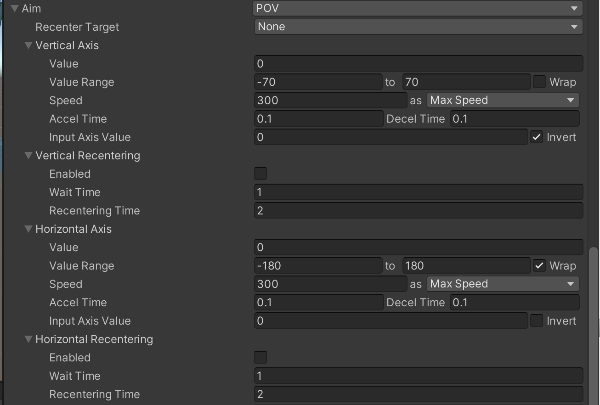

上一篇介绍到了使用POV 模式后相机的视锥体并没有看向【Look At】设置的物体的问题，现在实际运行起来后，旋转鼠标，发现也不是围绕着【Look At】旋转的，而是以自己为中心旋转的

>回到[《Unity Cinemachine：Follow 和Transposer》](http://www.xumenger.com/cinemachine-follow-20230512/)，提到了一点：Follow 和Body 影响的是虚拟相机的Position；Look At 和Aim 影响的是虚拟相机的Rotation！

>所以这里设置Aim 为POV 模式，当鼠标移动的时候，如果希望相机围绕着玩家旋转，实际上修改的是Cinemachine 的Position 的位置实现的，而如上所述，Aim 控制的是相机的Rotation，而不是Position，所以和上图的表现也是一致的！

所以想要实现实现鼠标拖动的时候，相机围绕玩家旋转的效果，很好实现，不应该在【Look At】和【Aim】的地方做文章，而应该在【Follow】和【Body】上做文章

## 输入系统

上一篇说到了，POV 需要使用Input Manager（Old）输入系统，实际上是不严谨的

当我们为Aim 选择POV 模式的时候，确实下面的Vertical Axis -> Input Axis Name、Horizontal Axis -> Input Axis Name 的值是基于Input Manager（Old）的

但是回到上面是可以看到有警告的

可以点击【Add Input Provider】，然后就会新增一个脚本组件，这个就是来支持Input System 的

这时候对应POV 的配置项里面Vertical Axis -> Input Axis Name、Horizontal Axis -> Input Axis Name 也就不再显示了

