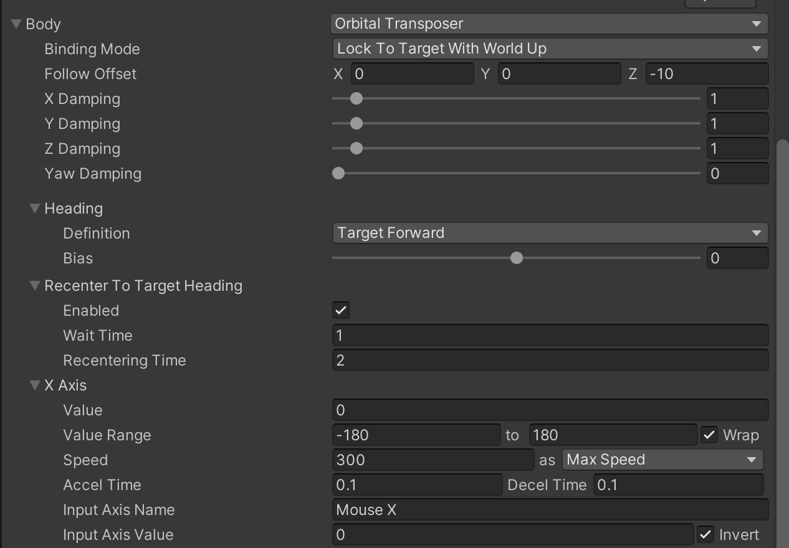
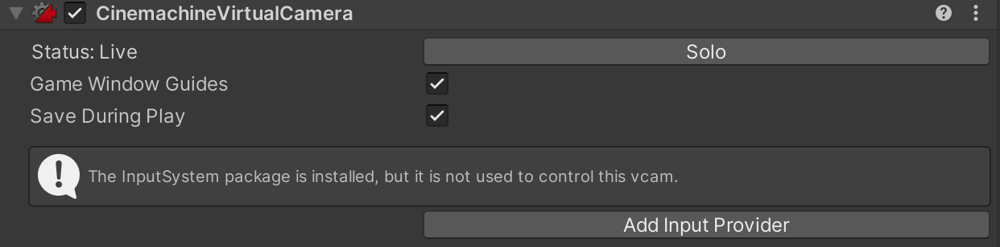
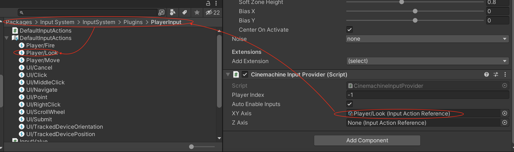
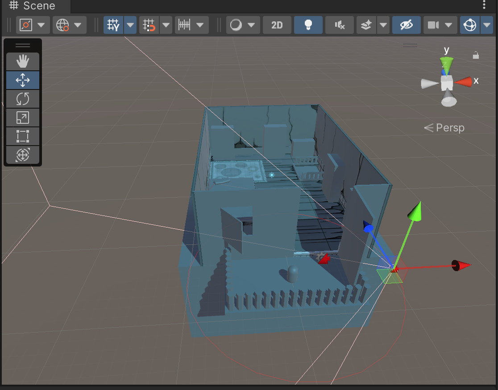
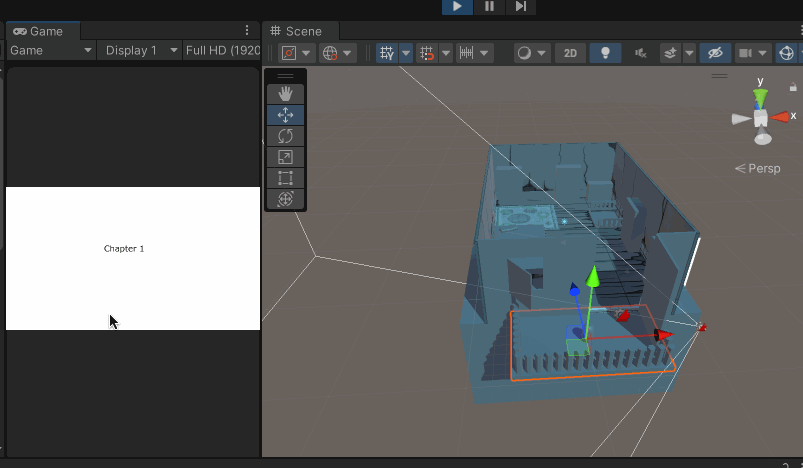
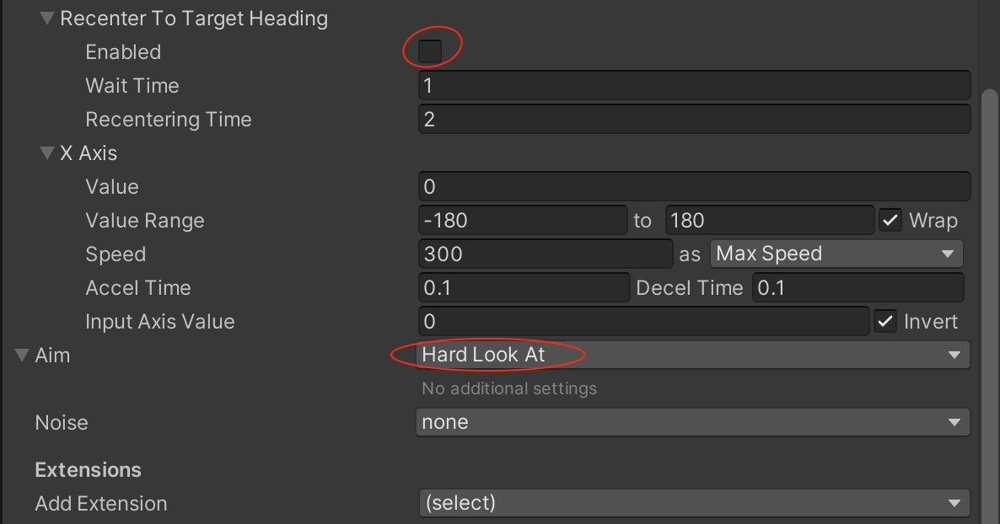
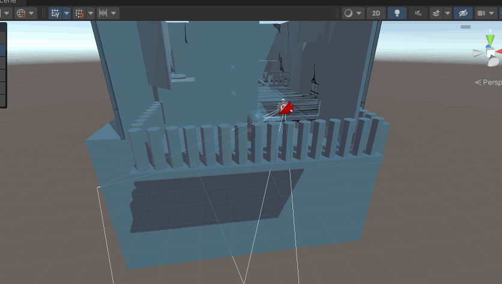

继续上文，想要实现当鼠标拖动的时候改变视角，让相机围绕角色旋转，可以使用Orbital Transposer（环绕相机）

在此基础上在增加一个角色移动控制的需求，实现角色的行走方向由相机的坐标系决定，也就是按下键盘的前后左右时，指的是相对于相机方向的前后左右，而不是世界坐标系下的前后左右

## Orbital Transposer

将Body 设置为Orbital Transposer



同时可以看到在CiemachineVirtualCamera 组件下面有一个告警



因为Orbital Transposer 是可以由玩家操作的，这里检测到了项目中安装了InputSystem，是否要添加输入的辅助组件，如果不添加的话，这个虚拟相机暂时是无法正常操作的，点击【Add Input Provider】

然后可以看到当前的Game Object 上面多了一个Cinemachine Input Provider 的脚本，使用Input System 自己默认带的Default Input Actions 的Look 作为控制相机行为的Action



然后在Scene 窗口上，针对这个VirtualCamera 可以看到有一个红色圆环，Orbital Transposer（环绕相机）就会限制相机在这个红色圆环上移动



对应在Body 下面有一个Follow Offset 属性，其中Y 表示红色圆环相对于Follow 目标的高度；Z 表示圆环的半径；X 表示相机在这个圆环的切线上的偏移

建议Binding Mode 选择为World Space，这样相机就不会因为玩家的移动而绕着这个红色圆圈自动转动了

运行起来之后的效果是这样的



很明显，确实随着鼠标的移动，相机围绕着中心旋转了，但是一旦鼠标不动，相机就自动归位了，可以通过取消勾选【Recenter To Target Heading】解决；另外也需要把Aim 设置为Hard Look At，这样相机无论怎么动，都始终盯着【Look At】看



## 角色移动控制

实现角色的行走方向由相机的坐标系决定，也就是按下键盘的前后左右时，指的是相对于相机方向的前后左右，而不是世界坐标系下的前后左右

```c#
public class PlayerController : MonoBehaviour
{
    CharacterController controller;


    public float speed = 2.0F;
    private Vector3 moveDirection = Vector3.zero;


    // Start is called before the first frame update
    void Start()
    {
        controller = GetComponent<CharacterController>();
    }

    // Update is called once per frame
    void Update()
    {
        // 代表相机前面的方向在水平平面上做投影
        Vector3 camForwardPro = Vector3.ProjectOnPlane(Camera.main.transform.forward, Vector3.up);

        // moveDirection代表输入在相机坐标系下的方向
        moveDirection = camForwardPro * Input.GetAxis("Horizontal") * -1 + Camera.main.transform.right * Input.GetAxis("Vertical");

        moveDirection = transform.TransformDirection(moveDirection);
        moveDirection *= speed;

        // 角色控制器实现角色移动
        controller.Move(moveDirection * Time.deltaTime);
    }
}
```

## 运行效果

再针对Orbital Transposer 的相关属性进行设置后，运行效果如下


还是会发现有一个问题：相机只能在一个水平的圆圈中旋转，在上下旋转则不行，但是我们实际上还是会有上下角度观察的需求的！除非我们做的是一个固定视角的游戏，但是大多数第三人称的游戏都是不限制视角的！

这个问题怎么解决？

Orbital Transposer 配合FOV 呢？如下所示，运行起来之后，相机的移动和旋转也是不符合预期的，而且移动和旋转看起来是乱七八糟的


