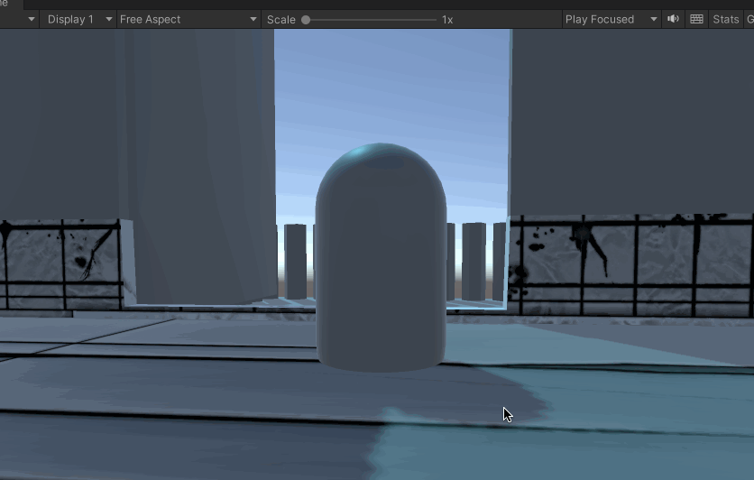
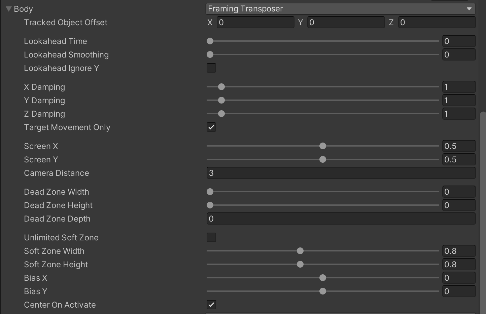
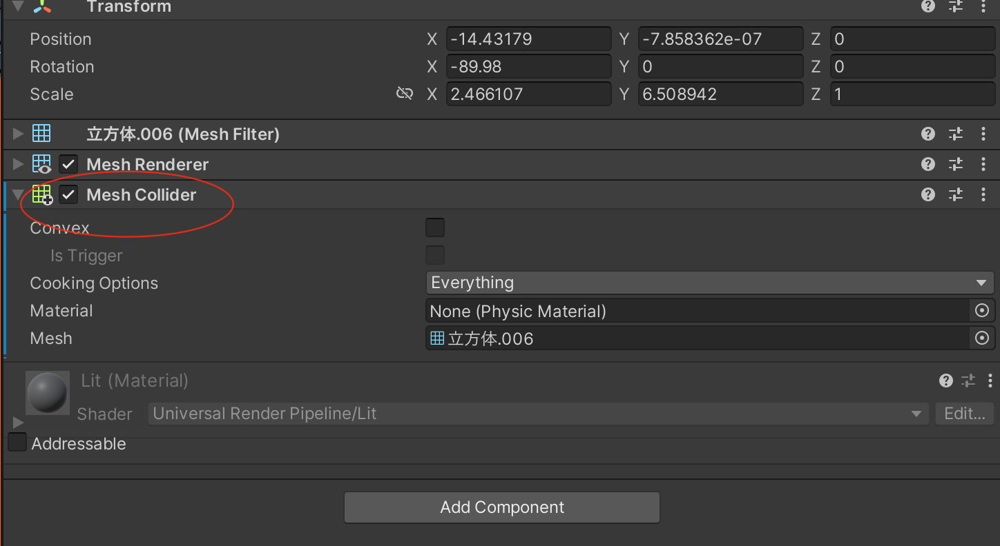
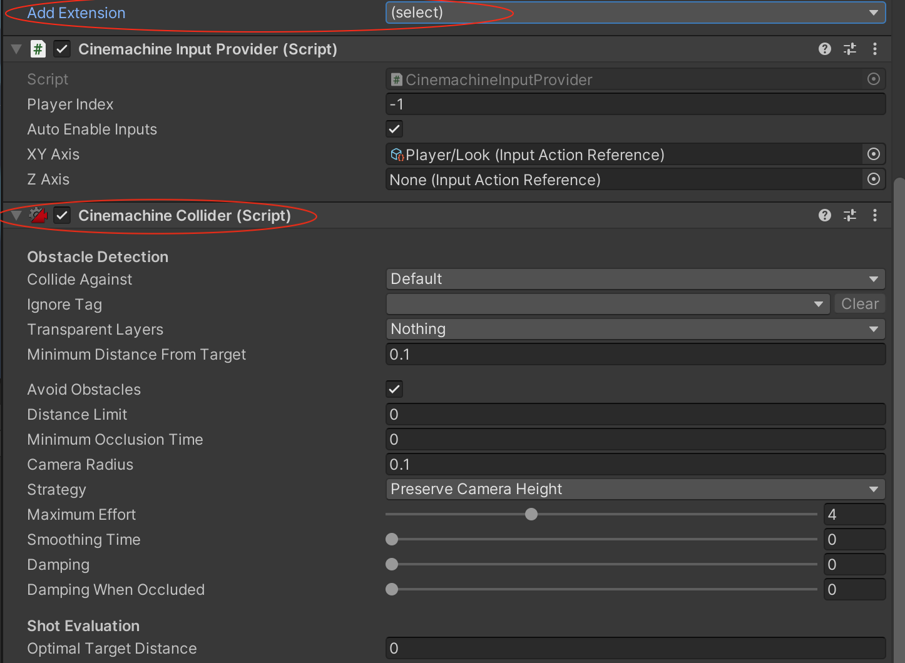

在上一篇中看到了，使用Orbital Transposer 配合Hard Look At 只能实现；Orbital Transposer 配合POV 的话，则更是乱七八糟

不用担心，Body 设置为Framing Transposer，Aim 设置为POV 就可以实现这样的效果

当屏幕和Follow 对象之间的关系相对固定的时候，一般会采用Framing Transposer，通常被用来在2D 游戏以及正交相机当中。当然我们这个场景中使用Framing Transposer 也刚刚好！

Framing Transposer 相机会和目标保持一个固定的距离，所以当我们想要相机围绕玩家旋转的时候，这个就是一个球形的运行轨迹，以玩家为中心，在固定半径的球面上，所以这个就符合固定距离的条件！

关于Framing Transposer 的各个设置项，这里就不再详细介绍，可以自己多动手试一下

## 手感相关

在游戏开发中，游戏的手感是玩家一直提到的点，打击感等，比如这里就是有一个点，鼠标移动后，反映到游戏里面视角变化的玩家感受，这个好不好，也是很影响玩家体验的

在Framing Transposer 里面通过合理设置阻尼、Dead Zone、Soft Zone，可以得到你想要的手感

## 视角问题

现在可以实现围绕角色在球形范围内旋转的逻辑了，但是经过在操作的过程中（如第一个演示动图所示），会出现从玩家脚底往上看的情况，甚至会走到地板下面，也就是穿模的问题，这个事情要怎么解决？

要么限制旋转角度

要么使用碰撞器，控制不允许穿模，包括墙和地面，而这个在Cinemachine 中也是支持的

比如我不想让相机穿模到地面下面

首先为场景中地面增加一个Mesh Collider 碰撞器

然后在Virtual Machine 组件的Extensions 下面选择Cinemachine Collider

