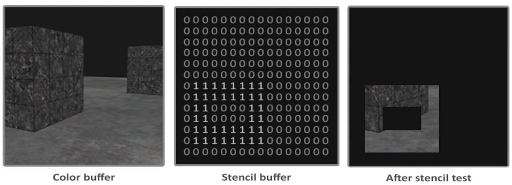
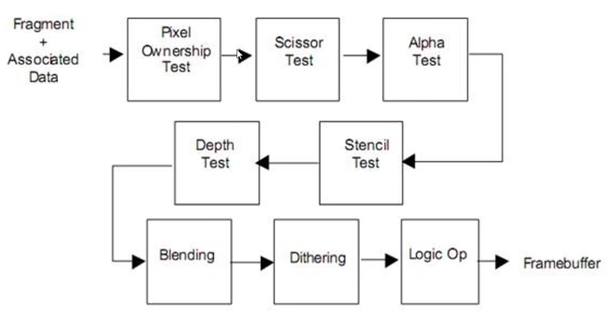

当片段着色器处理完一个片段之后，模板测试（Stencil Test）会开始执行，和深度测试一样，它也可能会丢弃片段。接下来，被保留的片段会进入深度测试，它可能会丢弃更多的片段。模板测试是根据又一个缓冲来进行的，它叫做模板缓冲（Stencil Buffer），我们可以在渲染的时候更新它来获得一些很有意思的效果

一个模板缓冲中，（通常）每个模板值（Stencil Value）是8位的。所以每个像素/片段一共能有256 种不同的模板值。我们可以将这些模板值设置为我们想要的值，然后当某一个片段有某一个模板值的时候，我们就可以选择丢弃或是保留这个片段了



```
stencil 
{
    Ref referenceValue      // Ref用来设定参考值referenceValue，这个值将用来与StencilBuffer进行比较
    ReadMask readMask
    WriteMask writeMask
    Com comparisonFunction  // Comp是定义参考值（referenceValue）与缓冲值（stencilBufferValue）比较的操作函数，默认值是always
    Pass stencilOperation   // 模板测试（和深度测试）通过时，默认keep
    Fail stencilOperation   // 模板测试（和深度测试）失败时
    ZFail stencilOperation  // 模板测试通过而深度测试失败时
}
```

ComparisonFunction 的取值如下

取值       | 介绍
--------- | ---------------------------------------------- 
Greater   | 相当于 >。即仅当左边>右边，模板测试通过，渲染像素
GEqual    | 相当于 >=。即仅当左边>=右边，模板测试通过，渲染像素
Less      | 相当于 <。即仅当左边<右边，模板测试通过，渲染像素
LEqual    | 相当于 <=。即仅当左边<=右边，模板测试通过，渲染像素
Equal     | 相当于 =。即仅当左边=右边，模板测试通过，渲染像素
NotEqual  | 相当于 !=。即仅当左边!=右边，模板测试通过，渲染像素
Always    | 不管公式两边为何值，模板测试总是通过，渲染像素
Never     | 不管公式两边为何值，模板测试总是失败，像素被抛弃

stencilOperation 的取值如下

取值       | 介绍
--------- | ---------------------------------------------- 
Keep      | 保留当前缓冲区中的内容，即stencilBufferValue不变
Zero      | 将0写入缓冲，即stencilBufferValue值变为0
Replace   | 将参考值写入缓冲，即将referenceValue赋值给stencilBufferValue
IncrSat   | stencilBufferValue加1，如果stencilBufferValue超过255了，那么保留为255，即不大于255
DecrSat   | stencilBufferValue减1，如果stencilBufferValue小于0，那么保留为0，即不小于0
Invert    | 将当前模板缓冲区（stencilBufferValue）按位取反
IncrWrap  | 当前缓冲区的值加1，如果缓冲值超过了255，那么就变成0，（然后继续自增）
DecrWrap  | 当前缓冲区的值减1，如果缓冲值已经为0，那么就变成255，（然后继续自减）

在渲染管线流程中看模板测试。从片元着色器处理完之后到帧缓冲输出，中间会有一系列逐片元的操作，如下图，模板测试就是其中的一环。只有经过所有的环节之后才能输出到帧缓冲区



>补充：Alpha Test 只能实现全透明或者不透明的效果；Blending 可以实现半透明的效果

## 参考资料

* [Learn OpenGL: 模板测试](https://learnopengl-cn.github.io/04%20Advanced%20OpenGL/02%20Stencil%20testing/)
* [LearnOpenGL之深度测试、模板测试、混合、面剔除](https://www.bilibili.com/video/BV1B24y1R7BH)
* [【教程】模板测试原理详解（空间效果实现）](https://www.bilibili.com/video/BV1NJ41167Ec)
* [【技术美术百人计划】图形 3.1 深度与模板测试 传送门效果示例](https://www.bilibili.com/video/BV1Tb4y1C7Qa)
