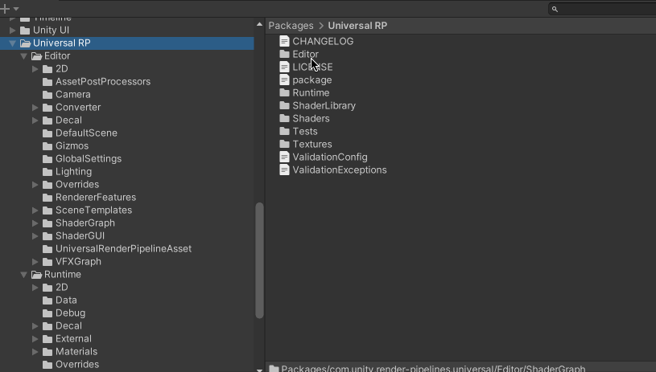
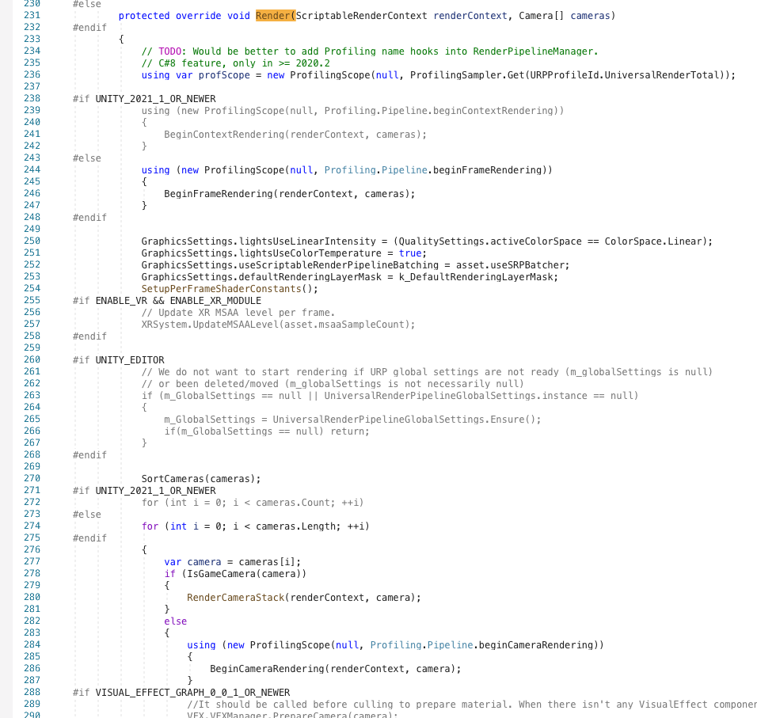

## 现象说明

比如用在URP 项目中编写下面的Shader，发现没有按照预期执行两个Pass 渲染！

```
Shader "Unlit/Outline_Stencil_Normal"
{
    Properties
    {
        // 属性定义
    }
    SubShader
    {
        Tags { "RenderType"="Opaque" "RenderPipeline" = "UniversalPipeline"}

        // 第一个Pass
        Pass
        {
            CGPROGRAM

            // ...

            ENDCG
        }

        // 第二个Pass
        Pass
        {
            CGPROGRAM

            // ...

            ENDCG
        }
    }
}
```

需要修改为下面这个样子，特别注意每个Pass 里面LightMode 的值，在URP 之前的默认渲染管线中，根据Shader 中Pass 的顺序进行渲染，但是在URP 中不同，Pass 渲染的顺序与Tags 里面的LightMode 值有关，SRPDefaultUnlit 先于UniversalForward 渲染（原因后面会专门解释）

```
Shader "Unlit/Outline_Stencil_Normal"
{
    Properties
    {
        // 属性定义
    }
    SubShader
    {
        Tags { "RenderType"="Opaque" "RenderPipeline" = "UniversalPipeline"}

        // 第一个Pass
        Pass
        {
            Tags { "LightMode" = "SRPDefaultUnlit" }

            CGPROGRAM

            // ...

            ENDCG
        }

        // 第二个Pass
        Pass
        {
            Tags { "LightMode" = "UniversalForward" }

            CGPROGRAM

            // ...

            ENDCG
        }
    }
}
```

## 类比URP 的Lit.Shader

Build-in 下的多Pass 如果直接搬到URP 下会不奏效，很多文章直接说URP 下只支持单Pass，但其实是换了一种方式，从按Pass 分的方式变成了按LightMode 分

比如URP 自带的Lit.Shader 也是支持多Pass 的，摘抄代码如下

```
Shader "Universal Render Pipeline/Lit"
{
    Properties
    {

    }
    SubShader {
        Pass {
            Tags{"LightMode" = "UniversalForward"}   // 正常光照
        }
        Pass {
            Tags{"LightMode" = "ShadowCaster"}       // 阴影
        }
        Pass {
            Tags{"LightMode" = "UniversalGBuffer"}
        }
        Pass {
            Tags{"LightMode" = "DepthOnly"}
        }
        Pass {
            Tags{"LightMode" = "DepthNormals"}
        }
        Pass {
            Tags{"LightMode" = "Meta"}
        }
        Pass {
            Tags{"LightMode" = "Universal2D"}
        }
    }
    SubShader {
        ...
    }
}
```

>相同的Tags 标签只会被执行一次，而不是说一个Shader 里面只能有一个Pass 块

## 继续原因分析

>[【Unity URP】2种描边方案：模板测试和正面剔除](https://blog.csdn.net/qq_41835314/article/details/129963711)

打开Packages/com.unity.render-pipelines.universal/Runtime/Passes/RenderObjectsPass.cs 的源码，可以找到这样的一段代码

```c#
public RenderObjectsPass(string profilerTag, RenderPassEvent renderPassEvent, string[] shaderTags, RenderQueueType renderQueueType, int layerMask, RenderObjects.CustomCameraSettings cameraSettings)
{
    base.profilingSampler = new ProfilingSampler(nameof(RenderObjectsPass));

    m_ProfilerTag = profilerTag;
    m_ProfilingSampler = new ProfilingSampler(profilerTag);
    this.renderPassEvent = renderPassEvent;
    this.renderQueueType = renderQueueType;
    this.overrideMaterial = null;
    this.overrideMaterialPassIndex = 0;
    RenderQueueRange renderQueueRange = (renderQueueType == RenderQueueType.Transparent)
        ? RenderQueueRange.transparent
        : RenderQueueRange.opaque;
    m_FilteringSettings = new FilteringSettings(renderQueueRange, layerMask);

    if (shaderTags != null && shaderTags.Length > 0)
    {
        foreach (var passName in shaderTags)
            m_ShaderTagIdList.Add(new ShaderTagId(passName));
    }
    else
    {
        m_ShaderTagIdList.Add(new ShaderTagId("SRPDefaultUnlit"));
        m_ShaderTagIdList.Add(new ShaderTagId("UniversalForward"));
        m_ShaderTagIdList.Add(new ShaderTagId("UniversalForwardOnly"));
    }

    m_RenderStateBlock = new RenderStateBlock(RenderStateMask.Nothing);
    m_CameraSettings = cameraSettings;
}
```

其中有下面这么一段：如果Shader 中自己单独定义了shaderTags，而且在这个shaderTags 中定义了不同的passName，则每个passName 可以单独执行一次；如果没自己定义shaderTags，就按照else 里面初始定的3个名字，也就是官方初始的

```c#
if (shaderTags != null && shaderTags.Length > 0)
{
    foreach (var passName in shaderTags)
        m_ShaderTagIdList.Add(new ShaderTagId(passName));
}
else
{
    m_ShaderTagIdList.Add(new ShaderTagId("SRPDefaultUnlit"));
    m_ShaderTagIdList.Add(new ShaderTagId("UniversalForward"));
    m_ShaderTagIdList.Add(new ShaderTagId("UniversalForwardOnly"));
}
```

再打开Packages/com.unity.render-pipelines.universal/Runtime/Passes/DrawObjectsPass.cs

```
public DrawObjectsPass(string profilerTag, ShaderTagId[] shaderTagIds, bool opaque, RenderPassEvent evt, RenderQueueRange renderQueueRange, LayerMask layerMask, StencilState stencilState, int stencilReference)
{
    base.profilingSampler = new ProfilingSampler(nameof(DrawObjectsPass));

    m_ProfilerTag = profilerTag;
    m_ProfilingSampler = new ProfilingSampler(profilerTag);
    foreach (ShaderTagId sid in shaderTagIds)
        m_ShaderTagIdList.Add(sid);
    renderPassEvent = evt;
    m_FilteringSettings = new FilteringSettings(renderQueueRange, layerMask);
    m_RenderStateBlock = new RenderStateBlock(RenderStateMask.Nothing);
    m_IsOpaque = opaque;

    if (stencilState.enabled)
    {
        m_RenderStateBlock.stencilReference = stencilReference;
        m_RenderStateBlock.mask = RenderStateMask.Stencil;
        m_RenderStateBlock.stencilState = stencilState;
    }
}

public DrawObjectsPass(string profilerTag, bool opaque, RenderPassEvent evt, RenderQueueRange renderQueueRange, LayerMask layerMask, StencilState stencilState, int stencilReference)
    : this(profilerTag,
    new ShaderTagId[] { new ShaderTagId("SRPDefaultUnlit"), new ShaderTagId("UniversalForward"), new ShaderTagId("UniversalForwardOnly") },
    opaque, evt, renderQueueRange, layerMask, stencilState, stencilReference)
{ }
```

URP 版本之间经常改源码，比如之前版本SRPDefaultUnlit 是在UniversalForward 之后的，现在(12.1.7)变成之前了，，也就是说我们的正常着色Pass 的LightMode 要是SRPDefaultUnlit

## URP 源码

推荐配合[《Unity图形渲染Part4/4——通用渲染管线（URP）教程系列（持续更新）》](zhuanlan.zhihu.com/p/333275514) 阅读URP 的源码



具体的入口是Universal RP/Runtime/UniversalRenderPipeline.cs 的Render() 方法



## 参考资料

* [Unity图形渲染Part4/4——通用渲染管线（URP）教程系列（持续更新）](zhuanlan.zhihu.com/p/333275514)
* [在shader中实现五种描边方法](https://zhuanlan.zhihu.com/p/410710318)
* [【Unity URP】2种描边方案：模板测试和正面剔除](https://blog.csdn.net/qq_41835314/article/details/129963711)
* [【Blender 水墨材质】实现过程简单剖析](https://blog.csdn.net/qq_41835314/article/details/129686093)
