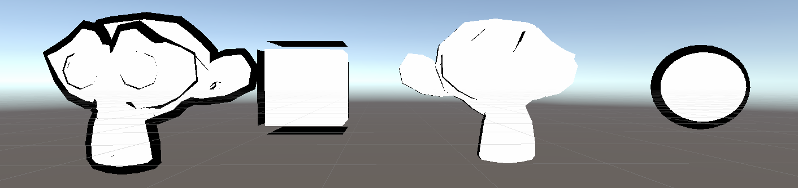
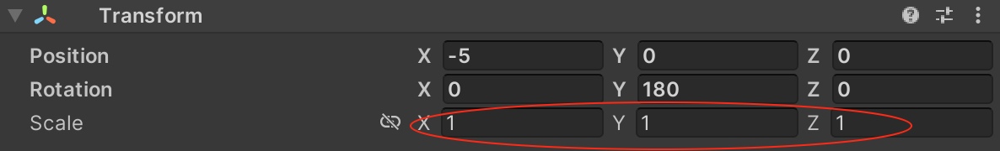
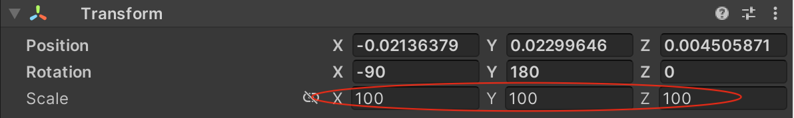

先看一下效果



## 猴头描边问题

通过上面的效果展示，可以看到第一个猴头和第二个猴头的描边效果不同，原因如下

如上图，第一个猴头在Unity 中的Transform 的Scale 是(1, 1, 1)



而第二个猴头在Unity 中的Transform 的Scale 是(100, 100, 100)



其中因为第一个猴头从Blender 导出的时候勾选了【应用变换】，而第二个没有勾选


>首先Blender 默认是没有单位的，而Unity 的单位是米，这个是主要的原因！

>注意后面几篇文章的猴头也是一样的，请关注渲染效果

## Cube 和其他的不同

因为是通过沿着法线方向往外扩展，而Cube 在8 个尖处的法线不平滑的，所以向外扩展是有问题的

为了解决这个问题，可以使用将模型放大的方式，也就是下一篇会介绍到的

>再看后续的其他实现的时候，也请关注Cube 这种有“尖”的模型和其他“圆润”模型的渲染效果的区别

## 法线在哪个空间扩展

在下面的代码中，可以看到第二个Pass 中，法线的扩展是在裁剪空间做的

需要注意的是，如果选择在模型空间外扩，就会出现这样的问题：远近描边的粗细是不同的。因为在裁剪之前做的变换，最后长度都会符合世界空间下因为相机透视造成的近大远小的效果

当然也可以改成在模型空间做法线扩展，然后实际在Unity 中看一下效果

```
v.vertex.xyz += v.normal * _Outline;
o.pos = UnityObjectToClipPos(v.vertex.xyz);
```

>但是好像下面代码中的实现，当模型离相机很远的时候，描边也会变细，当模型离相机很近的时候，描边也会变粗？！

## 代码演示

```
Shader "Unlit/Outline_Cull_Normal"
{
    Properties
    {
        _MainTex ("Texture", 2D) = "white" {}
        _Color("Color", Color) = (1, 1, 1, 1)
        _RefValue("Stencil RefValue", Int) = 1
        _Outline("Outline Width", Range(0, 0.2)) = 0.05
        _OutlineColor("Outline Color", Color) = (0, 0, 0, 1)
    }
    SubShader
    {
        Tags { "RenderType"="Opaque" "RenderPipeline" = "UniversalPipeline"}

        // 渲染固定颜色（缺少光照模型、贴图处理等）
        Pass
        {
            Cull Back

            Tags { "LightMode" = "SRPDefaultUnlit" }

            CGPROGRAM

            fixed4 _Color;

            #pragma vertex vert
            #pragma fragment frag

            float4 vert (float4 v : POSITION) : SV_POSITION 
            {       
                return UnityObjectToClipPos(v); 
            }

            float4 frag() : SV_Target 
            { 
                return _Color;
            }

            ENDCG
        }

        // 渲染偏大用于描边效果黑色模型
        Pass
        {
            Cull Front

            Tags { "LightMode" = "UniversalForward" }

            CGPROGRAM

            #pragma vertex vert
            #pragma fragment frag
            #include "UnityCG.cginc"

            struct a2v
            {
                float4 vertex : POSITION;
                float3 normal : NORMAL;
            };

            struct v2f
            {
                float4 pos : SV_POSITION;
            };

            fixed _Outline;
            fixed4 _OutlineColor;

            v2f vert (a2v v) 
            {
                v2f o;

                float4 pos = mul(UNITY_MATRIX_MV, v.vertex); 
                float3 normal = mul((float3x3)UNITY_MATRIX_IT_MV, v.normal);  
                normal.z = -0.5;
                pos = pos + float4(normalize(normal), 0) * _Outline;
                o.pos = mul(UNITY_MATRIX_P, pos);

                return o;
            }

            float4 frag(v2f i) : SV_Target 
            { 
                return float4(_OutlineColor.rgb, 1);               
            }

            ENDCG
        }
    }

    FallBack "Diffuse"
}
```