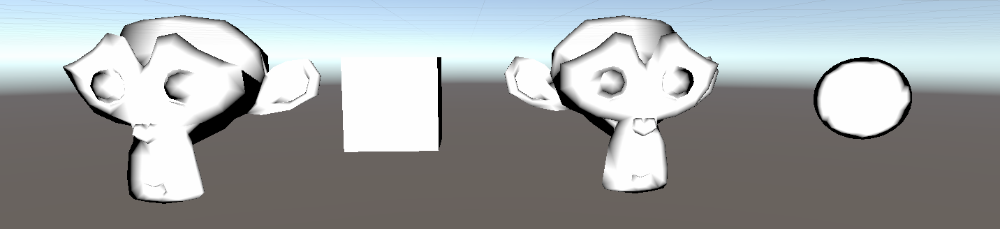
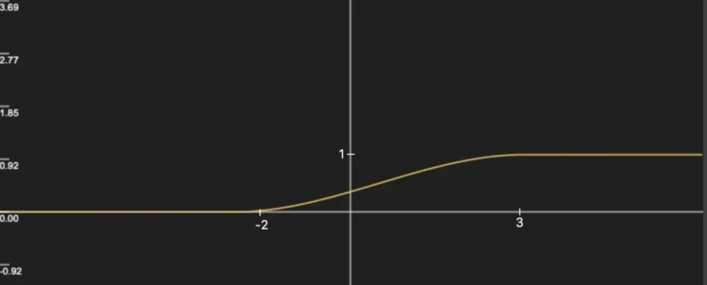
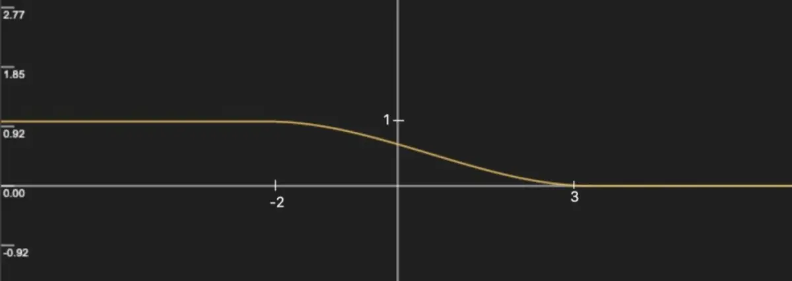
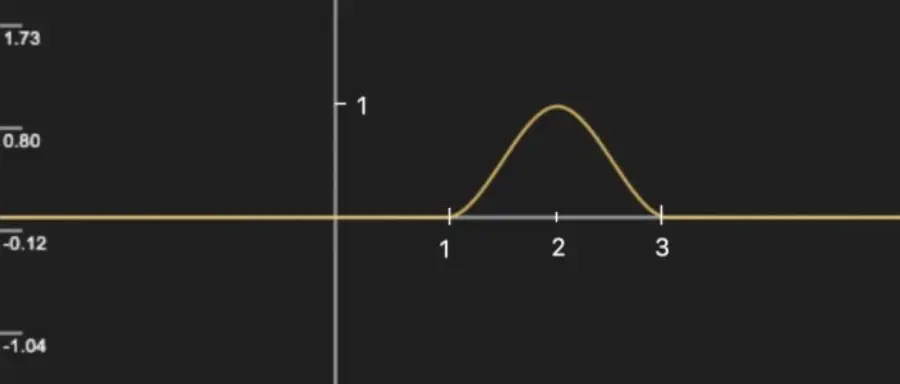
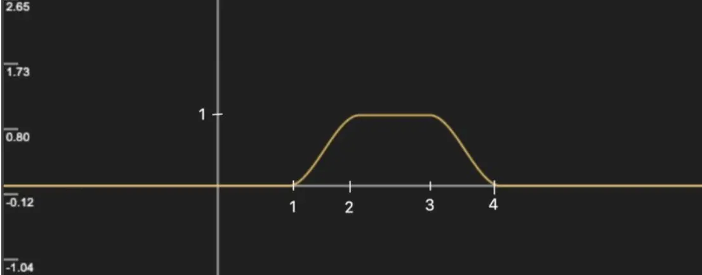
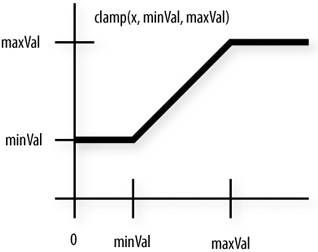

这种基于观察方向 + 法线方向实现的描边效果，出来的描边效果不“硬”，反而适合水墨渲染的那种随意感！

>[【Blender 水墨材质】实现过程简单剖析](https://blog.csdn.net/qq_41835314/article/details/129686093)

>[仿宋代水墨山水画风格3D渲染 Unity实现](https://zhuanlan.zhihu.com/p/602960198)

>[Unity-一个简单的水墨渲染方法](https://zhuanlan.zhihu.com/p/98948117)

>[【Unity Shader】 水墨风格渲染：如何优雅的画一只猴子](https://zhuanlan.zhihu.com/p/63893540)

## 公式解释

下面的代码中最重要的就是

```
v2f vert (appdata_base v)
{       
    v2f o;

    // 将模型空间的点转换到裁剪空间
    o.pos = UnityObjectToClipPos(v.vertex);
    
    // ObjSpaceViewDir() 这个函数输入一个模型空间的顶点位置，返回模型空间中从该点到摄像机的观察方向，即 view方向
    float3 ObjViewDir = normalize(ObjSpaceViewDir(v.vertex));
    
    // 标准化法线向量
    float3 normal = normalize(v.normal);
    
    // 两个标准向量点乘，计算得到两个向量夹角的cos 值
    // 向量垂直，点乘为0；向量同向，点乘为1；夹角为锐角，点乘大于0；夹角为钝角，点乘小于0
    float factor = step(_Outline, dot(normal, ObjViewDir));
    o.color = float4(1, 1, 1, 1) * factor;
    return o;
}
```

另外step() 函数的逻辑可以用下面的伪代码表示

```
step (a, x)
{
    if (x < a) 
    {
        return 0;
    }
    else
    {
        return 1;
    }
}
```

另外顺便介绍一下常用的lerp()、smoothstep() 函数

## lerp() 函数

lerp() 函数伪代码如下：

```
lerp(a, b, w)
{
    return a + w*(b-a)
}
```

当w = 0 时，返回a，当w = 1 时返回b，否则返回对a 和b 的差值，w 越接近0，返回结果越接近a，w 越接近1，返回结果🈷越接近1，通常用来计算一些渐变量

## smoothstep() 函数

smoothstep() 可以用来生成0 到1 的平滑过渡值，它也叫平滑阶梯函数。smoothstep定义是

```
float smoothstep(float a, float b, float x) 
{
    x = clamp((x - a) / (b- a), 0.0, 1.0); 
    return x * x * (3 - 2 * x);
}
```

在a < b 的情况下，当x < a 时，返回0，当x > b 时，返回1，否则在0 和1 之间平滑过渡，比如smoothstep(-2, 3, x) 的函数图像:



在a > b 的情况下，当x < b 时，返回1，当x > a 时，返回0，否则在1 和0 之间平滑过渡，交换上述a 和b 的位置，可以得到 smoothstep(3, -2, x) 的函数图像 ：



两个smoothstep 进行减法运算可以得到一些波形图，例如smoothstep(1, 2, x) - smoothstep(2, 3, x) 的函数图像



想要增加波峰的持续宽度，可以构造smoothstep(1, 2, x) - smoothstep(3, 4, x)，图像如下：



## clamp() 函数

用来将某个值“钳”住、限制在某个区间（min~max）

```
float lamp(float x, float min, float max)
{
    if (x > max)
        return max;
    if (x < min)
        return min;
    return x;
}
```



## 代码演示

```
// 基于观察角度和表面法线
Shader "Unlit/Outline_Cull_View_Normal"
{
    Properties
    {
        _Outline ("Outline", Range(0, 1)) = 0.1
    }
    SubShader
    {
        Tags { "RenderType"="Opaque" "RenderPipeline" = "UniversalPipeline"}

        // 渲染固定颜色（缺少光照模型、贴图处理等）
        Pass
        {
            Cull Back

            Tags { "LightMode" = "SRPDefaultUnlit" }

            CGPROGRAM

            fixed4 _Color;

            #pragma vertex vert
            #pragma fragment frag

            #include "UnityCG.cginc"

            float _Outline;

            struct v2f
            {
                float4 pos : SV_POSITION;
                fixed4 color : COLOR;
            };

            v2f vert (appdata_base v)
            {       
                v2f o;
                o.pos = UnityObjectToClipPos(v.vertex);
                float3 ObjViewDir = normalize(ObjSpaceViewDir(v.vertex));
                float3 normal = normalize(v.normal);
                float factor = step(_Outline, dot(normal, ObjViewDir));
                o.color = float4(1, 1, 1, 1) * factor;
                return o;
            }

            float4 frag(v2f i) : SV_Target 
            { 
                return i.color;
            }

            ENDCG
        }
    }

    FallBack "Diffuse"
}
```