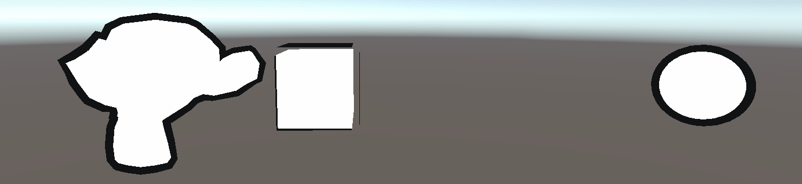
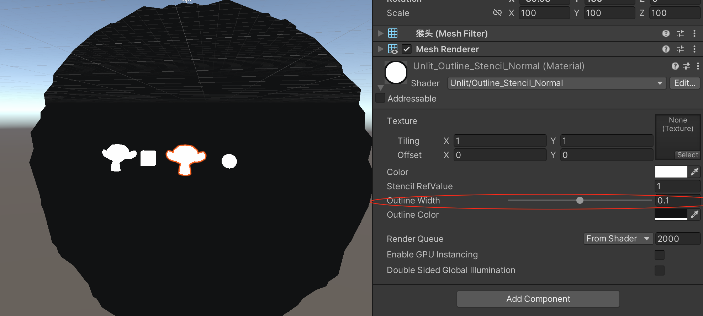

基于模板测试的外边框描边实现，和基于Cull 有明显的不同，它只会渲染外边框，不同于Cull 把猴头的眼眶、鼻子等有轮廓的地方都渲染出来了

注意这里将第二个Scale 为100 的猴头取消显示，是因为在下面的Shader 实现下相同的描边设置下，因为Scale 问题，它的描边也放到了100 倍，如下：



## 代码演示

```
Shader "Unlit/Outline_Stencil_Normal"
{
    Properties
    {
        _MainTex ("Texture", 2D) = "white" {}
        _Color("Color", Color) = (1, 1, 1, 1)
        _RefValue("Stencil RefValue", Int) = 1
        _Outline("Outline Width", Range(0, 0.2)) = 0.05
        _OutlineColor("Outline Color", Color) = (0, 0, 0, 1)
    }
    SubShader
    {
        Tags { "RenderType"="Opaque" "RenderPipeline" = "UniversalPipeline"}

        // 渲染固定颜色（缺少光照模型、贴图处理等）
        Pass
        {
            Stencil {
                Ref [_RefValue]
                Comp Always
                Pass Replace
            }

            Tags { "LightMode" = "SRPDefaultUnlit" }

            CGPROGRAM

            fixed4 _Color;

            #pragma vertex vert
            #pragma fragment frag

            float4 vert (float4 v : POSITION) : SV_POSITION 
            {       
                return UnityObjectToClipPos(v); 
            }

            float4 frag() : SV_Target 
            { 
                return _Color;
            }

            ENDCG
        }

        // 渲染偏大用于描边效果黑色模型
        Pass
        {
            Stencil {
                Ref [_RefValue]
                Comp NotEqual
            }

            Tags { "LightMode" = "UniversalForward" }

            CGPROGRAM

            #pragma vertex vert
            #pragma fragment frag
            #include "UnityCG.cginc"

            struct a2v
            {
                float4 vertex : POSITION;
                float3 normal : NORMAL;
            };

            struct v2f
            {
                float4 pos : SV_POSITION;
            };

            fixed _Outline;
            fixed4 _OutlineColor;

            v2f vert (a2v v) 
            {
                v2f o;

                // 下面是在视角空间下的法线扩展实现。具体可以自己在Unity对比一下
                //float4 pos = mul(UNITY_MATRIX_MV, v.vertex); 
                //float3 normal = mul((float3x3)UNITY_MATRIX_IT_MV, v.normal);  
                //normal.z = -0.5;
                //pos = pos + float4(normalize(normal), 0) * _Outline;
                //o.pos = mul(UNITY_MATRIX_P, pos);

                // 在模型空间下坐标沿着法线方向扩展实现 =>
                // 如果Unity自带的Cube、Sphere与Blender导出的Monkey不一样
                // 因为Monkey的Scale 是100，而Cube和Sphere的Scale是1，这个是根本原因！
                // Blender导出fbx的时候，勾选【应用变换】
                // v.vertex.xyz += v.normal * _Outline * 0.01;
                v.vertex.xyz += v.normal * _Outline;
                o.pos = UnityObjectToClipPos(v.vertex.xyz);

                return o;
            }

            float4 frag(v2f i) : SV_Target 
            { 
                return float4(_OutlineColor.rgb, 1);               
            }

            ENDCG
        }
    }

    FallBack "Diffuse"
}
```